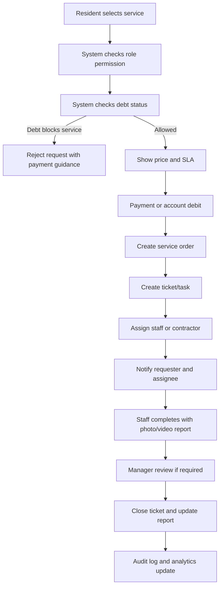
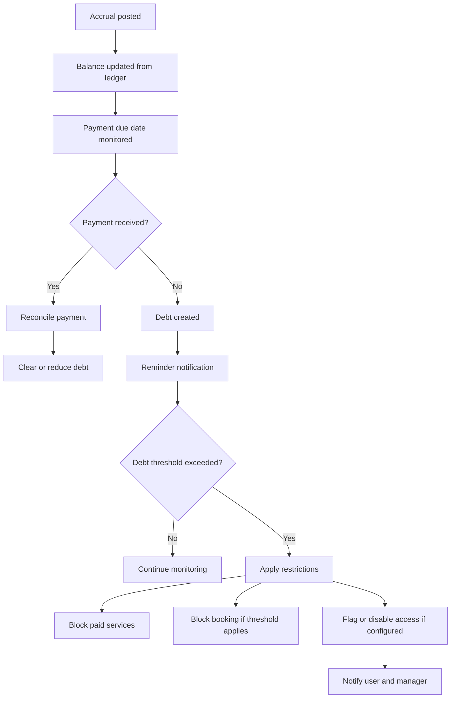
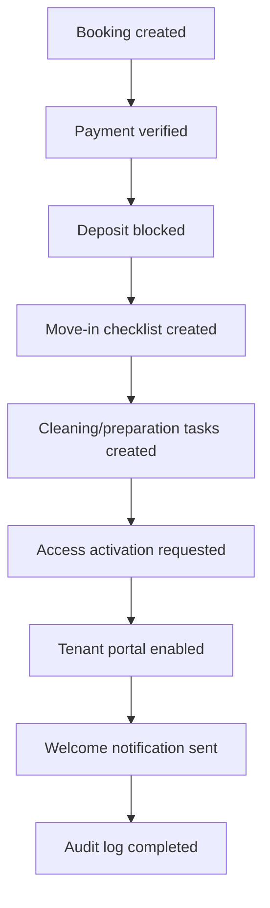
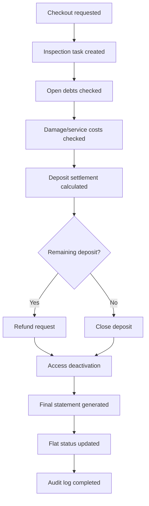
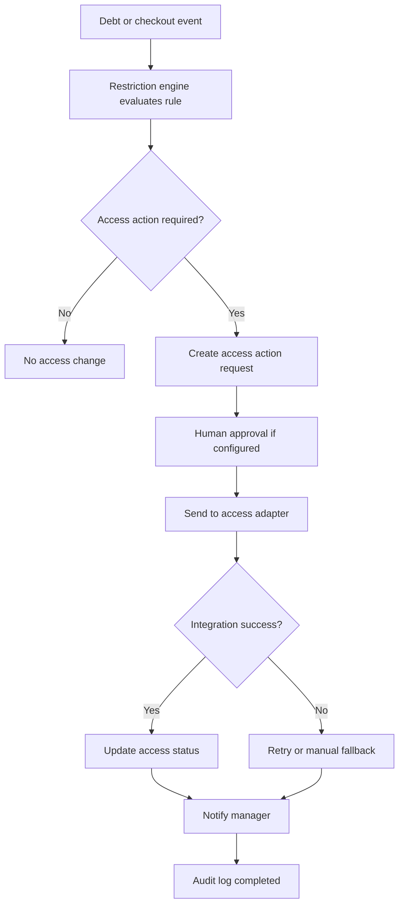

# Business Requirements Document

## AI-Powered Residential Site Management CRM

Version: 0.3
Date: 26 June 2026
Prepared for: Internal proposal and delivery planning
Prepared by: 1Cati / Product and Engineering
Primary market: Turkey
Primary deployment scope: Web application and installable PWA, not native mobile app at launch

---

<!-- DOC-UPGRADE:BEGIN -->
## Executive At-A-Glance

- The requested product is a full residential site operating platform, not a simple website or dashboard.
- Launch should be web/PWA-first to reduce delivery risk while still serving mobile resident and staff workflows.
- Finance, service tickets, bookings, debt restrictions, auditability and AI guardrails are the core business decisions.

## Reader Guide

| Item | Detail |
|---|---|
| Document type | Business Requirements Document |
| Primary audience | Executive sponsors, product leadership, delivery leads |
| Status | Current delivery baseline v0.3 |
| Last reconciled | 26 June 2026 |
| Confidentiality | STRICTLY CONFIDENTIAL |

## Visual Navigation

- Service Ticket Workflow (source retained in this Markdown; regenerate a rendered diagram only when a stakeholder export explicitly needs it)
- Payment And Debt Restriction Workflow (source retained in this Markdown; regenerate a rendered diagram only when a stakeholder export explicitly needs it)
- Move-In Workflow (source retained in this Markdown; regenerate a rendered diagram only when a stakeholder export explicitly needs it)
- Checkout Workflow (source retained in this Markdown; regenerate a rendered diagram only when a stakeholder export explicitly needs it)
- Access Restriction Workflow (source retained in this Markdown; regenerate a rendered diagram only when a stakeholder export explicitly needs it)
<!-- DOC-UPGRADE:END -->

## Current Delivery Baseline

This BRD defines the business target and acceptance logic for the 1Cati residential site management CRM. It must be read together with `docs/PROJECT-HANDBOOK.md` for current implementation status.

As of 29 June 2026, phases 1-9 are complete as a demo/internal-QA implementation foundation and ready-for-UAT slice, while phases 10-15 remain planned production work under the accelerated delivery target. Business claims in this BRD describe target requirements unless a section explicitly says that the capability is already implemented.

## 1. Executive Summary

The client is not asking for a simple website, landing page, or basic dashboard. The client is asking for a full residential site management operating system for a complex of 769 flats. The system must manage owners, tenants, staff, accounting, services, tickets, bookings, deposits, payments, access restrictions, communications, reporting, and audit history.

The best market response is to position the solution as a premium web-based CRM and operations platform for Turkish residential complexes. The proposed product should match the client's requested scope and improve it with AI-assisted management, stronger reporting, modern UX, and structured service workflows.

This BRD converts the client's short specification into a business-level requirement document. It defines the business goals, users, market expectations, Turkish service psychology, scope decisions, 15 delivery phases, functionality per phase, business rules, workflows, acceptance criteria, success metrics, and open questions.

The native mobile app requirement is removed from the first delivery scope. Instead, the recommended launch product is a responsive web application with PWA capability. This gives residents, owners, managers, accountants, and staff a mobile-friendly app-like experience through the browser, while reducing cost, time, app store dependency, and release complexity. Native iOS and Android apps can remain a later optional phase only if the client specifically demands store distribution.

---

## 2. Scope Decision: Web App And PWA Instead Of Native Mobile

### 2.1 Original Requirement

The client mentioned a mobile app for iOS and Android. The required features were login, balance, payment, service request, chat, notifications, documents, and transaction history.

### 2.2 Recommended Scope Change

The launch scope should be:

- One responsive web application.
- Installable PWA for mobile users.
- Role-specific experiences for manager, accountant, owner, tenant, staff, and admin.
- Mobile-friendly screens for all urgent workflows.
- Push notification support where browser/device support allows.
- Optional native app wrapper only after the web product is stable.

### 2.3 Business Reasoning

A web app/PWA is more suited for the first delivery because:

- The client needs speed.
- Most core users need web-based operational screens, especially accounting and management.
- Finance, reporting, import, approvals, service boards, and admin settings are better on desktop/tablet.
- Residents and staff can still use the app from phones.
- PWA supports installability and a single codebase.
- Changes can be deployed immediately without App Store or Play Store review.
- The budget can be focused on the actual CRM logic rather than duplicate native interfaces.

### 2.4 Business Commitment

We will not ignore mobile usage. We will deliver mobile-friendly PWA workflows. The removed item is only native mobile store app delivery at launch.

---

## 3. Business Objectives

### 3.1 Primary Objectives

1. Create a single source of truth for the 769-flat residential site.
2. Replace manual tracking with structured digital workflows.
3. Give managers real-time visibility into debt, income, tasks, bookings, complaints, and risks.
4. Give accounting staff a reliable ledger-based finance system.
5. Give residents, owners, and tenants self-service access to payments, documents, service requests, and communication.
6. Give staff a clear task/ticket workflow with SLA and completion evidence.
7. Reduce late payments through reminders, debt visibility, and restriction rules.
8. Reduce operational delays by turning services into trackable tickets.
9. Improve trust through audit logs, statements, transparent balances, and documented actions.
10. Use AI to reduce manager workload without allowing AI to perform risky financial or access actions automatically.

### 3.2 Business Success Metrics

The product should be considered successful when:

- 100% of flats are represented in the system with correct block/floor/flat status.
- 100% of owners, tenants, and staff have role-based profiles.
- 100% of financial movements are recorded through the ledger.
- Service tickets have measurable status, assignee, priority, SLA, and completion evidence.
- Managers can see debt list, task status, income, expenses, and bookings from one dashboard.
- Residents can submit and track service requests without calling management.
- Accounting can export statements and debt reports.
- Access restrictions are applied based on configured debt rules.
- Every critical action creates an audit log.
- AI suggestions are explainable and require human approval for finance/access actions.

---

## 4. Research Methodology

Market research was performed using publicly available product and documentation pages from leading local and global property, site, and service management products.

Primary reference categories:

- Turkish residential site management software.
- Global property management software.
- Service desk and ticketing best practices.
- PWA/mobile web best practices.
- Application security and data protection references.
- Turkish privacy and digital-service expectations.

Primary sources reviewed:

- Apsiyon official website: https://www.apsiyon.com/
- Senyonet official website: https://www.senyonet.com.tr/
- Yönetimcell official website: https://www.yonetimcell.com/
- Aidatım official website: https://www.aidatim.com/
- Siteplus official website: https://www.siteplus.com.tr/
- Buildium features: https://www.buildium.com/features/
- Yardi Breeze features: https://www.yardibreeze.com/features/
- DoorLoop features: https://www.doorloop.com/features
- Atlassian Jira Service Management features: https://www.atlassian.com/software/jira/service-management/features
- web.dev PWA guidance: https://web.dev/learn/pwa/
- OWASP ASVS: https://owasp.org/www-project-application-security-verification-standard/
- KVKK Personal Data Protection Law: https://www.kvkk.gov.tr/Icerik/6649/Personal-Data-Protection-Law

Research date: 24 June 2026. Re-check external market sources before final pricing, legal review or production launch decisions.

---

## 5. Market Research Summary

### 5.1 Turkish Market Baseline

The Turkish residential site management market is already mature. A basic offer is not enough. A local competitor such as Apsiyon positions itself as an end-to-end digital assistant for collective living spaces. Its public messaging includes manager solutions, resident solutions, dues tracking, online bank integrations, card collection, reservations, manager mobile, resident mobile, access control systems, meter reading/billing, email/SMS, AI assistants, training, and support.

Important market signals from the Turkish baseline:

- Aidat/service charge tracking is mandatory.
- Online bank and card collection is expected.
- Manager mobile access is expected.
- Resident self-service is expected.
- Reservation functionality is expected.
- Email and SMS communication is expected.
- Access control is a strong local differentiator.
- Meter/billing integration is valuable for larger complexes.
- AI is no longer only a future idea; it is being used in positioning.
- Training and support matter in Turkey because non-technical management teams need help adopting new software.

The Turkish market also values trust, human support, clear records, and visible control. For a residential complex, the system must not feel experimental. It must feel official, reliable, and easy to understand.

### 5.2 Top Turkish Player Review

The following five Turkish players or adjacent market benchmarks should be tracked when positioning and designing the product. They are not presented as a legally ranked market-share list; they are the most relevant publicly verifiable benchmarks for the client requirement.

#### 5.2.1 Apsiyon

Apsiyon is the strongest local software benchmark for apartment/site management. It publicly promotes a broad suite of products and solutions including aidat tracking, online bank integrations, card collection, reservation, free website, manager mobile, e-mail/SMS, access control, meter reading and billing, AVM management software and AI assistants.

What this means for our product:

- Dues/aidat management is mandatory.
- Online collection is expected.
- Reservation and communication are not optional differentiators; they are baseline expectations.
- Access control and meter/billing should be included in the roadmap even if not launched first.
- AI should be positioned as a real management assistant, not a decorative chatbot.

#### 5.2.2 Senyonet

Senyonet positions itself for sites, apartments, facilities, hotels, offices, AVMs and management companies. Its public modules include public relations/communication, finance, accounting and security. It highlights requests, announcements, events, reservations, document management, bank/cash/current account visibility, collections, invoicing, budgeting, reporting, visitor/personnel/cargo/vehicle tracking, and support/training.

What this means for our product:

- Communication, finance, accounting and security must be treated as connected modules.
- Visitor/security workflows should be considered in the access/integration roadmap.
- Support and training are part of the offer, not only after-sales activity.
- The product should support professional management companies, not only one self-managed site.

#### 5.2.3 Yönetimcell

Yönetimcell positions itself as a simple and understandable site/apartment management program. Public features include aidat tracking, online bank integration, credit card/Masterpass collection, resident account/payment access, reports/Excel exports, multi-site management, manager mobile app, resident aidat tracking app and staff job-tracking app.

What this means for our product:

- Simplicity is a selling point in Turkey.
- Residents need a simple payment and balance view.
- Managers need Excel export and reporting.
- Staff job tracking is expected and supports our decision to build a proper ticket/task module.
- Web/PWA must be as simple to access as a mobile app.

#### 5.2.4 Aidatım

Aidatım combines software with service support. It publicly promotes a private assistant, management software, accounting support, legal support, transition/setup help, credit card collection, bank account tracking with smart matching, leave and payroll, monthly/yearly reports, current account tracking, expense sharing, meter reading/billing, e-mail/SMS and account sharing.

What this means for our product:

- The client will value setup, migration and support as much as the interface.
- Smart bank matching and reconciliation should be planned.
- Payroll/leave is not in the client MVP, but staff management should leave room for it.
- Legal/accounting support is a market expectation around debt, access and finance.
- Meter reading/billing must be on the integration roadmap.

#### 5.2.5 Siteplus

Siteplus is an adjacent integrated facility management benchmark rather than a pure software competitor. It publicly highlights integrated facility management, professional site management, private security, cleaning, alarm monitoring, landscaping, pest control, disinfection and technical maintenance/repair services.

What this means for our product:

- The software must support real operational service delivery, not only financial administration.
- Cleaning, security, maintenance and technical repair should be represented as work queues.
- Staff/contractor assignment, SLA, evidence, incident logs and performance reporting are important.
- The system should be able to support a professional service provider operating the site.

### 5.3 Turkish Competitive Capability Matrix

| Capability | Apsiyon | Senyonet | Yönetimcell | Aidatım | Siteplus | Requirement For Our Product |
|---|---|---|---|---|---|---|
| Aidat/dues tracking | Yes | Yes | Yes | Yes | Service context | Must have |
| Online card/bank collection | Yes | Yes | Yes | Yes | Not primary | Must have/provider adapter |
| Resident portal/app | Yes | Implied portal | Yes | Yes | Not primary | PWA must cover |
| Manager mobile/access | Yes | Implied cloud/mobile | Yes | Implied | Operations staff | PWA manager/staff views |
| Finance/accounting | Yes | Yes | Yes/reports | Yes | Not primary | Ledger and reports |
| Reservations/bookings | Yes | Yes | Not main public focus | Not main public focus | Service scheduling | Must have |
| Communication/announcements | Yes | Yes | Yes | E-mail/SMS | Operational contact | Must have |
| Document management | Noted in ecosystem | Yes | Limited public detail | Account sharing/docs | Policies/certifications | Must have |
| Security/access/visitor | Yes/access products | Yes/security module | Security login/visitor | Not primary | Strong service area | Must plan integration |
| Work/task tracking | Noted through services | Operations modules | Yes/job tracking | Staff/payroll support | Strong service area | Must build ticketing |
| Meter/billing | Yes | Noted indirectly | Not central public focus | Yes | Not primary | Roadmap integration |
| AI | Strong public positioning | Not primary public focus | Not primary public focus | Assistant/service support | Not software AI | Our differentiator |
| Training/support | Yes | Strong | Support videos/free trial | Private assistant | Academy/training | Must include |

### 5.4 Global Market Baseline

Global property management platforms such as Buildium, Yardi Breeze, and DoorLoop show the broader market standard.

Common global features:

- Property accounting.
- Online payments.
- Rent/fee collection.
- Maintenance requests.
- Resident portal.
- Owner portal.
- Online leasing.
- Digital documents and signatures.
- Reporting and analytics.
- Open APIs and integrations.
- File storage.
- Workflow automation.
- Data migration support.
- Training and onboarding.
- AI assistant features.

The global benchmark confirms that the client request is realistic, but large. It is closer to a property operations platform than a small CRM.

### 5.5 Service And Ticketing Benchmark

The client's "service management" requirement should not be built as a simple form. It should be a service desk/ticketing module.

Atlassian Jira Service Management and general ITSM practices show the standard pattern:

- Request intake.
- Categorization.
- Priority.
- Assignment.
- SLA.
- Status tracking.
- Internal notes.
- Customer communication.
- Escalation.
- Knowledge base or saved answers.
- Reporting.
- Automation.
- API integration.

For this project, the service module should work like a site operations ticketing system. Every cleaning request, transfer request, repair request, tour/activity request, complaint, and inspection should become a ticket with clear ownership and status.

### 5.6 PWA / Web App Benchmark

Modern PWAs allow a single web app to deliver app-like behavior with one codebase. The PWA model supports installability, responsive layouts, caching, service workers, push capability where supported, and improved mobile usability.

For this project, PWA is the right first delivery route because:

- It supports mobile usage without native app development.
- It keeps release cycles fast.
- It reduces cost and duplicate engineering.
- It lets accounting and management use the same platform on desktop.
- It can later be wrapped into native shells if required.

### 5.7 Security And Compliance Benchmark

This system will handle personal data, financial records, identity documents, access permissions, photos/videos, chats, and potentially camera/access events. Security cannot be treated as a late add-on.

Security baseline should include:

- Role-based access control.
- Row-level data restrictions.
- Audit logging.
- Data minimization.
- Consent and legal basis handling.
- Secure file access.
- Protection of special categories of personal data.
- Strong authentication.
- Rate limiting.
- Secure logging.
- Backup and restore.
- Incident response.
- OWASP ASVS-aligned security testing.

KVKK requires lawful, fair, purpose-limited, proportionate, accurate, and time-limited processing of personal data. This directly affects document storage, identity verification, camera events, access control, and AI data handling.

---

## 6. Turkish User And Service Psychology

### 6.1 Key User Psychology Patterns

Turkish residential site users are not one single group. The platform must serve older residents, younger tenants, property owners, management staff, accountants, technical staff, and administrators.

The design should respect these patterns:

- Trust must be visible. Users need receipts, statements, official-looking records, and clear timestamps.
- Uncertainty must be reduced. Users should always know what happened, who is responsible, and what happens next.
- Human support still matters. A chat/contact path should remain visible for unclear cases.
- Status matters. Managers need a professional dashboard that helps them look prepared and in control.
- Simplicity is essential. Residents should not face complex menus.
- Local language matters. Turkish-first wording should be clear, respectful, and not overly technical.
- Payment anxiety is real. Debt, penalties, blocked services, and access restrictions must be explained carefully.
- Older residents may prefer SMS/email and simple payment instructions.
- Staff need practical screens, not administrative complexity.
- Accounting users need precision, exports, and auditability more than visual decoration.

### 6.2 Ethical Behavioral Design

The product should use psychology ethically:

- Use progress indicators for onboarding, booking, checkout, and document completion.
- Use clear defaults, but never hide important financial decisions.
- Use reminders to prevent debt, not to shame users.
- Use transparent restriction messages so users know how to resolve the problem.
- Use social proof carefully for management sales, not resident pressure.
- Use AI to reduce confusion, not to manipulate users.
- Use simple language and reduce choice overload.
- Show "next best action" for managers and residents.

### 6.3 Turkish Service Model

The service model should feel local, responsive, and accountable:

- Turkish-first onboarding and training.
- Manager training materials.
- Accountant-specific training.
- Staff quick-start training.
- Resident help articles.
- Live support during launch.
- Clear escalation path for urgent cases.
- Local payment and bank integration planning.
- KVKK-aware privacy language.
- Human approval for sensitive AI recommendations.

---

## 7. Personas

### 7.1 Administrator

Controls system settings, roles, permissions, integrations, global rules, and audit access. Needs a secure, structured admin area.

### 7.2 Site Manager

Owns daily operations. Needs dashboard, tasks, debt list, communications, approvals, bookings, services, staff performance, and AI briefing.

### 7.3 Accountant

Owns financial correctness. Needs ledger, accruals, payments, deposits, refunds, reconciliation, reports, exports, and audit trail.

### 7.4 Owner

Owns one or more flats. Needs balance, statements, payments, service requests, tenant/rental visibility, documents, reports, and communication.

### 7.5 Tenant

Lives in or uses a flat. Needs permitted access to balance, payment, service requests, chat, documents, booking status, and notifications.

### 7.6 Staff / Technician

Completes assigned work. Needs task list, SLA, location/flat info, notes, photo/video upload, completion status, and manager feedback.

### 7.7 Security Staff

Handles access-related tasks and entry issues. Needs access status, restricted flats, visitor/access events if integrated, and task/tour control.

### 7.8 Support / Implementation Team

Helps migrate data, train users, resolve issues, and maintain integrations. Needs admin-safe support tools and audit-safe troubleshooting.

---

## 8. Product Surfaces

| Surface | Users | Business Purpose |
|---|---|---|
| Web Admin App | Admin, manager, accounting | Main operational control center |
| Manager PWA | Manager | Mobile view for urgent tasks, approvals, debts and messages |
| Owner Portal/PWA | Owner | Balance, payments, documents, reports, services |
| Tenant Portal/PWA | Tenant | Payment, service request, chat, notifications |
| Staff PWA | Staff, technician, cleaning, security | Task execution and media reports |
| Accounting Console | Accountant | Ledger, payments, deposits, reconciliation, exports |
| Service Desk Console | Manager, staff lead | Ticket lifecycle and SLA management |
| Booking Console | Manager, booking team | Availability, move-in, checkout, deposit |
| Communication Center | Manager, residents, staff | Chat, announcements, email/SMS/push |
| Reporting Center | Manager, accounting, admin | Financial, operational and KPI reports |
| AI Command Center | Manager, accounting, admin | AI briefing, recommendations, risk detection |
| Integration Console | Admin, support | Bank, payment, access, identity, meter, camera integrations |

---

## 9. Phase-Based Business Requirements

## Phase 1: Discovery, Requirement Lock And Market Benchmark

### Business Goal

Convert the client's short specification into a complete, signed business scope that can be estimated, designed, built, tested, and delivered.

### Market Insight

Competitors do not sell only features. They sell confidence: support, migration, training, reporting, integrations, and proof that the platform can handle real operational complexity. The discovery phase must therefore produce more than a requirements list. It must produce a business operating model.

### Business Requirements

- Confirm number of flats, blocks, floors, flat numbering rules, ownership structure, tenant rules, and existing data sources.
- Confirm whether the site is a residential complex, holiday letting complex, mixed-use property, or long-term rental operation.
- Confirm finance rules for aidat, utilities, rent, services, deposits, penalties, and refunds.
- Confirm debt thresholds and what each restriction means.
- Confirm access card/barrier vendor details.
- Confirm payment provider and bank integration expectations.
- Confirm identity verification requirements.
- Confirm document types and retention expectations.
- Confirm required languages.
- Confirm who will operate the platform daily.
- Confirm launch priority and MVP boundaries.

### AI Opportunities

- AI-assisted requirement summary after client workshops.
- AI gap analysis against market benchmark.
- AI-generated process maps for review.
- AI meeting summary and action tracker.

### Turkish Service Considerations

- Use Turkish examples and Turkish operational wording.
- Explain financial and access rules in clear non-technical language.
- Keep the client confident by showing phased delivery and risk controls.

### Acceptance Criteria

- Signed BRD.
- Signed scope and non-scope.
- Confirmed phase plan.
- Confirmed decision that launch scope is web app/PWA, not native mobile.
- Confirmed open questions list.

### KPIs

- Requirement ambiguity reduced to less than 10 open items.
- All mandatory client scenarios documented.
- All business-critical integrations classified as launch, post-launch, or optional.

---

## Phase 2: UX/UI Design System And Product Navigation

### Business Goal

Create a premium but practical interface that Turkish management teams, accountants, staff, owners, and tenants can use without heavy training.

### Market Insight

Leading platforms emphasize ease of use, simple daily workflows, mobile access, and guided onboarding. This is especially important for non-technical property teams.

### Business Requirements

- Create Turkish-first navigation.
- Create role-specific dashboards.
- Create simple resident flows.
- Create dense but readable management screens.
- Create clear status language for debt, task, booking, access, payment and document states.
- Create consistent colors for safe/warning/blocked/complete states.
- Create forms with validation and helpful error messages.
- Create wizards for complex workflows.
- Create export-friendly tables for accounting and reports.
- Create mobile-first screens for staff and residents.

### Sub-Modules

- Design tokens.
- Navigation map.
- Role home screens.
- Dashboard widgets.
- Flat matrix UI.
- Ledger UI.
- Ticket UI.
- Booking calendar UI.
- Chat UI.
- AI command UI.
- Report UI.
- PWA install prompt.

### AI Opportunities

- AI assistant entry point in the dashboard.
- AI "what needs attention today" summary.
- AI explanation for complex ledger balances.
- AI suggested next action cards.

### Turkish Psychology Considerations

- Avoid overly playful UI for finance and access.
- Use official, calm, trustworthy layout.
- Make help and human contact visible.
- Use clear Turkish wording for debt and restrictions.
- Avoid choice overload.

### Acceptance Criteria

- Approved clickable prototype.
- All roles have a defined home screen.
- All client mandatory scenarios are represented in prototype.
- Mobile PWA screens are usable on common phone sizes.

### KPIs

- New manager can understand dashboard in under 5 minutes.
- Resident can submit a service request in under 90 seconds.
- Accountant can locate a user's ledger in under 30 seconds.

---

## Phase 3: Platform Foundation, Auth, RBAC And Audit

### Business Goal

Create the secure foundation for all future modules.

### Market Insight

Property platforms handle sensitive personal, financial, and access data. Trust depends on proper access control, auditability, and data separation.

### Business Requirements

- Secure login.
- Role-based access control.
- User sessions.
- Site-level configuration.
- Permission matrix.
- Audit log for all sensitive actions.
- Admin settings.
- Basic support/admin troubleshooting capability.

### Sub-Modules

- Auth.
- Roles.
- Permissions.
- Admin settings.
- Audit events.
- Session management.
- Support-safe impersonation policy if required.

### AI Opportunities

- AI can summarize audit activity.
- AI can identify unusual admin actions.
- AI can help admins find configuration gaps.

### Turkish Service Considerations

- Users need confidence that financial and personal data is controlled.
- Management must be able to prove who did what and when.
- Audit logs reduce disputes.

### Acceptance Criteria

- Owner cannot see another owner's data.
- Tenant cannot see owner-only information unless allowed.
- Staff can see assigned tasks only.
- Accountant can see finance modules but not unrelated admin secrets.
- Every write action creates an audit record.

### KPIs

- 100% of sensitive screens require authentication.
- 100% of write actions have audit logging.
- 0 unauthorized cross-role access in testing.

---

## Phase 4: Site, Block, Floor, Flat And Data Import

### Business Goal

Build the 769-flat operational map of the property.

### Market Insight

Competitors often emphasize quick setup and migration. DoorLoop specifically markets data migration from Excel or other systems. For this project, import quality is crucial because the site likely has existing spreadsheets.

### Business Requirements

- Create site profile.
- Create block/floor/flat structure.
- Support 769 flats.
- Track flat type and status.
- Track ownership and tenancy links.
- Import flats and residents from Excel.
- Validate duplicate and missing records.
- Export flat list.
- Display flat matrix by block and floor.

### Sub-Modules

- Site profile.
- Block management.
- Flat management.
- Occupancy history.
- Import wizard.
- Data quality dashboard.
- Flat matrix.

### AI Opportunities

- AI import anomaly summary.
- AI duplicate detection support.
- AI missing field recommendations.
- AI plain-language import report for the manager.

### Turkish Service Considerations

- Managers often work from spreadsheets. Import must be forgiving and guided.
- Visual flat matrix helps teams trust that the site is correctly represented.

### Acceptance Criteria

- All 769 flats can be created or imported.
- Each flat has status, block, floor, number and relationship history.
- Import preview shows errors before committing.
- Manager can filter by debt, status, owner, tenant and block.

### KPIs

- 95% of clean Excel records import without manual correction.
- 100% of import errors are explained clearly.
- Flat lookup returns results in under 2 seconds for 769 flats.

---

## Phase 5: User, Owner, Tenant And Staff Management

### Business Goal

Represent every person connected to the site and connect them to the correct flats, roles, documents and permissions.

### Market Insight

Owner portals, resident centers, tenant management, and staff workflows are standard in global products. The local Turkish context also needs strong identity/contact accuracy because payment, access and notifications depend on it.

### Business Requirements

- Create owner profiles.
- Create tenant profiles.
- Create staff profiles.
- Create manager, accountant and admin users.
- Link users to flats.
- Store contact details.
- Store documents.
- Track identity verification status.
- Track owner permissions for tenant access.
- Manage staff groups and skills.

### Sub-Modules

- User directory.
- Owner detail.
- Tenant detail.
- Staff detail.
- Document vault.
- Relationship timeline.
- Permissions per occupancy.
- Identity status.

### AI Opportunities

- AI duplicate contact detection.
- AI missing document alerts.
- AI suggested staff group based on job history.
- AI summary of owner/tenant relationship.

### Turkish Service Considerations

- Keep identity and personal documents private and clearly protected.
- Use formal wording in profile and document sections.
- Allow phone/SMS-centric contact records because many residents still expect phone-based communication.

### Acceptance Criteria

- Every user has exactly one primary role and optional secondary permissions.
- A flat can have owner and tenant relationships with date ranges.
- Tenant access can be restricted by owner/management permission.
- Documents are visible only to authorized roles.

### KPIs

- 100% of active flats have owner assignment or clear vacant/unassigned status.
- 100% of active tenants have contact details.
- 0 document leaks across unrelated users in testing.

---

## Phase 6: Financial Ledger Engine

### Business Goal

Create a reliable finance engine for aidat, utilities, services, rent, deposits, refunds and management accounting.

### Market Insight

Accounting and payment automation are core expectations in Buildium, Yardi Breeze, DoorLoop, and Apsiyon-like products. The finance module must be ledger-based, not a simple balance field.

### Business Requirements

- Create owner accounts.
- Create tenant accounts.
- Create deposit accounts.
- Create management company account.
- Record accruals.
- Record payments.
- Record service debits.
- Record utilities.
- Record rent-related transactions.
- Calculate balances from transaction history.
- Generate statements.
- Export financial records.
- Support audit and reversal rules.

### Sub-Modules

- Account setup.
- Ledger.
- Journal posting.
- Accrual engine.
- Balance engine.
- Statement generator.
- Finance dashboard.
- Reversal/adjustment controls.

### AI Opportunities

- AI explanation of balance.
- AI detection of unusual ledger entries.
- AI monthly finance summary.
- AI accountant assistant for transaction search.

### Turkish Service Considerations

- Residents must see clear, understandable statements.
- Accountants need precision and exports.
- Finance disputes are likely; every figure must be traceable.

### Acceptance Criteria

- Balance is calculated from ledger entries.
- Manual balance editing is not allowed except through controlled adjustment entries.
- Financial entries cannot be deleted after posting; they can only be reversed.
- All financial actions are audited.

### KPIs

- 100% of balances reconcile to ledger.
- 100% of posted transactions include source, user, timestamp and status.
- Statement export works for owner, tenant and accounting views.

---

## Phase 7: Payments, Deposits, Reconciliation And Debt Restrictions

### Business Goal

Implement payment collection, deposit lifecycle, automatic offsetting and debt-based restrictions.

### Market Insight

Online bank integrations, card collection, ACH/card payments and payment automation are market standards. Debt restriction is especially important in the client's requirement.

### Business Requirements

- Accept online payments through selected provider.
- Support manual payment posting.
- Reconcile bank/payment provider records.
- Block deposits at move-in.
- Use deposits for debts or damages during checkout.
- Refund remaining deposit.
- Automatically offset rent against owner debt where required.
- Apply debt thresholds.
- Block paid services when debt > 0.
- Block booking when debt > configured threshold.
- Disable or flag access card when debt > configured threshold.
- Notify users before and after restrictions.

### Sub-Modules

- Payment provider adapter.
- Payment intent.
- Bank import.
- Reconciliation queue.
- Deposit center.
- Debt rule engine.
- Restriction engine.
- Notification workflow.

### AI Opportunities

- AI unmatched payment suggestions.
- AI debt risk ranking.
- AI payment reminder drafting.
- AI deposit settlement explanation.

### Turkish Service Considerations

- Debt messaging must be firm but respectful.
- Restrictions must be transparent and legally reviewed.
- Users should always see how to resolve a blocked status.
- Payment receipts must be clear.

### Acceptance Criteria

- System rejects service orders when debt rule says blocked.
- System blocks booking when configured threshold is exceeded.
- Deposit cannot be refunded until checkout rules are completed.
- Every payment and restriction has audit trail.

### KPIs

- 100% payment records linked to account and flat where possible.
- 95% of payment imports auto-match after rules mature.
- Debt report can be produced daily.

---

## Phase 8: Service Catalogue And Service Order Flow

### Business Goal

Create a structured service catalogue and order process that turns resident requests into accountable operational work.

### Market Insight

Maintenance requests are standard in global property platforms. Local systems also include service/reservation functionality. The client explicitly asks for cleaning, transfer, repairs and tours.

### Business Requirements

- Create service catalogue.
- Define price.
- Define SLA.
- Define responsible staff/contractor.
- Define availability.
- Allow owner/tenant to order allowed services.
- Check debt before order acceptance.
- Collect payment or debit balance.
- Create service order.
- Create task/ticket automatically.
- Notify requester and staff.
- Track status.
- Attach completion report.

### Sub-Modules

- Service catalogue admin.
- Service order wizard.
- Debt check.
- Payment/debit step.
- Ticket creation.
- Status tracker.
- Completion report.

### AI Opportunities

- AI service category suggestion.
- AI urgency detection.
- AI suggested SLA.
- AI response draft for manager.
- AI service trend detection.

### Turkish Service Considerations

- Use familiar service names.
- Show price and expected completion time before confirmation.
- Provide clear rejection reason if debt blocks service.
- Make staff accountability visible without overexposing internal details.

### Acceptance Criteria

- A service order cannot skip debt check.
- A paid service cannot create a task until payment/debit is accepted.
- Requester can track status.
- Manager can see all open service orders.

### KPIs

- Resident can create a service request in under 90 seconds.
- 100% service orders create traceable tickets.
- SLA compliance report is available.

---

## Phase 9: Task, Workforce, SLA And Field Reporting

### Business Goal

Give staff and managers a complete ticket/task system for site operations.

### Market Insight

Yardi Breeze highlights electronic maintenance requests, smartphone photo/video capture, invoices/POs, and progress notes. Atlassian highlights request management, incident management, problem management, asset management, knowledge management, AI and APIs. This confirms that the service module should be a true ticketing/work management module.

### Business Requirements

- Create task/ticket records.
- Categorize task type.
- Set priority.
- Set SLA.
- Assign staff/contractor.
- Track status.
- Add internal notes.
- Add requester updates.
- Upload photos/videos.
- Attach documents, invoices or purchase orders if needed.
- Escalate overdue tasks.
- Measure staff performance.
- Support security/cleaning/technical tour control.

### Sub-Modules

- Ticket board.
- Queues.
- Assignment.
- SLA timers.
- Escalations.
- Media reports.
- Staff PWA.
- Tour control.
- Staff performance dashboard.

### AI Opportunities

- AI routing.
- AI prioritization.
- AI duplicate ticket detection.
- AI summary of long ticket history.
- AI preventive maintenance suggestions.

### Turkish Service Considerations

- Managers need proof of completed work.
- Residents want clear updates.
- Staff need simple mobile screens.
- Overdue issues should be visible to managers early.

### Acceptance Criteria

- Every service request has a ticket.
- Every ticket has status, priority, assignee and SLA.
- Staff can complete tickets from mobile.
- Completed ticket includes report and evidence where required.

### KPIs

- 90% of tickets assigned within defined SLA.
- Overdue tickets visible on manager dashboard.
- Staff completion reports include required media for selected categories.

---

## Phase 10: Booking, Letting, Move-In And Checkout

### Business Goal

Manage booking, payment, deposit, access, move-in preparation and checkout settlement from one workflow.

### Market Insight

Reservation and leasing flows are standard in local and global products. The client's requirement combines booking, deposit, access and task creation, so the workflow must be end-to-end.

### Business Requirements

- Availability calendar.
- Booking creation.
- Payment verification.
- Deposit hold.
- Move-in task creation.
- Access activation.
- Tenant portal activation.
- Checkout inspection.
- Debt calculation.
- Deposit deduction.
- Remaining deposit refund.
- Access deactivation.
- Final statement.

### Sub-Modules

- Booking calendar.
- Booking record.
- Availability rules.
- Move-in wizard.
- Checkout wizard.
- Deposit settlement.
- Access action queue.
- Final statement generator.

### AI Opportunities

- AI booking conflict detection.
- AI checkout risk summary.
- AI missing checklist alerts.
- AI final statement explanation.

### Turkish Service Considerations

- Move-in and checkout must feel official and documented.
- Deposit disputes are sensitive; all deductions need evidence and explanation.
- Access activation/deactivation needs strict approval and logs.

### Acceptance Criteria

- Booking cannot be confirmed without required payment/deposit status.
- Move-in automatically creates preparation tasks.
- Checkout cannot complete until inspection and settlement are complete.
- Access activation/deactivation is logged.

### KPIs

- 100% bookings have payment/deposit status.
- 100% checkouts produce final settlement.
- 0 unlogged access changes.

---

## Phase 11: Communication, Notifications And Documents

### Business Goal

Centralize communication and records so residents, owners, staff and managers do not rely on scattered calls or personal messages.

### Market Insight

Email/text communication, portals, file storage, chat support, owner/resident centers and notifications are market-standard features. In Turkey, SMS and direct communication remain especially important.

### Business Requirements

- Client-management chat.
- Internal team chat.
- Threading by flat, ticket, booking, account or service order.
- Push notifications where supported.
- Email notifications.
- SMS notifications.
- Announcement broadcasting.
- Document vault.
- Statement and report sharing.
- Notification templates.
- Delivery tracking.

### Sub-Modules

- Chat inbox.
- Internal channels.
- Announcement composer.
- Notification engine.
- Template library.
- Document center.
- Delivery logs.

### AI Opportunities

- AI reply drafts.
- AI announcement drafts.
- AI conversation summaries.
- AI translation support if multilingual.
- AI sentiment/urgency detection.

### Turkish Service Considerations

- Residents should not feel ignored.
- Keep official communication in the system.
- Allow managers to use formal, respectful Turkish.
- SMS should be used for payment/debt/access-critical messages.

### Acceptance Criteria

- Messages are linked to operational records.
- Users only see messages they are authorized to see.
- Notifications are logged.
- Documents have permission controls.

### KPIs

- 100% critical notifications have delivery status.
- Manager can search communication by flat/user/ticket.
- Resident can access shared documents from portal.

---

## Phase 12: Web App, PWA And Mobile Web Experience

### Business Goal

Deliver mobile usability through responsive web/PWA without building native apps at launch.

### Market Insight

Native mobile apps are common in the market, but PWA is the faster and more cost-effective launch path. The business requirement is mobile access, not necessarily native code. PWA satisfies the practical user need for app-like access from phone.

### Business Requirements

- Responsive web app.
- PWA installability.
- Role-based mobile navigation.
- Resident payment/service/chat/document screens.
- Staff task screens.
- Manager mobile dashboard.
- Push notifications where supported.
- Offline-friendly draft capture for staff tasks where feasible.
- Fast loading on mobile networks.

### Sub-Modules

- PWA manifest.
- Responsive layout system.
- Mobile navigation.
- Install prompt.
- Staff task mobile UI.
- Resident portal mobile UI.
- Manager mobile summary.

### AI Opportunities

- Mobile AI assistant.
- Voice-ready Turkish commands.
- AI "today's priorities" summary.
- AI help for residents.

### Turkish Service Considerations

- Some users will access from older devices.
- Keep screens light and simple.
- Use larger tap targets.
- SMS/email fallback should exist for users who do not install PWA.

### Acceptance Criteria

- Main flows work on mobile viewport.
- PWA install prompt works on supported browsers.
- Staff can complete assigned task from phone.
- Resident can request service and view balance from phone.

### KPIs

- Lighthouse mobile performance target agreed during TRD.
- Service request creation works on common Android and iOS browsers.
- Critical buttons meet accessibility tap target guidelines.

---

## Phase 13: External Integrations

### Business Goal

Connect the CRM with real operational systems: payments, banks, identity, access, cameras, meters, SMS, email and push.

### Market Insight

Integration capability is a market differentiator. Apsiyon highlights bank integrations, card collection, access control and meter/billing. Buildium highlights open API. DoorLoop and Yardi emphasize payments, accounting and operations.

### Business Requirements

- Payment provider integration.
- Bank integration or import.
- Identity verification adapter.
- Access card/barrier integration.
- Camera event reference integration.
- Meter reading/billing integration.
- SMS provider.
- Email provider.
- Push notifications.
- Webhook framework.
- Integration health dashboard.

### Sub-Modules

- Integration registry.
- Credential storage.
- Webhook processor.
- Retry queue.
- Integration logs.
- Manual retry.
- Vendor-specific adapters.
- Health dashboard.

### AI Opportunities

- AI failed-integration summary.
- AI anomaly detection in meter data.
- AI unmatched bank transaction matching.
- AI vendor issue explanation for support team.

### Turkish Service Considerations

- Local banks and providers may vary.
- Vendor details must be confirmed early.
- Access integrations are sensitive and require fallback procedures.
- Payment failures must be explained clearly to users.

### Acceptance Criteria

- Each integration has test mode.
- Each external call is logged.
- Failed integration actions can be retried or manually resolved.
- Access and payment integrations have human-safe fallback.

### KPIs

- 99% of successful payment provider events processed.
- Integration errors visible within monitoring dashboard.
- No silent failure for access or payment events.

---

## Phase 14: AI Premium Layer And Advanced Analytics

### Business Goal

Use AI to reduce workload, increase decision quality, improve response time and differentiate the proposal from standard competitors.

### Market Insight

Apsiyon markets AI assistants and AI use cases such as request categorization, billing error prediction, voice/NLP, predictive reporting, meter analytics, preventive maintenance and anomaly detection. DoorLoop markets an AI assistant for tenant requests, daily tasks, insights and reports. AI is now a competitive expectation in premium products.

### Business Requirements

- AI manager assistant.
- AI resident assistant.
- AI accountant assistant.
- AI staff assistant.
- Daily operations briefing.
- Debt risk prioritization.
- Service request categorization.
- Urgency detection.
- Recommended task assignment.
- Billing anomaly detection.
- Meter anomaly detection.
- Predictive maintenance suggestions.
- Report generation.
- Natural language search.
- AI approval workflow.
- AI audit log.

### Sub-Modules

- AI command center.
- Prompt templates.
- Retrieval/search layer.
- AI event log.
- Recommendation queue.
- Human approval workflow.
- Evaluation dataset.
- Safety rules.

### AI Guardrails

- AI cannot post payments.
- AI cannot refund deposits.
- AI cannot disable or activate access.
- AI cannot change ledger records.
- AI cannot message users automatically without configured approval unless explicitly allowed for low-risk templates.
- AI must show source data for recommendations.
- AI must log prompts, outputs and accepted/declined recommendations.

### Turkish Service Considerations

- Turkish language quality is essential.
- AI should sound professional and respectful.
- AI should not overpromise legal/accounting conclusions.
- Human approval is important for trust.

### Acceptance Criteria

- AI briefing shows source-linked recommendations.
- AI service categorization can be reviewed and corrected.
- AI cannot execute restricted actions directly.
- AI outputs are logged.

### KPIs

- AI categorization reaches agreed accuracy threshold after training/evaluation.
- Manager saves measurable time on daily review.
- AI suggestions have acceptance/decline tracking.

---

## Phase 15: QA, Security, Performance, UAT, Training And Launch

### Business Goal

Launch the product safely with tested workflows, trained users, support process, monitoring and rollback planning.

### Market Insight

Competitors emphasize onboarding, support, training and migration. For non-technical users, implementation quality is as important as software quality.

### Business Requirements

- Test plan.
- UAT plan.
- Security review.
- Performance testing.
- Backup and restore testing.
- Role-based test coverage.
- Finance workflow testing.
- Payment integration testing.
- Access integration testing.
- AI safety testing.
- Turkish copy review.
- Training materials.
- Go-live checklist.
- Support process.
- Post-launch success review.

### Sub-Modules

- QA suite.
- Security checklist.
- UAT scripts.
- Training portal/material.
- Launch runbook.
- Monitoring dashboard.
- Incident response process.

### AI Opportunities

- AI test-case generation support.
- AI release notes.
- AI training help assistant.
- AI support ticket classification after launch.

### Turkish Service Considerations

- Launch support should be hands-on.
- Training should be role-specific.
- Managers and accountants should receive extra care.
- Residents should receive simple instructions and FAQs.

### Acceptance Criteria

- Mandatory scenarios pass UAT.
- Security checks pass.
- Backups are verified.
- Launch runbook approved.
- Training completed for managers/accountants/staff.

### KPIs

- 0 critical defects at launch.
- 100% mandatory scenarios pass.
- Support response SLA agreed and active.
- First month adoption report delivered.

---

## 10. Mandatory Business Workflows

## 10.1 Service Ticket Workflow

<!-- DIAGRAM:brd-01-service-ticket-workflow:BEGIN -->
_Diagram: Service Ticket Workflow. Source is included below; regenerate a rendered diagram only when a stakeholder export explicitly needs it._

_Figure: Service Ticket Workflow. Source retained in this document for regeneration._

Mermaid source

<!-- DIAGRAM:brd-01-service-ticket-workflow:END -->

## 10.2 Payment And Debt Restriction Workflow

<!-- DIAGRAM:brd-02-payment-and-debt-restriction-workflow:BEGIN -->
_Diagram: Payment And Debt Restriction Workflow. Source is included below; regenerate a rendered diagram only when a stakeholder export explicitly needs it._

_Figure: Payment And Debt Restriction Workflow. Source retained in this document for regeneration._

Mermaid source

<!-- DIAGRAM:brd-02-payment-and-debt-restriction-workflow:END -->

## 10.3 Move-In Workflow

<!-- DIAGRAM:brd-03-move-in-workflow:BEGIN -->
_Diagram: Move-In Workflow. Source is included below; regenerate a rendered diagram only when a stakeholder export explicitly needs it._

_Figure: Move-In Workflow. Source retained in this document for regeneration._

Mermaid source

<!-- DIAGRAM:brd-03-move-in-workflow:END -->

## 10.4 Checkout Workflow

<!-- DIAGRAM:brd-04-checkout-workflow:BEGIN -->
_Diagram: Checkout Workflow. Source is included below; regenerate a rendered diagram only when a stakeholder export explicitly needs it._

_Figure: Checkout Workflow. Source retained in this document for regeneration._

Mermaid source

<!-- DIAGRAM:brd-04-checkout-workflow:END -->

## 10.5 Access Restriction Workflow

<!-- DIAGRAM:brd-05-access-restriction-workflow:BEGIN -->
_Diagram: Access Restriction Workflow. Source is included below; regenerate a rendered diagram only when a stakeholder export explicitly needs it._

_Figure: Access Restriction Workflow. Source retained in this document for regeneration._

Mermaid source

<!-- DIAGRAM:brd-05-access-restriction-workflow:END -->

---

## 11. Core Business Rules

### 11.1 Finance Rules

- Every user/flat financial movement must be represented as a transaction or journal entry.
- Balances must be calculated from ledger records.
- Posted finance records cannot be deleted.
- Corrections must be made through reversal or adjustment entries.
- Every financial action must record actor, timestamp, source, amount, currency and status.
- Deposits must be separated from normal balances.
- Deposit usage must be linked to checkout, debt, damage or approved adjustment.
- Refunds must require approval and audit.

### 11.2 Debt Rules

- Debt > 0 can block paid services if configured.
- Debt > configured threshold can block bookings.
- Debt > configured threshold can flag or disable access cards if configured and legally approved.
- Users must receive clear explanation and payment path.
- Managers must see restricted users/flats in dashboard.

### 11.3 Service Rules

- Every service order must pass role permission check.
- Every paid service must pass debt check.
- Every accepted service must create a ticket/task.
- Every completed service must have completion status and report.
- Selected service categories require photo/video evidence.

### 11.4 Booking Rules

- Booking requires availability.
- Booking requires payment status according to configuration.
- Move-in requires deposit hold if configured.
- Move-in creates preparation tasks.
- Checkout requires inspection and settlement.

### 11.5 Access Rules

- Access activation/deactivation must be logged.
- Access changes should use integration adapter when available.
- Failed access integration actions must be visible.
- Manual fallback process must exist.
- AI cannot directly activate or disable access.

---

## 12. Reporting Requirements

### 12.1 Executive Dashboard

- Income.
- Expenses.
- Outstanding debt.
- Debt aging.
- Open tasks.
- Overdue tasks.
- Booking status.
- Occupancy.
- Service volume.
- Staff SLA performance.
- AI risk highlights.

### 12.2 Finance Reports

- Daily cash flow.
- Receivables.
- Debt list.
- Debt aging.
- Accruals.
- Payments.
- Refunds.
- Deposits.
- Ledger export.
- Owner/tenant statements.

### 12.3 Operations Reports

- Service requests by category.
- Open/closed tickets.
- SLA compliance.
- Overdue tickets.
- Staff performance.
- Repeated faults.
- Media report completeness.

### 12.4 Booking Reports

- Availability.
- Check-ins.
- Checkouts.
- Deposit exposure.
- Booking revenue.
- Upcoming move-ins.
- Pending inspections.

### 12.5 AI Reports

- Daily manager briefing.
- Debt risk list.
- Anomaly detection report.
- Repeated fault report.
- Service category trends.
- AI recommendation acceptance rate.

---

## 13. Non-Functional Business Requirements

### 13.1 Usability

- Turkish-first language.
- Simple resident flows.
- Dense manager/accounting views.
- Mobile-friendly for all urgent workflows.
- Clear statuses.
- Clear next actions.
- Accessible contrast and touch targets.

### 13.2 Reliability

- Financial data must be durable.
- Payment events must not be lost.
- Access events must not fail silently.
- Backups and restore process required.
- Monitoring required for integrations and background jobs.

### 13.3 Compliance And Privacy

- KVKK-aware data handling.
- Data minimization.
- Purpose limitation.
- Document access control.
- Audit logs.
- Retention policy.
- Special category data caution, especially identity/biometric/camera/access data.

### 13.4 Performance

- Dashboard should load quickly for 769 flats.
- Search should work quickly for users, flats, accounts and tickets.
- Mobile screens should be optimized for slower networks.
- Reports should use optimized database queries and background generation where needed.

### 13.5 Supportability

- Admin/support tools.
- Error logs.
- Integration logs.
- Training material.
- Role-specific onboarding.
- Client success handover.

---

## 14. Edge Cases And Exception Handling

The following edge cases must be considered during product design, technical design, UAT and production launch.

### 14.1 User And Role Edge Cases

- One owner owns multiple flats.
- One flat has multiple owners.
- Owner changes during an active tenant period.
- Tenant changes before checkout is fully completed.
- Tenant has limited permission because owner does not authorize full access.
- Staff member is also a resident.
- Accountant should see financial data but not private chat content unless related to a finance case.
- Manager needs temporary emergency access to a restricted module.
- User loses access to email/phone.
- Duplicate user profiles are imported from Excel.

### 14.2 Flat And Occupancy Edge Cases

- Flat is vacant but has outstanding owner debt.
- Flat is under maintenance and cannot be booked.
- Flat is occupied but owner relationship is missing.
- Flat number formats are inconsistent across old spreadsheets.
- Multiple blocks use the same flat number.
- Historical ownership/tenancy needs to remain searchable.
- A flat changes status while a booking is pending.

### 14.3 Finance Edge Cases

- Partial payment.
- Overpayment.
- Payment posted to wrong account.
- Duplicate payment webhook.
- Bank transfer has missing reference.
- Payment succeeds at provider but webhook is delayed.
- Payment fails after user leaves checkout.
- Accrual is posted incorrectly and must be reversed.
- Refund is requested but bank provider fails.
- Deposit is not enough to cover checkout debt.
- Currency mismatch if foreign-currency payments are later allowed.
- Tax/KDV treatment differs by service type.
- Legacy opening balances are imported incorrectly.

### 14.4 Debt And Restriction Edge Cases

- Debt threshold changes after restrictions are already active.
- User pays enough to reduce but not fully clear debt.
- Access card restriction is legally disputed.
- Service is emergency repair and should bypass normal paid-service restriction.
- Booking should be blocked for tenant but not for owner/admin override.
- Restriction notification fails to deliver.
- Manual override is applied and must be audited.

### 14.5 Service And Ticket Edge Cases

- Service is requested for wrong flat.
- Service requires manager approval before payment.
- Service is free but still requires a task.
- Service needs multiple staff members.
- Ticket is duplicated.
- Ticket is urgent but all staff are unavailable.
- Staff uploads wrong photo/video.
- Media upload fails from mobile.
- Resident disputes ticket completion.
- Contractor completes work outside the system.
- SLA pause is required while waiting for resident response.

### 14.6 Booking, Move-In And Checkout Edge Cases

- Booking overlaps because of timezone/date boundary issue.
- Booking is cancelled after deposit is blocked.
- Payment is made but booking confirmation fails.
- Move-in access activation fails.
- Checkout inspection finds damage exceeding deposit.
- Checkout is completed but access deactivation fails.
- Tenant leaves without formal checkout.
- Booking needs manual admin override.
- Same flat has maintenance block during booking window.

### 14.7 Communication Edge Cases

- SMS fails but email succeeds.
- Resident claims notification was not received.
- User replies by email/SMS if two-way support is later enabled.
- Announcement is sent to wrong audience.
- Chat contains sensitive personal data.
- Staff internal note is accidentally exposed to resident.
- Multilingual text is needed for foreign owners/tenants.

### 14.8 Integration Edge Cases

- Payment provider downtime.
- Bank file format changes.
- Access vendor API changes.
- Webhook replay attack.
- Integration credentials expire.
- Camera/meter system has no API.
- Vendor returns success but action is not reflected physically.
- Retry queue grows without alerting.

### 14.9 AI Edge Cases

- AI recommends wrong priority.
- AI summarizes ledger incorrectly.
- AI tries to answer legal/accounting questions beyond its scope.
- AI exposes data across roles.
- AI produces overly informal Turkish text.
- AI hallucinated source or unsupported conclusion.
- User treats AI suggestion as final decision.
- AI recommendation is accepted by unauthorized role.

### 14.10 Security And Privacy Edge Cases

- User attempts to view another flat's documents.
- Staff downloads resident identity document without permission.
- Audit log contains too much personal data.
- Old documents exceed retention period.
- Browser session remains open on shared computer.
- Exported Excel/PDF is sent to wrong person.
- Backup restore exposes production data in test environment.

---

## 15. Open Questions For Client

1. What is the exact block/floor/flat structure for all 769 flats?
2. Is the property used for long-term tenancy, short-term letting, holiday rentals, or mixed use?
3. What are the exact debt thresholds for service, booking and access restrictions?
4. Which bank or payment provider must be used?
5. Is card payment required at launch or can manual/bank transfer posting be first?
6. Which access card/barrier system is currently installed?
7. Are camera systems required at launch or only later?
8. Is meter reading/billing required at launch?
9. What documents must be stored for owners, tenants and staff?
10. What data currently exists in Excel or another system?
11. Which languages are required at launch?
12. Who will approve refunds and access restrictions?
13. What legal wording is required for debt/access restrictions?
14. What is the expected support model after launch?
15. Is native mobile app officially removed from launch scope and accepted as PWA-first?
16. Which Turkish competitor does the client already know or currently use?
17. Are they expecting Apsiyon-like AI/access/meter features at launch or roadmap level?
18. Are professional facility services such as cleaning/security/maintenance provided internally or by an external company?
19. Are emergency services allowed to bypass debt restrictions?
20. What are the legal boundaries for access blocking due to debt?

---

## 16. Recommended Delivery Strategy

### 16.1 Client Demo Strategy

For the first client-facing demonstration, build a realistic clickable web/PWA demo with:

- 769-flat dashboard.
- Block/flat matrix.
- Owner/tenant profiles.
- Ledger and debt view.
- Service ticket creation with debt check.
- Task assignment and staff completion report.
- Booking, move-in and checkout flow.
- AI manager briefing.
- PWA mobile screens for resident and staff.
- Reporting preview.

This proves vision fast while the production system is built properly.

### 16.2 Production Strategy

Production should be built in controlled phases:

1. Foundation and data.
2. Users and permissions.
3. Finance ledger.
4. Payments/deposits/restrictions.
5. Services/tickets/tasks.
6. Booking/move-in/checkout.
7. Communication/documents.
8. PWA.
9. Integrations.
10. AI.
11. QA/security/launch.

### 16.3 Commercial Positioning

The offer should be positioned as:

"A premium AI-powered residential site operating system for Turkish complexes, combining finance, services, bookings, access, communication, reporting and AI management in one secure web platform."

---

## 17. BRD Approval Checklist

- Business objectives approved.
- Native mobile removed from launch scope and replaced by PWA.
- 15 phases approved.
- User roles approved.
- Core workflows approved.
- Finance rules approved.
- Debt restrictions approved.
- Service/ticket model approved.
- Integration list approved.
- AI guardrails approved.
- Turkish top-player benchmark reviewed.
- Edge-case list reviewed.
- Open questions answered or accepted as TBD.
