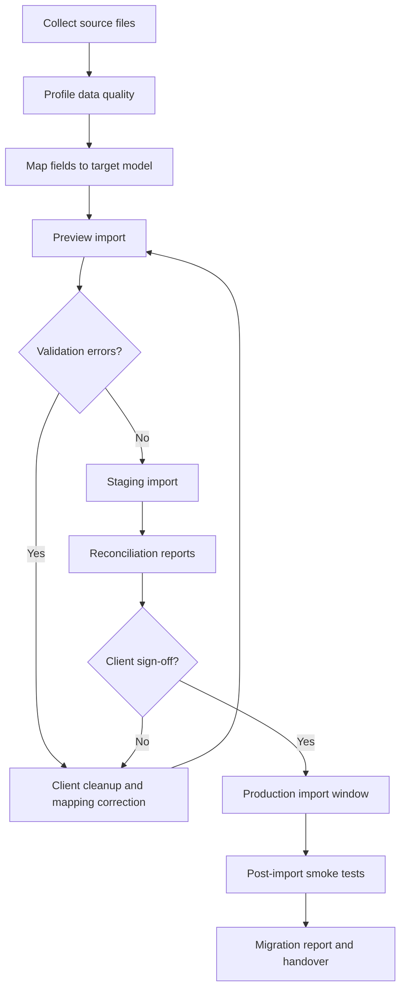

# Data Migration Plan

## AI-Powered Residential Site Management CRM

Version: 0.3
Date: 26 June 2026
Prepared for: Data migration, import validation and launch readiness
Prepared by: 1Cati / Product and Engineering
Primary migration scope: 769 flats, owners, tenants, staff, opening balances, documents and operational history where available

---

<!-- DOC-UPGRADE:BEGIN -->
## Executive At-A-Glance

- Day-one trust depends on accurate flats, relationships, opening balances, deposits, active bookings, open tickets and essential documents.
- Migration must use preview, validation, staging import, reconciliation and client sign-off before production cutover.
- Historical data should be migrated only when it is useful, legally appropriate and clean enough to avoid production confusion.

## Reader Guide

| Item | Detail |
|---|---|
| Document type | Data Migration Plan |
| Primary audience | Data migration, product, engineering, finance and client operations |
| Status | Current delivery baseline v0.3 |
| Last reconciled | 26 June 2026 |
| Confidentiality | STRICTLY CONFIDENTIAL |

## Visual Navigation

- Migration Workflow (source retained in this Markdown; regenerate a rendered diagram only when a stakeholder export explicitly needs it)
<!-- DOC-UPGRADE:END -->

## Current Migration Baseline

As of 26 June 2026, local Supabase migrations and seed data exist for realistic development and review. Production migration still requires client-approved source files, mapping sign-off, reconciliation, cloud Supabase setup, RLS/security verification and UAT acceptance.

Do not treat seeded local data as final production data.

## 1. Executive Summary

Data migration will decide whether the platform feels trustworthy on day one. The first production migration should focus on correct active records: flats, owner/tenant relationships, user contacts, staff, account opening balances, current debts, deposits, active bookings, open service requests and essential documents.

Historical data should be migrated only where it has business value and acceptable quality. Poor history should not be imported blindly into the production ledger or audit trail.

---

## 2. Migration Workflow

<!-- DIAGRAM:migration-01-migration-workflow:BEGIN -->
_Diagram: Migration Workflow. Source is included below; regenerate a rendered diagram only when a stakeholder export explicitly needs it._

_Figure: Migration Workflow. Source retained in this document for regeneration._

Mermaid source

<!-- DIAGRAM:migration-01-migration-workflow:END -->

---

## 3. Source Inventory

| Source | Expected Content | Migration Priority |
|---|---|---|
| Flat list | Site, block, floor, number, type, status | Critical |
| Owner list | Owner identity, contact, linked flats | Critical |
| Tenant list | Tenant identity, contact, occupancy dates, permissions | Critical |
| Staff list | Staff role, team, contact, employment status | Critical |
| Accounting export | Opening balances, debts, payments, deposits | Critical |
| Service history | Open requests, recent completed work, categories | High if available |
| Booking history | Active/future bookings, deposits, checkout status | High if available |
| Documents | Contracts, statements, identity files, rules, notices | High, with legal review |
| Communication history | Emails/SMS/chat | Optional unless required |
| Access list | Cards, access IDs, active/inactive status | Integration-dependent |

---

## 4. Data Quality Rules

| Data Area | Validation Rule |
|---|---|
| Flats | Block/floor/flat combination must be unique |
| Users | Duplicate email/phone/identity candidates must be flagged |
| Relationships | Owner/tenant must link to an existing flat |
| Occupancy | Dates must not overlap without approved reason |
| Finance | Opening balance must map to an account and source file row |
| Deposits | Deposit must link to booking/flat/user where possible |
| Documents | Document owner, type and visibility must be defined |
| Access | External card/access IDs must not be stored as user IDs |

---

## 5. Reconciliation Reports

The migration cannot be accepted by file count alone. It needs reconciliation reports:

- Total flats imported vs expected 769.
- Flats by block/floor/status.
- Owners imported and linked to flats.
- Tenants imported and linked to flats.
- Duplicate people candidates.
- Accounts created.
- Opening balances by account and total.
- Debts by age bucket.
- Deposits imported and linked.
- Documents imported by type and visibility.
- Open bookings and open tickets imported.
- Rejected rows with clear reasons.

---

## 6. Migration Cutover Plan

| Step | Action | Owner |
|---|---|---|
| 1 | Freeze source spreadsheets/exports | Client operations |
| 2 | Run final validation import in staging | Data lead |
| 3 | Review reconciliation report | Client and finance lead |
| 4 | Approve production import window | Steering group |
| 5 | Backup production database before import | Engineering lead |
| 6 | Run production import | Data/engineering lead |
| 7 | Run smoke tests and reconciliation | QA/data lead |
| 8 | Client signs migration acceptance | Client owner |

---

## 7. Migration Risks

| Risk | Mitigation |
|---|---|
| Duplicate users | Candidate matching, manual merge queue, no silent overwrite |
| Wrong opening balances | Finance reconciliation and accountant sign-off |
| Missing flat relationships | Import preview errors and client correction file |
| Bad encoding/language | UTF-8 normalization and sample import review |
| Sensitive document overexposure | Default private visibility and permission mapping |
| Historical data inconsistency | Import active records first; migrate history only by approved scope |

---

## 8. Acceptance Criteria

- 100% of expected flats imported or explained.
- Owner/tenant/staff records have accepted duplicate handling.
- Opening balances reconcile to approved source totals.
- Import errors are visible and resolved or accepted.
- Sensitive documents are not publicly accessible.
- Migration report is stored with source file versions and sign-off.
