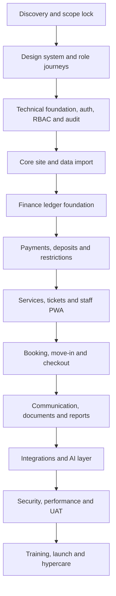

# Implementation Delivery Plan

## AI-Powered Residential Site Management CRM

Version: 0.3
Date: 26 June 2026
Prepared for: Delivery planning, estimation and client governance
Prepared by: 1Cati / Product and Engineering
Primary delivery model: Phased web application and installable PWA

---

<!-- DOC-UPGRADE:BEGIN -->
## Executive At-A-Glance

- Delivery should proceed through controlled phases because finance, restrictions, services, bookings, access and audit are tightly connected.
- Each phase should produce a usable business capability with evidence, not only static screens or isolated backend tables.
- The delivery model includes governance cadence, decision log, workstream ownership, risks and launch handover assets.

## Reader Guide

| Item | Detail |
|---|---|
| Document type | Implementation Delivery Plan |
| Primary audience | Delivery leadership, product, engineering, client operations and steering group |
| Status | Current delivery baseline v0.3 |
| Last reconciled | 26 June 2026 |
| Confidentiality | STRICTLY CONFIDENTIAL |

## Visual Navigation

- Delivery Workflow (source retained in this Markdown; regenerate a rendered diagram only when a stakeholder export explicitly needs it)
<!-- DOC-UPGRADE:END -->

## Current Delivery Baseline

As of 29 June 2026, the active delivery control model is 15 phases: phases 1-9 are complete as a demo/internal-QA implementation foundation and ready-for-UAT slice, while phases 10-15 remain planned production work under the accelerated delivery target.

This plan defines governance and sequencing. It should not be read as proof that every target phase is production complete.

## 1. Executive Summary

This plan converts the requirements package into a practical delivery model. The product should be delivered in controlled phases because the domains are highly connected: user relationships affect finance, finance affects restrictions, restrictions affect services and bookings, bookings affect deposits and access, and all sensitive actions must be auditable.

The recommended delivery approach is a phased modular monolith. Each phase should produce a usable business capability, not only backend tables or static screens. The first client-facing milestone should be a realistic demo that proves the operating model. Production work should then move through foundation, finance, services, bookings, communication, integrations, AI, QA and launch.

---

## 2. Delivery Principles

- Deliver business workflows, not isolated pages.
- Make finance and audit foundations early.
- Keep PWA mobile workflows in scope from the first usable release.
- Gate sensitive domains with legal/accounting review.
- Build integrations through adapters and test mode first.
- Treat data migration as a workstream, not a final task.
- Keep AI behind source links, role checks and human approval.
- Use UAT evidence before each major phase is accepted.

---

## 3. Delivery Workflow

<!-- DIAGRAM:implementation-01-delivery-workflow:BEGIN -->
_Diagram: Delivery Workflow. Source is included below; regenerate a rendered diagram only when a stakeholder export explicitly needs it._

_Figure: Delivery Workflow. Source retained in this document for regeneration._

Mermaid source

<!-- DIAGRAM:implementation-01-delivery-workflow:END -->

---

## 4. Phase Plan

| Phase | Business Outcome | Key Deliverables | Acceptance Gate |
|---|---|---|---|
| 1. Discovery and lock | Shared decision baseline | Final questions, data inventory, legal assumptions, integration inventory | Scope and assumptions signed |
| 2. UX and navigation | Role journeys are clear | Design system, route map, mobile PWA patterns, clickable workflows | Manager/resident/staff/accountant journeys approved |
| 3. Platform foundation | Secure access foundation | Auth, RBAC, RLS, audit log, protected route shell | Unauthorized access blocked and logged |
| 4. Site data | 769-flat model is usable | Site/block/floor/flat schema, import preview, flat matrix | 769 flats load and filter correctly |
| 5. People and roles | Owners, tenants and staff are mapped | Profiles, relationships, staff groups, identity status | Users link to flats with correct permissions |
| 6. Ledger | Finance has a reliable base | Accounts, journal entries, balances, reversals, statements | Balances reconcile to ledger lines |
| 7. Payments and restrictions | Debt affects operations safely | Payment intents, deposits, reconciliation, restriction engine | Restrictions enforced by backend rules |
| 8. Services and tickets | Requests become managed work | Catalogue, service order, ticket creation, SLA, assignment | Accepted service always creates trackable task |
| 9. Staff execution | Field work is visible | Staff PWA, media upload, completion report, tour control | Staff completes task from mobile with proof |
| 10. Booking and checkout | Move-in/out is controlled | Availability, booking, deposit, inspection, settlement, access actions | Mandatory booking/check-in/checkout scenario passes |
| 11. Communication/docs | Official communication is centralized | Chat, announcements, notifications, document vault | Messages and documents respect permissions |
| 12. PWA hardening | Mobile usage is production-ready | Manifest, mobile navigation, performance optimization, push plan | Mobile E2E workflows pass |
| 13. Integrations | External systems are connected safely | Payment/bank/SMS/access adapters, retry queue, health dashboard | No silent integration failure path |
| 14. AI and analytics | Management workload is reduced | AI briefing, recommendations, source links, evaluation set | AI cannot execute restricted actions |
| 15. Launch | Users can adopt safely | UAT, training, runbook, monitoring, hypercare | Go-live checklist accepted |

---

## 5. Workstreams

| Workstream | Owner | Main Responsibility |
|---|---|---|
| Product and scope | Product lead | Scope lock, acceptance criteria, roadmap decisions |
| UX and content | Design lead | Role journeys, Turkish-first UX, resident/staff simplicity |
| Engineering | Engineering lead | Architecture, implementation, code quality, technical gates |
| Data and migration | Data lead | Source inventory, import validation, reconciliation |
| Finance domain | Finance analyst / accountant | Ledger rules, deposits, statements, reconciliation |
| Security and compliance | Security/compliance lead | RBAC/RLS, KVKK, ASVS, audit, retention |
| QA and UAT | QA lead | Test strategy, UAT scripts, release evidence |
| Client operations | Client owner | Business rules, staff processes, training attendance |

---

## 6. Governance Cadence

- Weekly delivery steering: scope, risks, decisions, timeline.
- Twice-weekly product/engineering working session during build phases.
- Weekly data migration checkpoint once source files are available.
- Security/compliance review before finance, access and document features go live.
- UAT readiness review before each major release candidate.
- Daily launch standup during final go-live week and first hypercare week.

---

## 7. Decision Log

| Decision Area | Required Decision | Recommended Default |
|---|---|---|
| Mobile launch scope | Native app or PWA-first | PWA-first, native wrapper later only if approved |
| Payment launch scope | Online provider or manual/bank first | Provider adapter if vendor confirmed; manual/bank fallback |
| Access restriction | Legal and operational boundaries | Human-approved access action queue |
| AI autonomy | What AI can execute | Recommendation only for sensitive actions |
| Hosting and data residency | Supabase/Vercel region choice | Confirm with client/legal before production |
| Data migration | Historical depth | Opening balances plus active users/flats first; history by priority |

---

## 8. Delivery Risks And Mitigations

| Risk | Impact | Mitigation |
|---|---|---|
| Data quality is poor | Setup delay and trust issues | Import preview, error report, reconciliation sign-off |
| Finance rules are unclear | Wrong balances or disputes | Accountant workshops and ledger acceptance tests |
| Access blocking creates legal risk | Operational and legal escalation | Legal review, human approval and manual fallback |
| Integration vendor is not ready | Delay to payments/access/meter features | Adapter pattern and manual/import fallback |
| Native app expectation returns | Scope and budget expansion | Written PWA-first decision and optional later phase |
| AI overreach | Unsafe recommendations | Guardrails, source links, evaluation and approval queue |

---

## 9. Delivery Definition Of Done

- Feature is connected to the relevant domain data, not mocked in production.
- Role permissions are enforced server-side.
- Sensitive writes create audit logs.
- Acceptance criteria have test evidence.
- Mobile behavior is checked for resident/staff workflows.
- Turkish copy is reviewed for clarity and tone.
- Documentation and training notes are updated.
- Open risks are documented with an owner.

---

## 10. Handover Package

The final launch handover should include:

- Production architecture summary.
- Environment and deployment notes.
- Admin and support playbook.
- Data migration report.
- UAT evidence.
- Security/compliance checklist.
- Backup/restore procedure.
- Role-based training material.
- Post-launch adoption report template.
