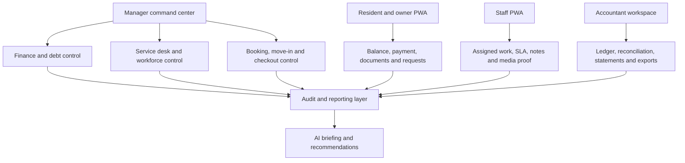
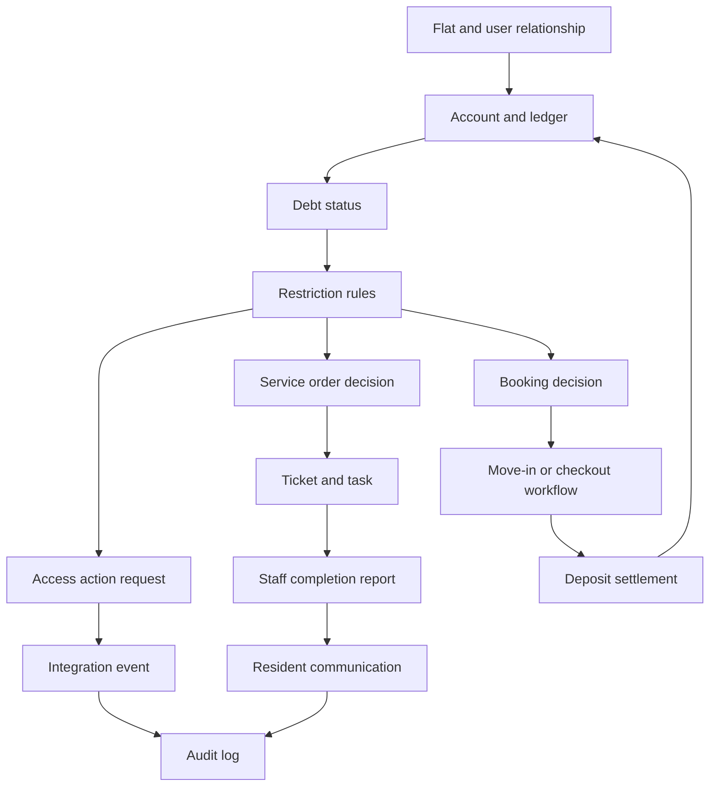

# Product Requirements Document

## AI-Powered Residential Site Management CRM

Version: 0.3
Date: 26 June 2026
Prepared for: Product, design, engineering, QA and delivery teams
Related documents:

- BRD: `docs/requirements/option-3-ai-site-crm/BRD.md`
- TRD: `docs/requirements/option-3-ai-site-crm/TRD.md`
- Market Annex: `docs/requirements/option-3-ai-site-crm/Market-Research-Annex.md`

---

<!-- DOC-UPGRADE:BEGIN -->
## Executive At-A-Glance

- The MVP should prove the operating model: 769 flats, role access, ledger basics, service desk and PWA workflows.
- V1 adds payments, deposits, restrictions, bookings, communication, documents, reports and AI assistant v1.
- V2 expands integrations, meter/billing, advanced reconciliation, predictive AI and optional native wrappers.

## Reader Guide

| Item | Detail |
|---|---|
| Document type | Product Requirements Document |
| Primary audience | Product, design, engineering, QA and delivery teams |
| Status | Current delivery baseline v0.3 |
| Last reconciled | 29 June 2026 |
| Confidentiality | STRICTLY CONFIDENTIAL |

## Visual Navigation

- Product Roadmap (source retained in this Markdown; regenerate a rendered diagram only when a stakeholder export explicitly needs it)
- Product Operating Model (source retained in this Markdown; regenerate a rendered diagram only when a stakeholder export explicitly needs it)
- Product Module Interaction Model (source retained in this Markdown; regenerate a rendered diagram only when a stakeholder export explicitly needs it)
<!-- DOC-UPGRADE:END -->

## Current Delivery Baseline

This PRD defines the product target and acceptance criteria. It must be read together with `docs/PROJECT-HANDBOOK.md` for current implementation status.

As of 29 June 2026, phases 1-7 are complete as a demo/internal-QA implementation foundation, with production activation still dependent on real client data, provider decisions, accounting/legal review and UAT. Phases 8-15 are under an accelerated Codex-assisted delivery target for completion by Wednesday 8 July 2026, excluding full exploratory manual testing. This target includes implementation, unit checks, automated E2E/regression scripts and browser smoke checks; a separate exploratory manual QA/UAT round should be planned after development if required. Product requirements below are target scope unless a section explicitly says the capability is already implemented.

## 1. Executive Summary

### Problem Statement

The client needs to manage a 769-flat residential complex with owners, tenants, staff, accounting, payments, services, bookings, deposits, debt restrictions, access rules, communication, reporting and audit history. The current implemented concept is a useful foundation, but the required product is a full site management operating platform.

### Proposed Solution

Build a Turkish-first AI-powered residential site management CRM as a responsive web application and installable PWA. The product will cover the client's mandatory requirements and add premium capabilities such as AI manager briefing, AI service triage, debt-risk insights, anomaly detection, workflow automation, modern dashboards and auditable operations.

### Success Criteria

- 100% of 769 flats can be represented with block, floor, status, owner/tenant relationship and account state.
- 100% of financial activity is recorded through an auditable ledger.
- 100% of accepted service requests create trackable tickets/tasks.
- Mandatory scenarios pass UAT: service order, tenant move-in, checkout and late-payment/debt restriction.
- Resident, staff and manager PWA workflows pass mobile viewport E2E tests.
- AI suggestions are source-linked, permission-aware and blocked from direct finance/access execution.

---

## 2. Market And Competitive Context

### 2.1 Turkish Top-Five Benchmark

The product must compete against or at least be credible beside the following Turkish market benchmarks:

1. Apsiyon: broad site/apartment management suite with aidat, bank integration, card collection, reservation, access control, meter/billing, e-mail/SMS, mobile and AI positioning.
2. Senyonet: site/facility management platform with public relations, finance, accounting, security, requests, announcements, events, reservations, document management, support and training.
3. Yönetimcell: simple site/apartment program with aidat tracking, bank integration, credit card/Masterpass collection, resident payments, reports, Excel export, manager/resident apps and staff job tracking.
4. Aidatım: hybrid software/service model with private assistant, accounting/legal support, setup/migration, smart bank matching, reports, meter reading, e-mail/SMS and account sharing.
5. Siteplus: adjacent integrated-facility-management benchmark with professional site management, security, cleaning, alarm monitoring, landscaping and technical maintenance/repair.

### 2.2 Product Positioning

The product should be positioned as:

> A premium AI-powered residential site operating system for Turkish complexes, combining finance, services, bookings, access, communication, reporting and management intelligence in one secure web platform.

### 2.3 Differentiation

The strongest differentiators are:

- PWA-first delivery for fast launch without native app delay.
- True service desk/ticketing module.
- Ledger-based finance engine.
- Debt restriction workflows with audit and human override.
- AI manager/accountant/resident/staff assistants.
- Turkish-first service psychology.
- Support for professional facility operations, not only resident payments.

---

## 3. User Personas

### 3.1 Administrator

As an administrator, I need full configuration access so that the system can be safely operated, secured and maintained.

### 3.2 Site Manager

As a site manager, I need one dashboard for debts, tasks, bookings, access issues, resident communication and AI recommendations so that I can control daily operations.

### 3.3 Accountant

As an accountant, I need accurate ledgers, accruals, payments, deposits, refunds, reconciliation and reports so that financial records are correct and auditable.

### 3.4 Owner

As an owner, I need to see my balance, payments, statements, tenant/rental information, documents and service requests so that I can manage my flat transparently.

### 3.5 Tenant

As a tenant, I need to pay allowed balances, request services, receive notifications, chat with management and access permitted documents so that I can handle daily needs without calling management.

### 3.6 Staff / Technician / Security

As staff, I need assigned tasks, SLA, location details, notes, photo/video upload and completion controls so that I can complete work correctly from my phone.

---

## 4. Product Scope

### 4.1 In Scope For Launch

- Web admin app.
- Installable PWA for manager, resident, owner, tenant and staff workflows.
- Site/block/floor/flat data model.
- User, role and permission management.
- Owner/tenant/staff profiles.
- Finance ledger.
- Accruals, payments, deposits, refunds and statements.
- Debt restriction rules.
- Service catalogue.
- Service order workflow.
- Ticket/task management.
- SLA and media reports.
- Booking, move-in and checkout workflows.
- Chat, announcements, notifications and documents.
- Reporting dashboard.
- Integration-ready architecture.
- AI assistant and recommendation layer with human approval.
- Audit logs.
- QA, UAT, security and launch support.

### 4.2 Out Of Scope For Launch

- Native iOS app.
- Native Android app.
- Full offline-first operation.
- Fully autonomous AI financial actions.
- Fully autonomous AI access actions.
- Full camera video storage unless legally and technically approved.
- Payroll/leave as a first-launch module.
- Complex ERP integration unless separately scoped.

---

## 5. Functional Requirements By Module

### 5.1 Core Site Data

User stories:

- As a manager, I want to view all 769 flats by block/floor so that I can understand the site at a glance.
- As an admin, I want to import flats from Excel so that setup is faster.
- As a manager, I want to filter flats by debt, status, owner and tenant so that I can find operational problems quickly.

Acceptance criteria:

- Flat records include site, block, floor, number, type and status.
- Import preview validates duplicates and missing fields before commit.
- Flat matrix supports all 769 flats.
- Flat history is not overwritten when owner/tenant changes.

### 5.2 User And Role Management

User stories:

- As an admin, I want to assign users to roles so that permissions are controlled.
- As a manager, I want to link owners and tenants to flats so that communication and finance are correct.
- As an owner, I want tenant permissions to be controlled so that private owner data is protected.

Acceptance criteria:

- Roles include owner, tenant, staff, manager, accountant and admin.
- Users can be linked to one or more flats.
- Tenant permissions can be limited.
- Document visibility follows role and relationship rules.

### 5.3 Finance Ledger

User stories:

- As an accountant, I want balances calculated from ledger entries so that records are reliable.
- As an owner, I want to see transaction history so that I understand my balance.
- As a manager, I want debt reports so that collection can be managed.

Acceptance criteria:

- Financial entries cannot be deleted after posting.
- Reversals reference original entries.
- Balance equals ledger total.
- Statements can be exported.

### 5.4 Payments, Deposits And Restrictions

User stories:

- As a resident, I want to pay online so that I can clear my balance quickly.
- As an accountant, I want payment reconciliation so that bank/provider records match accounts.
- As a manager, I want debt restrictions so that unpaid balances affect services/bookings/access according to policy.

Acceptance criteria:

- Duplicate payment webhooks do not double-post.
- Deposits can be blocked, used and refunded with audit history.
- Debt restrictions are enforced by backend APIs.
- Users see clear payment guidance when blocked.

### 5.5 Service Catalogue And Tickets

User stories:

- As a tenant, I want to request cleaning, transfer, repair or tour services so that I can get help.
- As a manager, I want every service request to create a ticket so that work is trackable.
- As staff, I want clear assigned tasks so that I know what to do next.

Acceptance criteria:

- Service order checks debt before acceptance.
- Paid service requires payment/debit before task creation.
- Every accepted service order creates a ticket/task.
- Ticket includes status, priority, SLA and assignee.

### 5.6 Workforce, SLA And Media Reports

User stories:

- As staff, I want to upload photo/video completion evidence so that work can be verified.
- As a manager, I want overdue tasks highlighted so that service quality is controlled.
- As a resident, I want to track service progress so that I know what is happening.

Acceptance criteria:

- Staff can complete a ticket from mobile web.
- Required media categories enforce upload before completion.
- SLA breach is visible on dashboard.
- Internal notes are not exposed to residents.

### 5.7 Booking, Move-In And Checkout

User stories:

- As a manager, I want availability calendar so that bookings do not overlap.
- As an accountant, I want deposits linked to booking so that checkout settlement is accurate.
- As a manager, I want checkout workflow so that debts, damages, refunds and access are handled correctly.

Acceptance criteria:

- Overlapping bookings are blocked.
- Move-in creates preparation tasks.
- Checkout requires inspection and settlement.
- Access activation/deactivation creates auditable request.

### 5.8 Communication And Documents

User stories:

- As a resident, I want to chat with management so that issues stay in one place.
- As a manager, I want announcements so that I can communicate with the right audience.
- As an owner, I want documents and statements so that records are accessible.

Acceptance criteria:

- Threads can link to flat, ticket, booking or account.
- Notification delivery status is logged.
- Documents have permission controls.
- Sensitive document access is auditable where required.

### 5.9 Reporting And Dashboard

User stories:

- As a manager, I want a dashboard showing income, debt, tasks and bookings so that I can prioritize.
- As an accountant, I want exportable financial reports so that I can work with external records.
- As management, I want staff and SLA reports so that service quality can be measured.

Acceptance criteria:

- Dashboard data comes from backend views/services.
- Reports support filters and date ranges.
- Reports export to Excel/CSV and PDF where required.
- Metrics drill down to source records.

### 5.10 AI Layer

User stories:

- As a manager, I want an AI daily briefing so that I know what needs attention.
- As an accountant, I want AI to explain balance anomalies so that I can investigate faster.
- As staff, I want AI to prioritize tasks so that urgent work is not missed.
- As a resident, I want AI help for simple questions so that I get answers faster.

Acceptance criteria:

- AI output is logged.
- AI recommendations include source/context.
- AI cannot post payments, refund deposits or change access directly.
- AI respects RBAC and data permissions.
- AI Turkish tone is professional and respectful.

---

## 6. UX Requirements

- Turkish-first interface.
- Clear navigation for each role.
- Calm, professional visual system.
- Dashboard optimized for scanning.
- Resident flows must be short and simple.
- Staff flows must be mobile-first.
- Accountant screens must prioritize precision, filters and exports.
- Debt and restriction messages must be clear and respectful.
- Critical workflows must use guided wizards.
- Mobile PWA must support common Android and iOS browsers.

---

## 7. AI System Requirements

### 7.1 AI Tools Required

- Natural language assistant.
- Retrieval over authorized system data.
- Prompt templates per role.
- AI recommendation queue.
- Approval/decline workflow.
- AI event log.
- AI evaluation set.

### 7.2 AI Evaluation Strategy

AI must be evaluated against:

- Service category classification.
- Urgency detection.
- Debt summary accuracy.
- Ledger explanation accuracy.
- Turkish language quality.
- Permission boundary safety.
- Refusal behavior for restricted actions.

### 7.3 AI Non-Goals

- No autonomous payments.
- No autonomous refunds.
- No autonomous access changes.
- No final legal advice.
- No hidden data access across roles.

---

## 8. Edge Cases

The product must handle:

- Multiple owners for one flat.
- One owner with multiple flats.
- Tenant permission restrictions.
- Duplicate imports.
- Partial payments.
- Overpayments.
- Duplicate/delayed payment webhooks.
- Deposit shortfall.
- Emergency service override.
- Debt threshold changes.
- Booking overlap.
- Checkout without tenant cooperation.
- Failed access integration.
- Failed SMS/email delivery.
- Media upload failure.
- Staff internal-note privacy.
- AI hallucination.
- AI unauthorized action attempt.
- KVKK-sensitive document and media handling.

---

## 9. Technical Specifications Summary

Architecture:

- Next.js 16 App Router.
- React 19.
- TypeScript.
- Tailwind CSS v4.
- Supabase Auth.
- Supabase PostgreSQL.
- Row Level Security.
- Supabase Storage/S3-compatible storage.
- Supabase Realtime where suitable.
- PostgreSQL full-text search.
- pgvector for AI retrieval.
- Optional FastAPI/LangGraph worker for advanced AI orchestration.

Security:

- RBAC.
- RLS.
- Audit logs.
- Idempotency keys.
- Validation.
- KVKK-aware data handling.
- OWASP ASVS-aligned security checks.

Testing:

- Unit tests for finance, restrictions, deposits and permissions.
- Integration tests for payments, access, notifications and RLS.
- Playwright E2E for mandatory scenarios.
- AI evaluation tests.

---

## 10. Roadmap

### MVP

- Core site/flat data.
- User/role model.
- Finance ledger basics.
- Service/ticket workflow.
- Basic PWA resident/staff screens.
- Dashboard.

### V1

- Payments.
- Deposits.
- Debt restrictions.
- Booking/move-in/checkout.
- Communication/documents.
- Reports.
- AI manager/accountant assistant v1.

### V2

- Access integrations.
- Meter/billing integration.
- Advanced reconciliation.
- Advanced AI anomaly detection.
- Native app wrapper only if explicitly approved.
- Expanded professional facility management workflows.

---

## 11. Product Operating Model

The product should be understood as four connected experiences, not one generic CRM screen. Each experience has a different job and therefore a different product standard.

<!-- DIAGRAM:prd-01-product-operating-model:BEGIN -->
_Diagram: Product Operating Model. Source is included below; regenerate a rendered diagram only when a stakeholder export explicitly needs it._

_Figure: Product Operating Model. Source retained in this document for regeneration._

Mermaid source

<!-- DIAGRAM:prd-01-product-operating-model:END -->

Product implication:

- Manager screens should prioritize control, exceptions and approvals.
- Resident screens should prioritize simplicity, trust and fast completion.
- Staff screens should prioritize mobile task execution and proof of work.
- Accountant screens should prioritize accuracy, filters, exports and audit trail.

---

## 12. Product Module Interaction Model

The main product risk is treating modules as separate pages. The platform only works if finance, restrictions, tickets, bookings, access and communications share one operational state.

<!-- DIAGRAM:prd-02-product-module-interaction-model:BEGIN -->
_Diagram: Product Module Interaction Model. Source is included below; regenerate a rendered diagram only when a stakeholder export explicitly needs it._

_Figure: Product Module Interaction Model. Source retained in this document for regeneration._

Mermaid source

<!-- DIAGRAM:prd-02-product-module-interaction-model:END -->

Design rule:

- A user should never need to understand the internal module boundaries.
- Every module should show the current state, the next action and the reason behind any block.
- Critical actions must explain the source record: debt amount, booking, ticket, deposit, access request or approval.

---

## 13. Screen And Workflow Inventory

| Area | Primary Screens | Must Support | Product Quality Bar |
|---|---|---|---|
| Manager command center | Dashboard, debt list, task board, booking calendar, approvals, AI briefing | Exception review, assignment, approval, communication | Clear priorities and no hidden operational risk |
| Resident/owner PWA | Home, balance, payment, service request, booking status, documents, chat | Fast mobile completion and simple language | Fewer steps, clear receipts, respectful debt messaging |
| Staff PWA | Task list, task detail, route/checkpoint, media upload, completion form | Mobile execution, SLA visibility, offline draft where feasible | No administrative clutter during field work |
| Accountant workspace | Ledger, accruals, payments, deposits, reconciliation, reports, exports | Accuracy, reversals, audit trail, statement generation | Finance actions are traceable and hard to misuse |
| Admin workspace | Roles, permissions, site setup, integrations, rules, audit logs | Safe configuration and controlled overrides | Dangerous settings are explicit and logged |
| AI command center | Briefing, recommendations, approval queue, evaluation results | Source-linked recommendations and human approval | AI is useful but never silently authoritative |

---

## 14. MVP Acceptance Matrix

| Capability | MVP Acceptance Standard | Evidence Required |
|---|---|---|
| 769-flat model | Blocks, floors, flats, status and relationships load correctly | Seed/import result and flat matrix review |
| Role model | Admin, manager, accountant, owner, tenant and staff permissions work | Role-based navigation and blocked access tests |
| Ledger basics | Balances are derived from ledger lines, not editable totals | Unit tests and accountant review scenario |
| Service desk | Accepted service request always creates a ticket/task | E2E test and audit log record |
| Staff mobile flow | Staff can open, update and complete a task with media | Mobile viewport Playwright test |
| Resident PWA flow | Resident can view balance, submit request and see status | Mobile viewport Playwright test |
| Dashboard | Manager sees debt, tickets, bookings and risk priorities | Dashboard source-data drill-down |
| AI guardrails | AI cannot execute payment, refund, ledger or access changes | AI safety test cases |
| Audit log | Critical writes create actor, timestamp and entity history | Audit log inspection |

---

## 15. Risks

- Finance logic errors could create trust and legal issues.
- Access restriction rules need legal review.
- Payment/bank integrations depend on vendor selection.
- Native mobile demand could expand scope if not controlled.
- AI must be guarded to prevent unsafe decisions.
- Data migration quality may affect launch timeline.
- Turkish copy and support quality will heavily affect adoption.

---

## 16. PRD Approval Checklist

- Problem and solution approved.
- PWA-first scope approved.
- Native mobile launch exclusion approved.
- Turkish top-five benchmark reviewed.
- Functional requirements approved.
- Product operating model approved.
- Module interaction model approved.
- MVP acceptance matrix approved.
- Edge cases reviewed.
- AI guardrails approved.
- Technical architecture accepted.
- MVP/V1/V2 roadmap approved.
