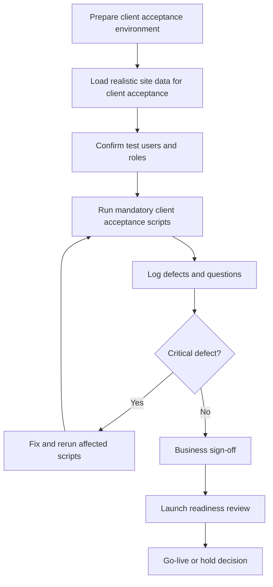

# QA and Client Acceptance Launch Plan

## AI-Powered Residential Site Management CRM

Version: 0.3
Date: 26 June 2026
Prepared for: QA, client acceptance, release management and launch readiness
Prepared by: 1Cati / Product and Engineering
Primary goal: Launch safely with tested workflows, trained users and clear support ownership

---

<!-- DOC-UPGRADE:BEGIN -->
## Executive At-A-Glance

- QA must prove business correctness across finance, service tickets, bookings, access, documents, reports, AI and role permissions.
- Mandatory client acceptance scenarios should block launch when critical or high defects remain unresolved.
- Launch readiness requires test evidence, security checks, migration reconciliation, training and support ownership.

## Reader Guide

| Item | Detail |
|---|---|
| Document type | QA and Client Acceptance Launch Plan |
| Primary audience | QA, product, engineering, delivery leadership and client operations |
| Status | Current delivery baseline v0.3 |
| Last reconciled | 26 June 2026 |
| Confidentiality | STRICTLY CONFIDENTIAL |

## Visual Navigation

- Client Acceptance Workflow (source retained in this Markdown; regenerate a rendered diagram only when a stakeholder export explicitly needs it)
<!-- DOC-UPGRADE:END -->

## Current QA Baseline

As of 26 June 2026, repeatable QA includes TypeScript/ESLint/build checks, Playwright E2E, phase harnesses, a focused `phase:06-09` regression harness and Jira/Xray dry-run planning. Production launch still requires client acceptance with realistic client data, RLS/security review, migration reconciliation, backup/restore proof and signed launch approval.

Generated screenshots, JSON reports and temporary browser output are disposable unless promoted into a maintained Markdown or DOCX reading copy.

## 1. Executive Summary

The platform handles finance, deposits, resident data, service requests, documents, access actions, AI recommendations and audit history. QA must therefore focus on business correctness and operational trust, not only UI behavior.

The launch should not proceed until the mandatory client scenarios pass: role login, flat lookup, ledger balance, payment/restriction behavior, service ticket, staff completion, booking, move-in, checkout, document permission, reporting and AI guardrail behavior.

---

## 2. Test Strategy

| Layer | Purpose | Example Coverage |
|---|---|---|
| Unit tests | Prove domain rules | Ledger posting, balance calculation, restrictions, deposit settlement, permissions, AI guardrails |
| Integration tests | Prove services work together | Payment webhook idempotency, access action queue, notification delivery, storage permissions, RLS |
| E2E tests | Prove user workflows | Resident service request, debt block, staff completion, manager dashboard, booking and checkout |
| Client acceptance scripts | Prove business acceptance | Client validates scenarios using realistic data |
| Security checks | Prove safe controls | RBAC/RLS, file access, audit logs, ASVS checklist, secrets |
| Performance checks | Prove usability at expected scale | 769-flat dashboard, search, reports, mobile staff/resident flows |

---

## 3. Client Acceptance Workflow

<!-- DIAGRAM:qa-01-client-acceptance-workflow:BEGIN -->
_Diagram: Client Acceptance Workflow. Source is included below; regenerate a rendered diagram only when a stakeholder export explicitly needs it._

_Figure: Client Acceptance Workflow. Source retained in this document for regeneration._

Mermaid source

<!-- DIAGRAM:qa-01-client-acceptance-workflow:END -->

---

## 4. Mandatory Client Acceptance Scenarios

| Scenario | Roles | Acceptance Standard |
|---|---|---|
| Role login and navigation | Admin, manager, accountant, owner, tenant, staff | Each role sees only permitted modules |
| 769-flat lookup | Manager | Flats filter by block, floor, status, owner/tenant and debt |
| Owner balance and statement | Owner, accountant | Balance matches ledger and statement export |
| Tenant service request | Tenant, manager, staff | Request creates service order, ticket and status trail |
| Debt blocks service | Tenant, manager | User sees clear reason and payment path |
| Payment clears restriction | Tenant, accountant | Payment posts once and restriction status updates |
| Staff task completion | Staff, manager | Staff completes task with notes and media proof |
| Booking creation | Manager, accountant | Availability prevents overlap and links deposit |
| Move-in | Manager, staff, tenant | Preparation tasks, access request and welcome notification are created |
| Checkout | Manager, accountant | Inspection, debt check, settlement and access action are complete |
| Document access | Owner, tenant, staff | Users cannot view unauthorized documents |
| AI recommendation | Manager, accountant | AI shows sources and cannot execute restricted action |
| Reporting | Manager, accountant | Dashboard and exports match source records |

---

## 5. Defect Severity Model

| Severity | Definition | Launch Impact |
|---|---|---|
| Critical | Finance corruption, role data leak, broken login, lost payment/access event | Blocks launch |
| High | Mandatory workflow blocked or incorrect audit/restriction behavior | Blocks launch unless formal waiver |
| Medium | Workaround exists but workflow is inefficient or confusing | Fix before launch if in core flow |
| Low | Cosmetic or low-impact content issue | Can move to launch backlog |

---

## 6. Release Gates

| Gate | Required Evidence | Owner |
|---|---|---|
| Feature complete | Scope checklist and demo | Product lead |
| Test complete | Unit/integration/E2E/client acceptance evidence | QA lead |
| Security ready | RBAC/RLS, ASVS-aligned checklist, secret check | Security lead |
| Data ready | Migration report and reconciliation sign-off | Data lead |
| Operations ready | Support runbook, monitoring, backup/restore evidence | Delivery lead |
| Training ready | Role-based training delivered or scheduled | Client operations |
| Launch decision | Open risks accepted and go-live approved | Steering group |

---

## 7. Launch Runbook

### Pre-Launch

- Freeze scope for launch release.
- Confirm environment variables and secrets.
- Run database migrations in staging.
- Load or verify production seed/migration data.
- Complete backup/restore drill.
- Complete smoke tests in production-like environment.
- Prepare rollback plan.
- Prepare client support contacts.

### Launch Day

- Confirm production deployment.
- Run smoke test: login, dashboard, flat lookup, service request, ledger read, document access.
- Monitor logs, errors, payments/integrations and notification delivery.
- Keep launch bridge open for decision-makers and support.
- Record issues in one launch tracker.

### Hypercare

- Daily issue review for first week.
- Track adoption by role.
- Review support themes.
- Review finance and ticket correctness.
- Produce first-month adoption and stability report.

---

## 8. QA Exit Checklist

- No unresolved critical defects.
- High defects resolved or formally accepted.
- Mandatory client acceptance scenarios passed.
- Role permissions tested.
- Finance ledger tested.
- Debt and restriction behavior tested.
- Mobile PWA workflows tested.
- AI guardrail tests passed.
- Backup/restore evidence exists.
- Launch runbook approved.

