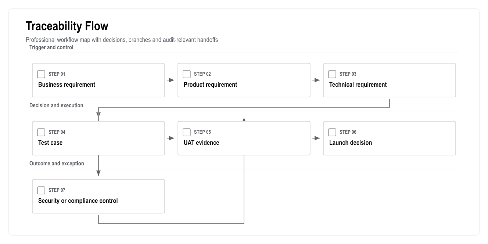
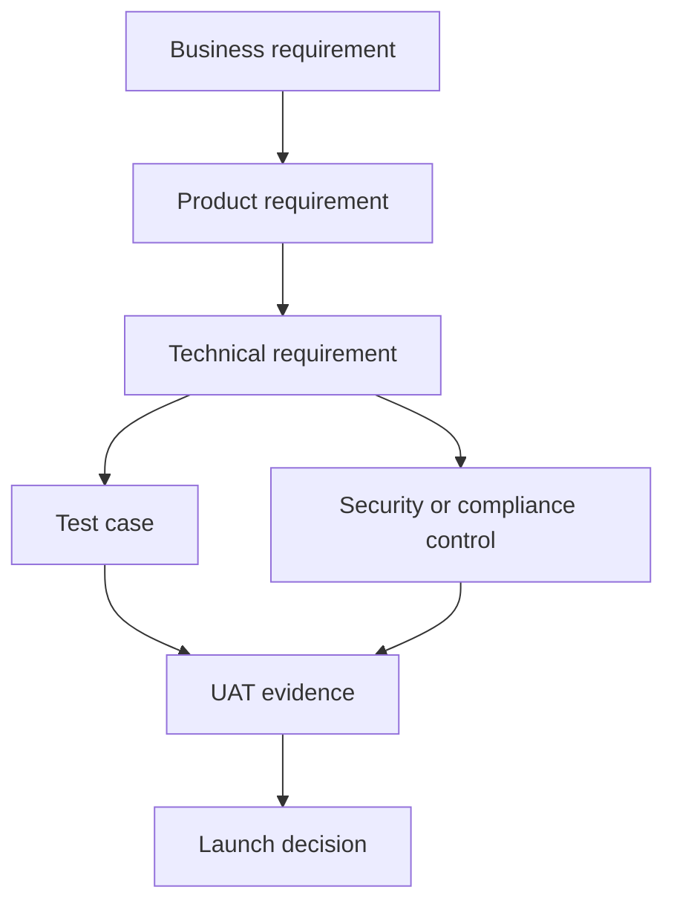

# Requirements Traceability Matrix

## AI-Powered Residential Site Management CRM

Version: 0.2  
Date: 25 June 2026  
Prepared for: Scope control, QA planning and stakeholder sign-off  
Prepared by: 1Cati / Product and Engineering  
Purpose: Connect business needs to product requirements, technical controls and test evidence

---

<!-- DOC-UPGRADE:BEGIN -->
## Executive At-A-Glance

- Traceability prevents business requirements from disappearing between BRD, PRD, TRD, QA and launch planning.
- Every launch requirement should have product coverage, technical coverage, security/compliance controls and acceptance evidence.
- Open traceability items should be resolved or formally accepted before scope lock and launch readiness approval.

## Reader Guide

| Item | Detail |
|---|---|
| Document type | Requirements Traceability Matrix |
| Primary audience | Product, QA, delivery leadership, engineering and client stakeholders |
| Status | Consulting-ready v0.2 |
| Design refresh | 25 June 2026 |
| Confidentiality | STRICTLY CONFIDENTIAL |

## Visual Navigation

- [Traceability Flow](assets/diagrams/traceability-01-traceability-flow.png)
<!-- DOC-UPGRADE:END -->

## 1. Executive Summary

This matrix keeps the documentation package connected. It prevents a common delivery failure: a business requirement appears in the BRD, but the PRD, TRD, test plan or launch checklist does not carry it through.

Each major requirement must have a product owner, a technical owner, acceptance evidence and a release gate. Items without traceability should not be treated as launch-ready.

---

## 2. Traceability Flow

<!-- DIAGRAM:traceability-01-traceability-flow:BEGIN -->

_Figure: Traceability Flow. Generated from the workflow source in this document._

Mermaid source

<!-- DIAGRAM:traceability-01-traceability-flow:END -->

---

## 3. Core Traceability Matrix

| ID | Business Requirement | Product Coverage | Technical Coverage | Acceptance Evidence |
|---|---|---|---|---|
| BR-001 | Represent all 769 flats | Core site data, flat matrix | Site/block/flat schema, import APIs | Import report and flat matrix UAT |
| BR-002 | Role-based access for all users | User and role management | Supabase Auth, RBAC, RLS | Role navigation and blocked access tests |
| BR-003 | Reliable finance balances | Finance ledger | Journal entries, balances, reversals | Ledger unit tests and accountant UAT |
| BR-004 | Payments and reconciliation | Payments/deposits module | Payment intents, webhooks, idempotency | Payment integration tests |
| BR-005 | Debt restrictions | Restriction rules | Restriction engine, backend checks | Debt-block E2E and legal approval |
| BR-006 | Service requests become work | Service catalogue and tickets | Service orders, tickets, SLA events | Service request E2E |
| BR-007 | Staff completion evidence | Workforce and media reports | Storage, media reports, ticket events | Mobile staff E2E |
| BR-008 | Booking, move-in and checkout | Booking workflows | Availability, deposits, settlement, access queue | Booking/check-in/checkout UAT |
| BR-009 | Communication and documents | Chat, announcements, vault | Message threads, notifications, document permissions | Permission and delivery tests |
| BR-010 | Reporting dashboard | Reporting module | Views/materialized views, exports | Dashboard source-data review |
| BR-011 | AI assistance with guardrails | AI layer | AI events, recommendations, approvals, retrieval | AI eval and restricted-action tests |
| BR-012 | Auditability | Audit module | Immutable audit logs | Audit inspection for critical actions |
| BR-013 | PWA mobile access | Resident/staff/manager PWA | Manifest, mobile shells, responsive routes | Mobile viewport tests |
| BR-014 | Integrations | Integration layer | Adapters, webhooks, retry queue | Integration health and failure tests |
| BR-015 | Security and privacy | Security requirements | RBAC/RLS, storage policies, ASVS checklist | Security launch checklist |

---

## 4. Release Traceability Gates

| Release | Minimum Traceability Evidence |
|---|---|
| Demo | Clickable role journeys, sample data, workflow demonstration |
| MVP | BR-001, BR-002, BR-003, BR-006, BR-007, BR-010, BR-012, BR-013 |
| V1 | MVP plus BR-004, BR-005, BR-008, BR-009, BR-011 |
| V2 | V1 plus BR-014 and advanced AI/analytics |
| Launch | All launch-scoped requirements have UAT evidence and accepted risks |

---

## 5. Open Traceability Items

| Topic | Why It Is Open | Required Decision |
|---|---|---|
| Payment provider | Vendor not confirmed | Choose provider or approve manual/bank-first flow |
| Access vendor | API capability unknown | Confirm vendor, API/export/manual fallback |
| Legal access restriction boundary | Debt-based access action is sensitive | Legal review and client policy approval |
| Data retention | Retention periods not confirmed | Legal/accounting retention policy |
| Native app | Excluded from launch but may return | Written PWA-first approval |
| Meter/camera integrations | Vendor and legal basis unknown | Confirm roadmap vs launch requirement |

---

## 6. Traceability Acceptance Checklist

- Every launch requirement has a product owner.
- Every launch requirement has technical coverage.
- Every sensitive requirement has a security/compliance control.
- Every mandatory scenario has a test case.
- Every UAT result is linked to the requirement it validates.
- Open decisions are tracked before scope lock.

