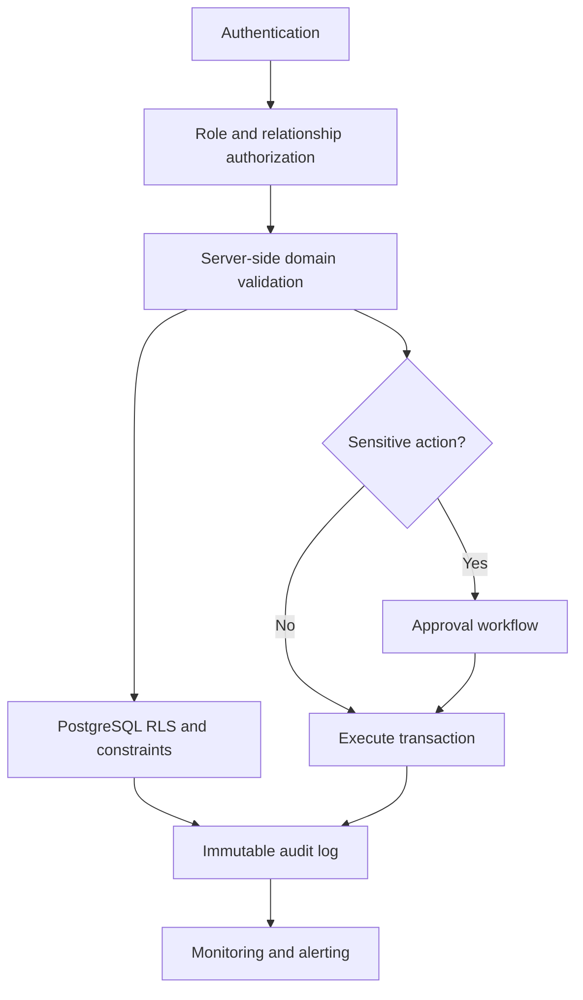

# Security And Compliance Plan

## AI-Powered Residential Site Management CRM

Version: 0.3
Date: 26 June 2026
Prepared for: Security, privacy, compliance and production readiness
Prepared by: 1Cati / Product and Engineering
Reference baseline: KVKK-aware processing and OWASP ASVS-aligned controls

---

<!-- DOC-UPGRADE:BEGIN -->
## Executive At-A-Glance

- The system will process personal, financial, document, media, access and AI-event data, so security must be designed into launch scope.
- Controls should combine authentication, RBAC, RLS, domain validation, audit logs, monitoring and approval workflows.
- Debt-based access restriction, identity data, camera/media handling, payment compliance and retention require legal/accounting review.

## Reader Guide

| Item | Detail |
|---|---|
| Document type | Security And Compliance Plan |
| Primary audience | Security, compliance, engineering, product and client leadership |
| Status | Current delivery baseline v0.3 |
| Last reconciled | 26 June 2026 |
| Confidentiality | STRICTLY CONFIDENTIAL |

## Visual Navigation

- Security Control Model (source retained in this Markdown; regenerate a rendered diagram only when a stakeholder export explicitly needs it)
<!-- DOC-UPGRADE:END -->

## Current Security Baseline

As of 26 June 2026, the repository includes RBAC/RLS-oriented migrations, protected dashboard routing, demo-auth fallback controls, audit-oriented tables and AI approval rules. Production still requires environment hardening, demo-auth removal or strict gating, RLS policy review, storage policy review, secrets review, backup/restore proof and client/legal sign-off for debt/access restrictions.

This document is an engineering and delivery checklist, not a legal opinion.

## 1. Executive Summary

The platform will process personal data, owner/tenant relationships, financial records, documents, media uploads, service communications, access actions and AI events. Security and compliance must be designed into the product from the first production release.

This plan is not a legal opinion. It is a delivery checklist for engineering, product and operations. Debt restriction, access blocking, identity verification, camera data, document retention and payment compliance must still be reviewed by legal/accounting specialists before production launch.

---

## 2. Reference Baseline

| Source | How It Applies |
|---|---|
| KVKK Personal Data Protection Law: https://www.kvkk.gov.tr/Icerik/6649/Personal-Data-Protection-Law | Personal data must be processed lawfully, fairly, purposefully and proportionately |
| OWASP ASVS: https://owasp.org/www-project-application-security-verification-standard/ | Provides a structured baseline for testing web application security controls; current official page references ASVS 5.0.0 |
| web.dev PWA guidance: https://web.dev/learn/pwa/ | PWA should be treated as a modern installable web app with responsive design, service worker and secure delivery practices |

---

## 3. Security Control Model

<!-- DIAGRAM:security-01-security-control-model:BEGIN -->
_Diagram: Security Control Model. Source is included below; regenerate a rendered diagram only when a stakeholder export explicitly needs it._

_Figure: Security Control Model. Source retained in this document for regeneration._

Mermaid source

<!-- DIAGRAM:security-01-security-control-model:END -->

---

## 4. Data Classification

| Data Class | Examples | Required Controls |
|---|---|---|
| Public/marketing | Public landing page content | Normal web publishing controls |
| Operational | Tickets, bookings, service categories, staff assignments | RBAC, audit for status changes, role-specific visibility |
| Personal | Names, contact data, owner/tenant relationships | Purpose limitation, role access, export caution |
| Financial | Ledger, balances, payments, deposits, refunds | Immutable postings, approval, idempotency, audit, restricted exports |
| Sensitive documents | Identity files, contracts, statements, legal notices | Storage permissions, download audit, retention review |
| Media | Task photos/videos, possible access/camera references | Role limits, retention policy, avoid unnecessary storage |
| Access control | Card/barrier IDs, activation/deactivation events | High privilege, approval, manual fallback, audit |
| AI events | Prompts, context, outputs, accepted/declined suggestions | Source links, role filtering, prompt/output logs, retention policy |

---

## 5. Control Matrix

| Area | Required Control | Acceptance Evidence |
|---|---|---|
| Authentication | Supabase Auth, secure session refresh, password reset | Login/logout/session tests |
| Authorization | App-level RBAC plus database RLS | Role-based E2E and RLS tests |
| Finance | Immutable ledger, reversals, idempotency keys | Unit and integration tests |
| Files | Private buckets, signed URLs where needed, permission checks | Unauthorized file access test |
| Audit | Actor, timestamp, entity, action and sensitive before/after context | Audit log inspection |
| Integrations | Signature verification, retry queue, health dashboard | Webhook and failure-mode tests |
| AI | Source-linked, role-filtered, no direct sensitive mutations | AI safety/evaluation tests |
| Secrets | No secrets in client code or repository | Secret scan and env review |
| Logging | Structured logs without unnecessary personal data | Log review |
| Backup | Backup and restore drill | Restore evidence |

---

## 6. Sensitive Workflow Rules

### Finance

- Posted records cannot be edited directly.
- Corrections must use reversal or adjustment entries.
- Refunds require explicit permission and audit.
- Duplicate provider events must not double-post.

### Access

- Access activation/deactivation must be recorded as an action request.
- Manual override requires high privilege, reason and audit.
- Debt-based access restriction requires legal review and client policy approval.
- Failed access integrations must create visible alerts.

### Documents

- Sensitive documents need role and relationship checks.
- Downloads of sensitive documents should be auditable where required.
- Retention and deletion rules require legal/accounting review.

### AI

- AI cannot post payments.
- AI cannot refund deposits.
- AI cannot mutate ledger records.
- AI cannot activate or disable access.
- AI recommendations must show source data and be logged.

---

## 7. Compliance Open Questions

1. Which data residency requirements apply?
2. Which user consent and privacy notices are required?
3. What retention periods apply to financial records, identity documents, media and chat?
4. What is the legal basis for access restriction due to debt?
5. Are camera references or video storage required?
6. Which payment provider compliance rules apply?
7. Who approves refunds, access changes and sensitive exports?
8. Which reports are legally required for site management?

---

## 8. Security Launch Checklist

- RBAC and RLS tests pass.
- Finance integrity tests pass.
- File permission tests pass.
- Integration webhook tests pass.
- Secrets are not committed.
- Audit logs are created for sensitive actions.
- Backup/restore drill is complete.
- AI guardrail tests pass.
- Legal/accounting review is complete for access, debt, payments, identity and retention.
