# Technical Requirements Document

## AI-Powered Residential Site Management CRM

Version: 0.2
Date: 25 June 2026
Prepared for: Internal architecture, estimation and delivery planning  
Prepared by: 1Cati / Product and Engineering  
Related BRD: `docs/requirements/option-3-ai-site-crm/BRD.md`  
Primary delivery model: Web application and installable PWA  
Native mobile scope: Excluded from launch scope unless later approved

---

<!-- DOC-UPGRADE:BEGIN -->
## Executive At-A-Glance

- A modular monolith on Next.js and Supabase is the safest first production architecture because the domains are tightly coupled.
- Finance must be ledger-based, immutable after posting and protected by idempotency, RBAC, RLS and audit logs.
- AI must be source-linked, role-aware and blocked from direct finance, refund, ledger and access-control execution.

## Reader Guide

| Item | Detail |
|---|---|
| Document type | Technical Requirements Document |
| Primary audience | Architecture, engineering, QA, security and implementation teams |
| Status | Consulting-ready v0.2 |
| Design refresh | 25 June 2026 |
| Confidentiality | STRICTLY CONFIDENTIAL |

## Visual Navigation

- [High-Level System Architecture](assets/diagrams/trd-01-high-level-system-architecture.png)
- [Data Model Overview](assets/diagrams/trd-02-data-model-overview.png)
- [Ticket Lifecycle](assets/diagrams/trd-03-ticket-lifecycle.png)
- [Payment Flow](assets/diagrams/trd-04-payment-flow.png)
- [Access Flow](assets/diagrams/trd-05-access-flow.png)
- [Control Architecture](assets/diagrams/trd-06-control-architecture.png)
<!-- DOC-UPGRADE:END -->

## 1. Technical Executive Summary

This TRD defines the technical requirements for building a full residential site management CRM for a 769-flat complex. The system must support site/flat data, users, owners, tenants, staff, finance, payments, deposits, restrictions, services, tickets, bookings, communication, documents, reports, integrations, AI assistance, security, audit logs and PWA access.

The recommended architecture is a modular monolith-first platform using the existing Next.js and Supabase foundation. A modular monolith is the right first production architecture because the product has heavy domain coupling: finance affects service orders, service orders create tasks, bookings create deposits and access actions, and access restrictions depend on debt. Premature microservices would increase delivery risk. The architecture should still be API-first and module-separated so services can be extracted later if scale or team structure demands it.

The launch system should use:

- Next.js App Router for the web app and PWA.
- TypeScript for all application code.
- React 19 for UI.
- Tailwind CSS v4 and shadcn/base UI patterns for the design system.
- Supabase Auth for authentication.
- Supabase PostgreSQL for core data and financial ledger.
- Supabase Row Level Security for data isolation.
- Supabase Storage or S3-compatible storage for documents and media.
- Supabase Realtime for chat, live task updates and dashboard updates where suitable.
- PostgreSQL full-text search and pgvector for AI retrieval.
- Optional FastAPI or separate AI worker service for advanced AI workflows.
- Playwright for end-to-end tests.
- OWASP ASVS-aligned security controls.
- KVKK-aware data handling.

---

## 2. Current Repository Baseline

The current web app already includes:

- Next.js `16.2.6`.
- React `19.2.4`.
- TypeScript.
- Tailwind CSS v4.
- Supabase client packages.
- next-intl.
- next-themes.
- shadcn/base UI dependencies.
- lucide-react icons.
- Playwright E2E testing.
- ESLint, Prettier and typecheck scripts.

Current package commands:

- `pnpm dev`
- `pnpm build`
- `pnpm lint`
- `pnpm typecheck`
- `pnpm test:e2e`

The existing stack is a good foundation for the web/PWA product. The missing parts are the real domain database schema, server-side business logic, finance engine, APIs, workflow orchestration, integrations, AI safety layer, and complete test coverage.

---

## 3. Architecture Principles

### 3.1 Product Architecture Principles

- Web/PWA first.
- API-first backend boundaries.
- Modular domain structure.
- Ledger-based finance.
- Audit-first operations.
- Human approval for sensitive AI actions.
- Turkish-first UX and content.
- Secure by default.
- Integration adapter pattern.
- Incremental delivery by phase.

### 3.2 Technical Architecture Principles

- Use PostgreSQL for transactional consistency.
- Avoid deleting financial records; use reversals.
- Use row-level security for user isolation.
- Use server-side validation for all writes.
- Use idempotency keys for payments and ledger writes.
- Use background jobs for slow or retryable work.
- Use structured audit logs.
- Use feature flags for phased rollout.
- Use type-safe contracts between UI and business logic.
- Use monitoring and alerting from early production.

### 3.3 AI Architecture Principles

- AI assists, recommends and drafts.
- AI does not directly perform financial or access-control actions.
- AI outputs must be logged.
- AI recommendations must include source data.
- AI should be evaluated through a test set.
- AI must respect role permissions and data boundaries.

---

## 4. High-Level System Architecture

<!-- DIAGRAM:trd-01-high-level-system-architecture:BEGIN -->
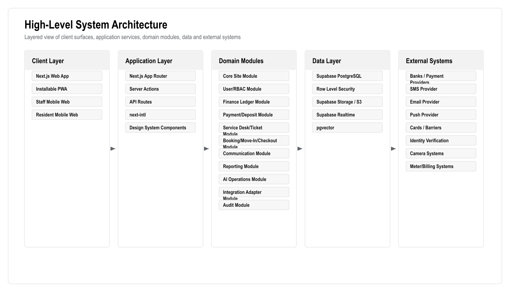

_Figure: High-Level System Architecture. Generated from the workflow source in this document._

Mermaid source

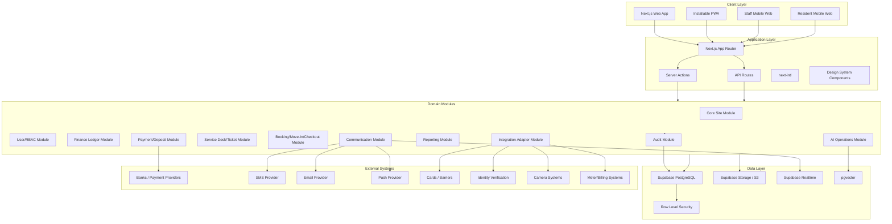

<!-- DIAGRAM:trd-01-high-level-system-architecture:END -->

---

## 5. Recommended Technology Stack

| Layer | Recommended Technology | Reason |
|---|---|---|
| Frontend | Next.js 16 App Router | Already used; supports SSR, routing, API/server actions and PWA-friendly delivery |
| UI | React 19, Tailwind CSS v4, shadcn/base UI, lucide-react | Existing stack; accessible components and consistent design system |
| Language | TypeScript | Type safety for business-critical finance and permissions logic |
| Auth | Supabase Auth | Existing stack and integrates with Supabase database/RLS |
| Database | Supabase PostgreSQL | Strong ACID transactions, relational model, ledger integrity, reporting |
| Authorization | PostgreSQL RLS + app-level RBAC | Defense in depth for owner/tenant/staff data isolation |
| Files | Supabase Storage or S3-compatible storage | Documents, identity files, task photos/videos, reports |
| Realtime | Supabase Realtime | Chat, task status, notification counters, live dashboards |
| Search | PostgreSQL full-text search | Search flats, users, tickets, transactions and documents metadata |
| AI retrieval | pgvector | Retrieve policies, tickets, ledger explanations and knowledge snippets |
| AI orchestration | Next.js server module first; optional FastAPI/LangGraph worker later | Start simple; separate when workflows become heavy |
| Background jobs | Supabase Edge Functions/cron initially; queue service later if needed | Payment reconciliation, reminders, report generation, retries |
| Charts | Recharts or equivalent React charting library | Dashboard and reporting visuals |
| Testing | Playwright, Vitest/React Testing Library if added | E2E and unit coverage |
| Monitoring | Sentry, Vercel logs/analytics, OpenTelemetry where practical | Error tracking and operational visibility |
| Security baseline | OWASP ASVS, KVKK-aware controls | Security and privacy expectations |

---

## 6. Turkish Competitor Technical Implications

The Turkish market benchmark changes the technical scope in practical ways. Apsiyon, Senyonet, Yönetimcell, Aidatım and Siteplus show that the platform must not only display CRM data. It must support finance, resident self-service, reporting, communication, payment collection, work tracking, access/security workflows, support/training and integration readiness.

| Turkish Player | Technical Capabilities To Account For | Required Technical Response |
|---|---|---|
| Apsiyon | Aidat tracking, online bank integrations, card collection, reservations, manager mobile, e-mail/SMS, access control, meter/billing, AI positioning | Keep payments, access, reservations, meter/billing and AI in core architecture/roadmap |
| Senyonet | Communication/public relations, finance, accounting, security, reservations, document management, support/training | Build connected modules, not disconnected pages; include documents, security events and training/support outputs |
| Yönetimcell | Aidat tracking, bank integration, credit card/Masterpass, resident payment view, reporting/Excel export, manager/resident/staff mobile apps, job tracking | PWA must cover mobile use cases; export and staff task tracking are required |
| Aidatım | Private assistant, management software, accounting/legal support, migration/setup, smart bank matching, payroll/leave, reporting, meter reading, e-mail/SMS | Add reconciliation queue, migration tooling, support workflows and future payroll/meter extensibility |
| Siteplus | Integrated facility management, professional site management, security, cleaning, alarm monitoring, landscaping, technical maintenance/repair | Service desk must support real field operations, contractor/staff queues, SLA, media evidence and incident tracking |

Technical design consequences:

- Do not design finance as a dashboard-only module; it must be ledger-based.
- Do not design service as a contact form; it must be a ticketing/workforce module.
- Do not design access as a static status; it must use an action queue and integration adapter.
- Do not design mobile as an afterthought; PWA workflows must be first-class.
- Do not design AI as open chat only; it must be role-aware and source-linked.
- Do not design migration as a manual afterthought; import validation is required.
- Do not design reports as screenshots; Excel/PDF export is required.

---

## 7. Application Surfaces

### 7.1 Web Admin App

Technical responsibilities:

- Admin shell.
- Dashboard.
- Role-based navigation.
- Management screens.
- Accounting screens.
- Service desk.
- Booking.
- Reports.
- Integrations.
- AI command center.

### 7.2 PWA Resident/Owner/Tenant Surface

Technical responsibilities:

- Mobile-responsive layout.
- PWA manifest.
- Service worker where appropriate.
- Balance.
- Payment.
- Service request.
- Booking status.
- Documents.
- Chat.
- Notifications.

### 7.3 Staff PWA Surface

Technical responsibilities:

- Assigned tasks.
- SLA and priority.
- Flat/location detail.
- Photo/video upload.
- Completion form.
- Offline draft capture where feasible.
- Tour control support.

### 7.4 Manager PWA Surface

Technical responsibilities:

- Today's priorities.
- Urgent debt/access/ticket alerts.
- Approvals.
- AI briefing.
- Staff workload.
- Announcements.

---

## 8. Domain Modules

### 8.1 Core Site Module

Responsibilities:

- Site.
- Blocks.
- Floors.
- Flats.
- Flat status.
- Flat metadata.
- Occupancy history.
- Import/export.

Key entities:

- `sites`
- `blocks`
- `flats`
- `flat_status_events`
- `occupancies`
- `import_batches`
- `import_errors`

### 8.2 User And RBAC Module

Responsibilities:

- User profiles.
- Roles.
- Permissions.
- Flat relationships.
- Staff groups.
- Identity status.
- Document access.

Key entities:

- `profiles`
- `roles`
- `permissions`
- `role_permissions`
- `user_roles`
- `staff_groups`
- `staff_group_members`
- `identity_verifications`

### 8.3 Finance Ledger Module

Responsibilities:

- Accounts.
- Journal entries.
- Transactions.
- Accruals.
- Balances.
- Statements.
- Reversals.
- Reports.

Key entities:

- `accounts`
- `journal_entries`
- `journal_lines`
- `transactions`
- `accrual_batches`
- `account_balances`
- `statement_runs`
- `finance_adjustments`

### 8.4 Payment And Deposit Module

Responsibilities:

- Payment intents.
- Manual payment posting.
- Provider webhooks.
- Bank import.
- Reconciliation.
- Deposits.
- Refunds.
- Debt restrictions.

Key entities:

- `payment_intents`
- `payment_events`
- `bank_imports`
- `bank_import_lines`
- `reconciliation_matches`
- `deposits`
- `deposit_events`
- `refund_requests`
- `restriction_rules`
- `restriction_events`

### 8.5 Service Desk And Ticket Module

Responsibilities:

- Service catalogue.
- Service orders.
- Tickets.
- Task assignment.
- SLA.
- Media reports.
- Escalation.
- Tour control.

Key entities:

- `service_catalog`
- `service_orders`
- `tickets`
- `ticket_events`
- `ticket_assignments`
- `ticket_sla_events`
- `media_reports`
- `tour_routes`
- `tour_checkpoints`
- `tour_runs`

### 8.6 Booking, Move-In And Checkout Module

Responsibilities:

- Availability.
- Booking.
- Payment verification.
- Move-in.
- Checkout.
- Deposit settlement.
- Access action generation.

Key entities:

- `bookings`
- `booking_events`
- `availability_blocks`
- `move_in_checklists`
- `checkout_inspections`
- `settlements`
- `access_action_requests`

### 8.7 Communication And Notification Module

Responsibilities:

- Chat.
- Internal communication.
- Announcements.
- Notifications.
- Templates.
- Delivery logs.

Key entities:

- `message_threads`
- `messages`
- `message_participants`
- `announcements`
- `notification_templates`
- `notifications`
- `notification_deliveries`

### 8.8 Documents Module

Responsibilities:

- Document metadata.
- Access permissions.
- Statements.
- Reports.
- Identity files.
- Ticket media.

Key entities:

- `documents`
- `document_permissions`
- `document_versions`
- `generated_documents`

### 8.9 Reporting Module

Responsibilities:

- Dashboard metrics.
- Finance reports.
- Operations reports.
- Booking reports.
- Staff reports.
- Export jobs.

Key entities:

- `report_definitions`
- `report_runs`
- `export_jobs`
- `dashboard_snapshots`

### 8.10 AI Operations Module

Responsibilities:

- AI prompts.
- AI responses.
- AI recommendations.
- AI approvals.
- AI evaluations.
- Retrieval knowledge.

Key entities:

- `ai_events`
- `ai_recommendations`
- `ai_approval_actions`
- `ai_eval_cases`
- `ai_eval_results`
- `knowledge_documents`
- `knowledge_chunks`

### 8.11 Integration Module

Responsibilities:

- Payment providers.
- Banks.
- Identity providers.
- Access systems.
- Cameras.
- Meters.
- SMS/email/push.
- Webhooks.
- Retry queue.

Key entities:

- `integration_connections`
- `integration_credentials`
- `integration_events`
- `webhook_events`
- `integration_retries`
- `integration_health_checks`

### 8.12 Audit Module

Responsibilities:

- Immutable audit records.
- Actor tracking.
- Before/after snapshots.
- IP/device metadata.
- Sensitive action review.

Key entities:

- `audit_logs`
- `security_events`
- `admin_actions`

---

## 9. Data Model Overview

<!-- DIAGRAM:trd-02-data-model-overview:BEGIN -->
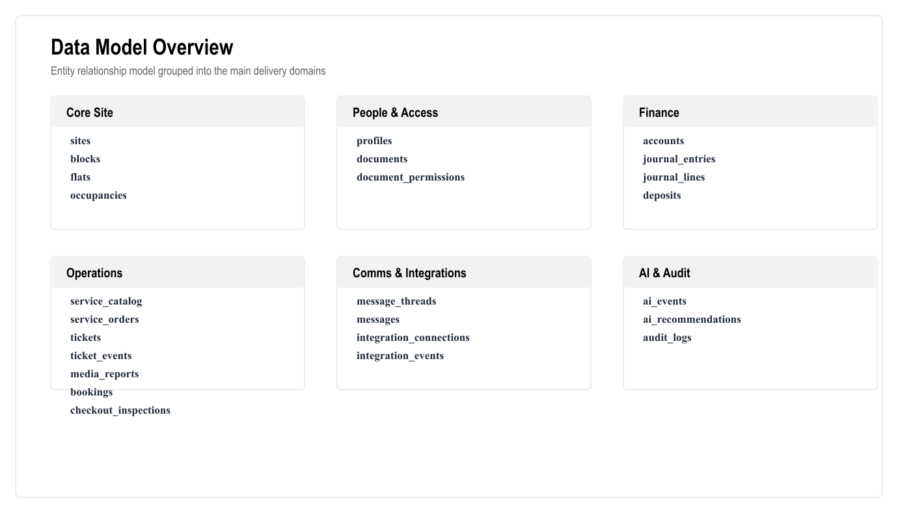

_Figure: Data Model Overview. Generated from the workflow source in this document._

Mermaid source

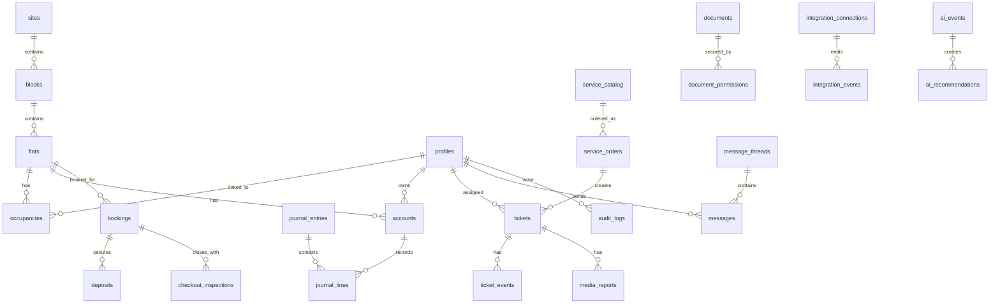

<!-- DIAGRAM:trd-02-data-model-overview:END -->

---

## 10. Database Requirements

### 10.1 PostgreSQL Requirements

- Use UUID primary keys unless existing system integration requires numeric IDs.
- Use `created_at`, `updated_at`, `created_by`, `updated_by` on operational tables.
- Use immutable records for financial postings.
- Use explicit status enums through check constraints or enum tables.
- Use foreign keys for critical relationships.
- Use indexes for search and dashboard filters.
- Use views/materialized views for heavy dashboard/reporting calculations where needed.
- Use RLS for tenant/owner/staff data isolation.

### 10.2 Critical Indexes

Required indexes include:

- `flats(site_id, block_id, floor, number)`
- `flats(status)`
- `occupancies(flat_id, start_date, end_date)`
- `occupancies(user_id)`
- `accounts(owner_user_id)`
- `accounts(flat_id)`
- `journal_lines(account_id, posted_at)`
- `journal_entries(source_type, source_id)`
- `transactions(status, posted_at)`
- `payment_events(provider, provider_event_id)`
- `tickets(status, priority, assigned_to)`
- `tickets(flat_id)`
- `tickets(sla_due_at)`
- `bookings(flat_id, date_range)`
- `messages(thread_id, created_at)`
- `notifications(user_id, status)`
- `audit_logs(entity_type, entity_id, created_at)`
- `ai_events(user_id, created_at)`

### 10.3 Ledger Integrity Rules

- Journal entries must balance.
- Posted entries cannot be edited.
- Reversal entries must reference original entries.
- Every account balance must be derivable from journal lines.
- Every payment event must be idempotent.
- Manual corrections require accountant/admin permission.
- Financial data must be backed up and restorable.

---

## 11. API Requirements

### 11.1 API Style

Use Next.js server actions for tightly coupled app mutations and API routes for external/integration-facing endpoints. Keep business logic in domain services, not directly inside UI components.

### 11.2 API Standards

All write APIs must include:

- Authentication.
- Authorization.
- Input validation.
- Idempotency key where needed.
- Domain rule validation.
- Audit logging.
- Structured error handling.
- Transaction boundary.

### 11.3 Core API Examples

Core site:

- `GET /api/sites/:siteId/overview`
- `GET /api/blocks`
- `POST /api/blocks`
- `GET /api/flats`
- `POST /api/flats`
- `GET /api/flats/:flatId`
- `POST /api/imports/flats/preview`
- `POST /api/imports/flats/commit`

Users:

- `GET /api/users`
- `POST /api/users`
- `GET /api/users/:userId`
- `POST /api/occupancies`
- `PATCH /api/occupancies/:id`

Finance:

- `GET /api/accounts/:accountId`
- `GET /api/accounts/:accountId/ledger`
- `POST /api/accruals`
- `POST /api/journal-entries`
- `POST /api/journal-entries/:id/reverse`
- `GET /api/reports/debts`
- `GET /api/reports/cash-flow`

Payments and deposits:

- `POST /api/payments/intents`
- `POST /api/payments/manual`
- `POST /api/webhooks/payments/:provider`
- `POST /api/deposits/block`
- `POST /api/deposits/use`
- `POST /api/deposits/refund-request`
- `GET /api/restrictions/:flatId`

Services and tickets:

- `GET /api/services/catalog`
- `POST /api/services/catalog`
- `POST /api/service-orders`
- `GET /api/tickets`
- `POST /api/tickets/:ticketId/assign`
- `POST /api/tickets/:ticketId/status`
- `POST /api/tickets/:ticketId/media`
- `POST /api/tours/:tourId/runs`

Bookings:

- `GET /api/bookings/availability`
- `POST /api/bookings`
- `POST /api/bookings/:bookingId/check-in`
- `POST /api/bookings/:bookingId/check-out`
- `POST /api/bookings/:bookingId/settlement`

Communication:

- `GET /api/messages/threads`
- `POST /api/messages/threads`
- `POST /api/messages`
- `POST /api/announcements`
- `POST /api/notifications/send`

AI:

- `POST /api/ai/ask`
- `POST /api/ai/recommendations`
- `POST /api/ai/recommendations/:id/approve`
- `POST /api/ai/recommendations/:id/decline`

Integrations:

- `GET /api/integrations`
- `POST /api/integrations`
- `POST /api/webhooks/:integration`
- `POST /api/integrations/:id/retry`

---

## 12. Service Desk / Ticketing Technical Requirements

### 12.1 Ticket Lifecycle

<!-- DIAGRAM:trd-03-ticket-lifecycle:BEGIN -->
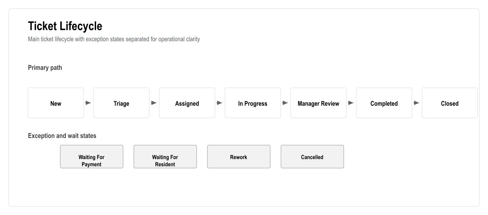

_Figure: Ticket Lifecycle. Generated from the workflow source in this document._

Mermaid source

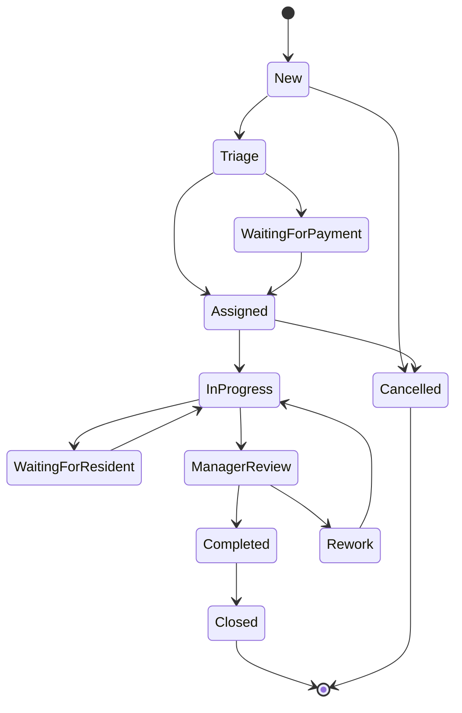

<!-- DIAGRAM:trd-03-ticket-lifecycle:END -->

### 12.2 Ticket Fields

Required fields:

- `id`
- `site_id`
- `flat_id`
- `requester_id`
- `category`
- `priority`
- `status`
- `assigned_to`
- `sla_due_at`
- `source_type`
- `source_id`
- `description`
- `internal_notes`
- `created_at`
- `closed_at`

### 12.3 SLA Rules

- SLA starts when ticket is accepted or assigned, depending on category configuration.
- Emergency priority must have separate SLA.
- Overdue tickets must appear on manager dashboard.
- SLA pause rules must be explicitly configured.
- SLA changes must be audited.

### 12.4 Media Requirements

- Allow photo/video upload.
- Store original metadata.
- Compress or limit media size where needed.
- Attach media to ticket and completion report.
- Restrict media visibility by role.
- Do not expose staff internal notes to residents.

---

## 13. Payment, Deposit And Restriction Technical Flow

### 13.1 Payment Flow

<!-- DIAGRAM:trd-04-payment-flow:BEGIN -->
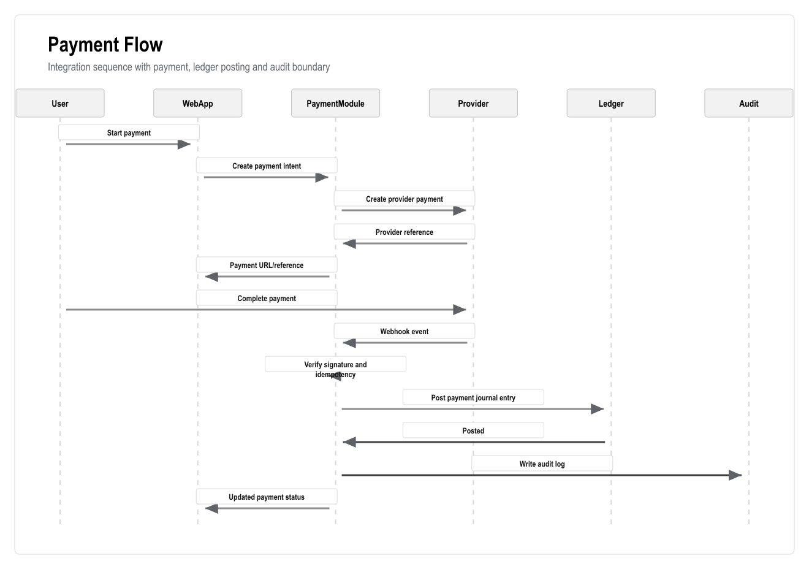

_Figure: Payment Flow. Generated from the workflow source in this document._

Mermaid source

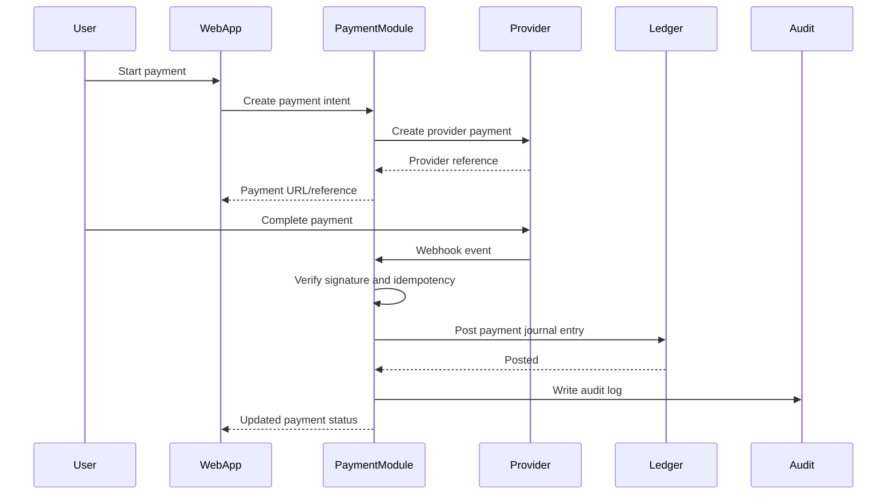

<!-- DIAGRAM:trd-04-payment-flow:END -->

### 13.2 Deposit Flow

- Deposit is created during booking/move-in.
- Deposit amount is blocked and linked to booking/flat/user.
- Deposit cannot be used except through approved settlement.
- Deposit events track block, partial use, full use, refund request, refund paid and closed.
- Refund requires permission and audit.

### 13.3 Restriction Flow

- Restriction engine evaluates debt rules.
- Result creates restriction event.
- UI displays restriction status.
- Service and booking APIs must call restriction check before accepting request.
- Access actions are queued and sent through integration adapter.
- AI cannot execute restriction changes directly.

---

## 14. Access, Security And Physical-System Integration

### 14.1 Access Integration Requirements

- Support adapter pattern because the vendor is unknown.
- Store external card/access identifiers separately from user IDs.
- Queue access activation/deactivation actions.
- Log every request and result.
- Retry failed vendor calls.
- Provide manual fallback status.
- Require high privilege for manual override.

### 14.2 Access Flow

<!-- DIAGRAM:trd-05-access-flow:BEGIN -->
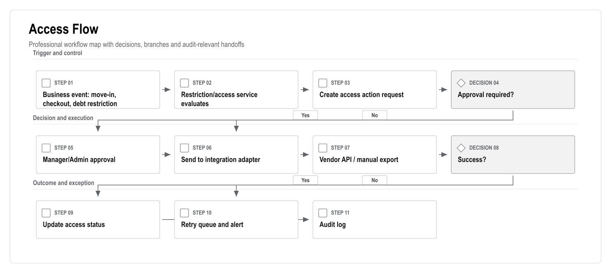

_Figure: Access Flow. Generated from the workflow source in this document._

Mermaid source

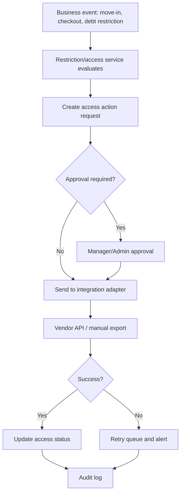

<!-- DIAGRAM:trd-05-access-flow:END -->

### 14.3 Camera Integration Requirements

Camera integration should not be first-core unless required by client. Recommended first version:

- Store camera system references or event IDs.
- Link events to tickets/access incidents where provided.
- Avoid storing raw video unless there is clear legal basis, storage plan and retention policy.
- Apply strict permissions and retention.

### 14.4 Meter Integration Requirements

- Adapter pattern.
- Store meter readings.
- Validate reading anomalies.
- Generate utility accruals after approval.
- AI can flag unusual usage but not auto-bill without rules/approval.

---

## 15. AI Technical Architecture

### 15.1 AI Components

- AI prompt templates.
- AI context builder.
- Retrieval layer.
- AI event log.
- AI recommendation queue.
- Approval workflow.
- Evaluation dataset.
- Safety policy engine.

### 15.2 AI Data Sources

AI may read only authorized data:

- Flats.
- User profiles allowed by role.
- Tickets.
- Service orders.
- Booking status.
- Ledger summaries.
- Reports.
- Documents marked as AI-readable.
- Knowledge base articles.
- Policies and rules.

AI must not read:

- Unauthorized user data.
- Raw secrets.
- Payment credentials.
- Private identity documents unless explicitly allowed and legally approved.
- Camera/media files unless included in a controlled AI workflow.

### 15.3 AI Use Cases

Manager:

- Daily briefing.
- Debt risk summary.
- Overdue task summary.
- Staff workload summary.
- Booking and checkout risk alerts.

Accountant:

- Ledger explanation.
- Unmatched payment suggestions.
- Debt aging summary.
- Billing anomaly alerts.

Resident:

- Balance explanation.
- Service request help.
- Document lookup.
- Booking status help.

Staff:

- Task summary.
- Suggested next task order.
- Completion report draft.

### 15.4 AI Guardrails

- No direct payment posting.
- No direct refund.
- No direct access activation/deactivation.
- No direct ledger mutation.
- No automatic legal/accounting conclusions.
- Human approval required for sensitive recommendations.
- Prompt and output logging required.
- Source-linked recommendations required.

### 15.5 AI Evaluation

Evaluation cases should include:

- Service categorization.
- Urgency classification.
- Debt summary accuracy.
- Ledger explanation accuracy.
- Turkish response quality.
- Permission boundary tests.
- Refusal behavior for restricted actions.

Minimum acceptance should be defined per use case before production release.

---

## 16. Security Requirements

### 16.1 Authentication

- Supabase Auth.
- Email/password or magic link depending on client preference.
- MFA for admin/accountant/manager roles if feasible.
- Session expiry and refresh handling.
- Secure password reset.

### 16.2 Authorization

- App-level RBAC.
- PostgreSQL RLS.
- Permission checks at every write endpoint.
- Role-specific navigation.
- Data-level checks for owner/tenant/flat relationship.

### 16.3 Audit Logging

Audit required for:

- Login and admin actions.
- Role changes.
- Permission changes.
- Financial postings.
- Payment events.
- Deposit events.
- Refund requests.
- Restriction events.
- Access activation/deactivation.
- Booking changes.
- Service/ticket status changes.
- Document access/download for sensitive documents.
- AI recommendations and approvals.

### 16.4 Data Protection

- KVKK-aware processing.
- Document access policies.
- Retention policy.
- Data export/deletion policy where legally possible.
- Encryption in transit.
- Encryption at rest through provider defaults.
- No secrets in client code.
- Secure credential storage for integration keys.

### 16.5 OWASP Controls

The system should align with OWASP ASVS categories including:

- Authentication.
- Session management.
- Access control.
- Validation.
- Stored cryptography.
- Error handling and logging.
- Data protection.
- Communication security.
- Malicious input handling.
- API security.

---

## 17. Reporting And Analytics Technical Requirements

### 17.1 Dashboard Metrics

Dashboard metrics should come from database views or service-level aggregation, not hardcoded frontend calculations.

Required metrics:

- Total flats.
- Occupied/vacant/maintenance flats.
- Total debt.
- Debt by age bucket.
- Income.
- Expenses.
- Payments today.
- Open tickets.
- Overdue tickets.
- SLA compliance.
- Upcoming bookings.
- Pending checkouts.
- Deposit exposure.
- AI risk count.

### 17.2 Report Generation

Reports should support:

- Filters.
- Date ranges.
- Export to Excel/CSV.
- Export to PDF for statements where required.
- Saved report definitions.
- Background generation for heavy reports.
- Audit record for sensitive exports.

### 17.3 Analytics Architecture

Initial version:

- PostgreSQL views.
- Materialized views where necessary.
- Scheduled refresh jobs.

Later version:

- Dedicated analytics warehouse if data volume or reporting load grows.
- Event stream for operational analytics.

---

## 18. PWA Technical Requirements

### 18.1 PWA Scope

The PWA must support:

- Installable app metadata.
- Responsive layout.
- Mobile navigation.
- App icons.
- Service worker strategy where appropriate.
- Push notification support where browser support and provider allow.
- Offline-friendly drafts for staff completion forms if feasible.

### 18.2 PWA Non-Goals At Launch

- Native App Store submission.
- Native Play Store submission.
- Native biometric APIs.
- Heavy offline-first sync for all modules.
- Native camera scanning beyond browser upload/camera capture.

### 18.3 Mobile Performance Requirements

- Avoid large unneeded client bundles.
- Lazy-load heavy modules.
- Optimize images.
- Use server rendering for important screens.
- Keep staff/resident flows minimal.

---

## 19. Integration Architecture

### 19.1 Adapter Pattern

Each integration must implement a common adapter contract:

- `connect`
- `validateCredentials`
- `send`
- `receiveWebhook`
- `parseEvent`
- `retry`
- `healthCheck`
- `disconnect`

### 19.2 Integration Reliability

All integrations must support:

- Idempotency.
- Webhook signature verification where available.
- Retry with backoff.
- Dead-letter/error queue.
- Manual retry.
- Integration health status.
- Audit logs.

### 19.3 Integration Priority

Priority 1:

- Payment provider or bank import.
- SMS/email.
- Access integration if client confirms vendor and launch dependency.

Priority 2:

- Identity verification.
- Push notifications.
- Bank reconciliation improvements.

Priority 3:

- Cameras.
- Meter readings/billing.
- Advanced open API/webhooks.

---

## 20. Phase-By-Phase Technical Delivery

## Phase 1: Discovery, Requirement Lock And Market Benchmark

Technical deliverables:

- System context diagram.
- Initial domain model.
- Integration inventory.
- Data migration inventory.
- Risk register.
- Non-functional requirements.

Engineering outputs:

- Architecture decision log.
- Open questions.
- Technical assumptions.

Definition of done:

- Signed technical assumptions.
- Confirmed native mobile exclusion and PWA-first decision.

## Phase 2: UX/UI Design System And Product Navigation

Technical deliverables:

- Design system tokens.
- Component inventory.
- Route map.
- Role navigation map.
- PWA layout patterns.

Engineering outputs:

- Shared UI primitives.
- Responsive shells.
- Prototype routes.

Definition of done:

- Role-based UI shells approved.
- Prototype covers core workflows.

## Phase 3: Platform Foundation, Auth, RBAC And Audit

Technical deliverables:

- Auth setup.
- RBAC tables.
- Permission middleware.
- RLS policies.
- Audit log schema.
- Protected route system.

Engineering outputs:

- `profiles`, `roles`, `permissions`, `audit_logs`.
- Auth pages.
- Role-aware navigation.

Definition of done:

- Unauthorized role access blocked.
- All test writes produce audit logs.

## Phase 4: Site, Block, Floor, Flat And Data Import

Technical deliverables:

- Site/block/flat schema.
- Flat matrix query.
- Import preview/commit APIs.
- Data validation rules.

Engineering outputs:

- Flat matrix UI.
- Flat detail.
- Import wizard.

Definition of done:

- 769 flats load and filter correctly.
- Import errors shown before commit.

## Phase 5: User, Owner, Tenant And Staff Management

Technical deliverables:

- Extended profile schema.
- Occupancy relationships.
- Document metadata.
- Identity status.
- Staff groups.

Engineering outputs:

- User directory.
- Owner/tenant/staff detail pages.
- Document vault foundation.

Definition of done:

- Users link to flats with correct permission boundaries.

## Phase 6: Financial Ledger Engine

Technical deliverables:

- Account schema.
- Journal entry schema.
- Posting service.
- Balance views.
- Statement generation.
- Reversal logic.

Engineering outputs:

- Account ledger UI.
- Accrual posting.
- Statement export.

Definition of done:

- Balances reconcile to journal lines.
- Posted entries cannot be edited directly.

## Phase 7: Payments, Deposits, Reconciliation And Debt Restrictions

Technical deliverables:

- Payment intent model.
- Provider webhook endpoint.
- Bank import model.
- Reconciliation service.
- Deposit service.
- Restriction engine.

Engineering outputs:

- Payment screen.
- Deposit center.
- Restriction center.
- Accountant approval queue.

Definition of done:

- Debt restrictions are enforced by APIs, not only UI.

## Phase 8: Service Catalogue And Service Order Flow

Technical deliverables:

- Service catalogue schema.
- Service order state machine.
- Debt check integration.
- Task/ticket creation integration.

Engineering outputs:

- Service catalogue admin.
- Resident service order wizard.
- Service order detail.

Definition of done:

- Accepted service order always creates a ticket/task.

## Phase 9: Task, Workforce, SLA And Field Reporting

Technical deliverables:

- Ticket schema.
- SLA rules.
- Assignment service.
- Media upload.
- Ticket event timeline.
- Tour control schema.

Engineering outputs:

- Ticket board.
- Staff PWA task view.
- Completion report.
- SLA dashboard.

Definition of done:

- Staff can complete ticket with media from mobile.

## Phase 10: Booking, Letting, Move-In And Checkout

Technical deliverables:

- Booking schema.
- Availability query.
- Move-in workflow.
- Checkout workflow.
- Settlement service.
- Access action queue.

Engineering outputs:

- Booking calendar.
- Move-in wizard.
- Checkout wizard.
- Settlement view.

Definition of done:

- Booking, move-in, checkout mandatory scenario passes E2E.

## Phase 11: Communication, Notifications And Documents

Technical deliverables:

- Message thread schema.
- Notification engine.
- Email/SMS provider adapter.
- Document permissions.
- Delivery logs.

Engineering outputs:

- Chat inbox.
- Announcement composer.
- Notification center.
- Document vault.

Definition of done:

- Messages, notifications and documents respect role permissions.

## Phase 12: Web App, PWA And Mobile Web Experience

Technical deliverables:

- PWA manifest.
- Mobile navigation.
- Installable shell.
- Mobile performance optimization.
- Push support where feasible.

Engineering outputs:

- Resident mobile web.
- Staff mobile web.
- Manager mobile summary.

Definition of done:

- Core mobile workflows pass Playwright mobile viewport tests.

## Phase 13: External Integrations

Technical deliverables:

- Integration registry.
- Adapter interfaces.
- Webhook processor.
- Retry queue.
- Health dashboard.
- Vendor-specific adapters.

Engineering outputs:

- Integration settings.
- Event logs.
- Manual retry UI.

Definition of done:

- Each launch integration has test mode, logs and retry handling.

## Phase 14: AI Premium Layer And Advanced Analytics

Technical deliverables:

- AI orchestration.
- Retrieval layer.
- AI event log.
- Recommendation queue.
- Approval workflow.
- Evaluation suite.

Engineering outputs:

- AI command center.
- AI dashboard cards.
- AI recommendations.
- AI approval/decline UI.

Definition of done:

- AI cannot perform restricted actions directly.
- AI output is logged and source-linked.

## Phase 15: QA, Security, Performance, UAT, Training And Launch

Technical deliverables:

- Playwright suite.
- Unit/integration tests.
- Security test checklist.
- Load test plan.
- Backup/restore drill.
- Monitoring.
- Launch runbook.

Engineering outputs:

- UAT scripts.
- Training content.
- Operational dashboards.
- Release checklist.

Definition of done:

- All mandatory client scenarios pass.
- No critical security issues remain.
- Go-live checklist approved.

---

## 21. Testing Strategy

### 21.1 Unit Tests

Required for:

- Ledger posting.
- Balance calculation.
- Debt restrictions.
- Deposit settlement.
- Booking availability.
- SLA calculation.
- Permission checks.
- AI guardrail functions.

### 21.2 Integration Tests

Required for:

- Payment webhook idempotency.
- Bank import reconciliation.
- Access action queue.
- Notification delivery.
- File permissions.
- RLS behavior.

### 21.3 E2E Tests

Required scenarios:

- Login by role.
- Owner views balance.
- Tenant submits service request.
- Debt blocks service.
- Payment clears restriction.
- Staff completes ticket with media.
- Booking created.
- Move-in completed.
- Checkout completed.
- Accountant posts accrual.
- Manager views dashboard.
- AI recommendation approval.

### 21.4 UAT Tests

Business UAT must include:

- Service order.
- Tenant move-in.
- Checkout.
- Debt accumulation.
- Payment reconciliation.
- Access restriction.
- Reporting.
- Mobile PWA.

---

## 22. Deployment And Environments

### 22.1 Environments

- Local development.
- Preview/staging.
- UAT.
- Production.

### 22.2 Environment Requirements

Each environment must have:

- Separate database.
- Separate storage bucket.
- Separate API keys.
- Separate integration credentials.
- Seed/demo data.
- Backup configuration.

### 22.3 CI/CD

Pipeline should run:

- Install dependencies.
- Typecheck.
- Lint.
- Unit tests.
- Build.
- Playwright smoke tests.
- Database migration check.
- Deployment preview.

### 22.4 Database Migrations

- All schema changes through versioned migrations.
- Production migrations reviewed before deployment.
- Finance-related migrations require rollback plan.
- Data migrations tested on staging copy.

---

## 23. Observability And Operations

### 23.1 Logging

Use structured logs with:

- Request ID.
- User ID where safe.
- Site ID.
- Module.
- Entity type.
- Entity ID.
- Error code.

### 23.2 Metrics

Track:

- API errors.
- API latency.
- Payment webhook failures.
- Integration retries.
- Notification failures.
- Ticket SLA breach count.
- AI recommendation volume.
- AI approval rate.

### 23.3 Alerts

Alerts required for:

- Payment webhook failure spike.
- Access integration failures.
- Database errors.
- High error rate.
- Failed backup.
- Queue backlog.
- Critical AI safety violation.

---

## 24. Data Migration Requirements

### 24.1 Source Types

Likely sources:

- Excel flat lists.
- Owner/tenant contact spreadsheets.
- Accounting exports.
- Existing debt lists.
- Service history if available.
- Booking records if available.

### 24.2 Migration Process

1. Collect source files.
2. Map columns.
3. Validate data.
4. Preview import.
5. Resolve errors.
6. Commit import.
7. Run reconciliation reports.
8. Get client sign-off.

### 24.3 Migration Risks

- Duplicate contacts.
- Missing flat numbers.
- Incorrect owner/tenant relationships.
- Historical finance inconsistencies.
- Unsupported document formats.
- Encoding/language issues.

---

## 25. Technical Edge Cases And Failure Modes

### 25.1 Finance And Payment Failure Modes

- Duplicate provider webhook must not double-post payment.
- Delayed webhook must update payment status when received.
- Failed provider signature verification must reject the event.
- Manual payment correction must create reversal/adjustment, not edit original record.
- Overpayment must create credit balance or refund workflow based on business rule.
- Deposit shortfall must create receivable and settlement note.
- Refund provider failure must keep refund request pending and alert accounting.
- Payment against wrong flat/account must require accountant correction workflow.

### 25.2 Access And Physical-System Failure Modes

- Vendor API unavailable: queue action and alert manager.
- Vendor success but physical card still active: allow manual verification and incident record.
- Debt threshold changed: recompute restrictions and record rule version.
- Emergency service override: require privileged reason and audit.
- Access action generated by checkout but integration is disconnected: show unresolved access action.

### 25.3 Ticket And Workforce Failure Modes

- Media upload fails: save ticket completion as draft and retry upload.
- Staff loses network: preserve local draft where feasible.
- Duplicate ticket: support merge/link action.
- SLA pause: require reason and timeline event.
- Contractor outside system: manager can record external completion with evidence.
- Wrong flat selected: allow controlled correction with audit.

### 25.4 Booking And Occupancy Failure Modes

- Overlapping bookings must be blocked at database/service level.
- Maintenance status must block availability.
- Checkout cannot close if unresolved access/deposit settlement exists.
- Tenant changed mid-booking: create occupancy event, not overwrite history.
- Timezone/date range boundaries must use site timezone consistently.

### 25.5 Communication And Document Failure Modes

- Failed SMS/email delivery must be visible.
- Sensitive document download must be permission checked and optionally audited.
- Staff internal notes must never appear in resident portal.
- Announcement audience must be previewed before sending.
- Document retention/delete policies must not remove finance/audit records unlawfully.

### 25.6 AI Failure Modes

- AI must refuse restricted actions.
- AI must not return data beyond user's role.
- AI recommendations must show confidence/source.
- AI hallucination reports should be captured for evaluation.
- AI output in Turkish must use professional tone.
- AI should not provide legal/accounting final advice; it can recommend human review.

---

## 26. Non-Goals For Launch

The following are excluded from first launch unless separately approved:

- Native iOS app.
- Native Android app.
- Full offline-first operation.
- Full camera video storage.
- Full meter integration if vendor not confirmed.
- Custom ERP accounting integration.
- Multi-property enterprise marketplace.
- Fully autonomous AI finance actions.
- Fully autonomous access restriction actions.

---

## 27. Technical Open Questions

1. Which payment provider or bank must be integrated first?
2. Is card payment required at launch?
3. Which access control vendor is installed?
4. Does access vendor provide API, file import, or manual admin panel only?
5. Are cameras required at launch?
6. Is meter reading/billing required at launch?
7. Is identity verification external provider required or manual document review enough?
8. What is the required retention period for documents, audit logs and media?
9. What languages are required for launch?
10. Does the client require hosting in Turkey or EU?
11. Is Supabase acceptable for production hosting and data residency?
12. What are expected concurrent users?
13. Are there legal constraints around access blocking due to debt?
14. Who approves refunds and access changes?
15. Which reports are legally/operationally mandatory?
16. Which Turkish competitor is the client comparing us against?
17. Does the client require Apsiyon-like access/meter/AI capability at launch or in roadmap?
18. Which professional facility management services are in-house vs outsourced?
19. Should emergency maintenance bypass debt restriction with manager approval?
20. Does the client need payroll/leave features later, as seen in some Turkish market offerings?

---

## 28. Technical Design Addendum

### 28.1 Control Architecture

The platform should apply sensitive controls in layers. UI visibility is useful, but it is not a security boundary. Server-side authorization, database policies, idempotency, audit logs and approval queues must carry the actual control responsibility.

<!-- DIAGRAM:trd-06-control-architecture:BEGIN -->
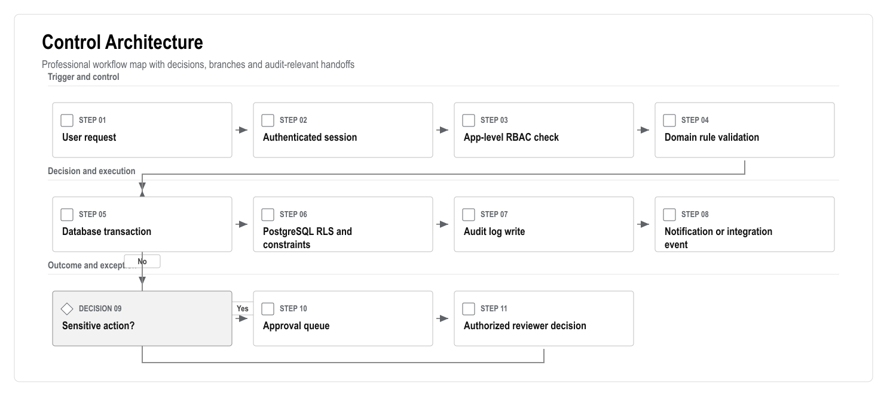

_Figure: Control Architecture. Generated from the workflow source in this document._

Mermaid source

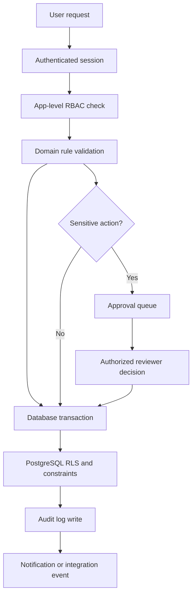

<!-- DIAGRAM:trd-06-control-architecture:END -->

Required rule:

- Finance, deposit, refund, access and AI recommendation approvals must be enforced by server-side services and database rules, not only by hidden buttons.

### 28.2 Integration Lifecycle

Every external integration must behave like an auditable state machine. This is especially important for payments, banks, access cards/barriers, SMS/email, identity verification and meter systems.

<!-- DIAGRAM:trd-07-integration-lifecycle:BEGIN -->
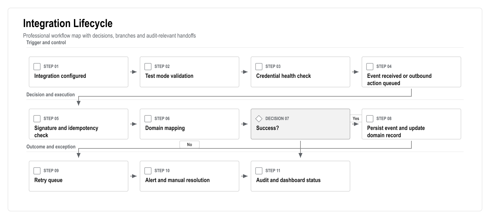

_Figure: Integration Lifecycle. Generated from the workflow source in this document._

Mermaid source

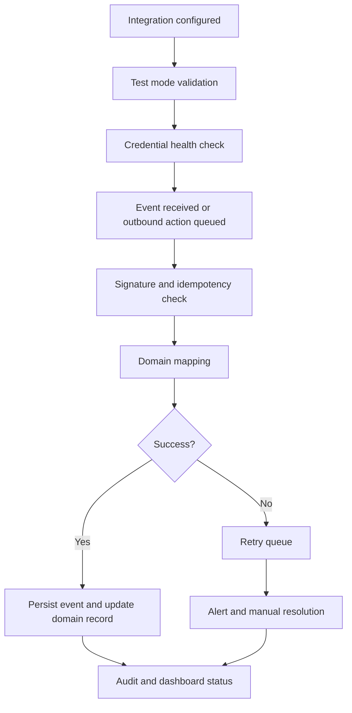

<!-- DIAGRAM:trd-07-integration-lifecycle:END -->

Required rule:

- No payment, access or notification integration may fail silently.
- Each integration must expose status, last successful event, last failed event, retry count and manual fallback guidance.

### 28.3 Data Lifecycle

<!-- DIAGRAM:trd-08-data-lifecycle:BEGIN -->
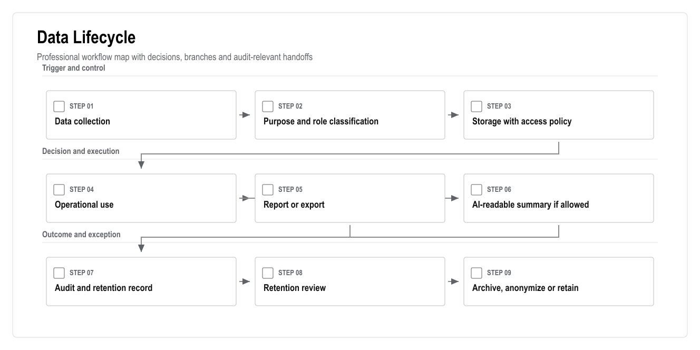

_Figure: Data Lifecycle. Generated from the workflow source in this document._

Mermaid source

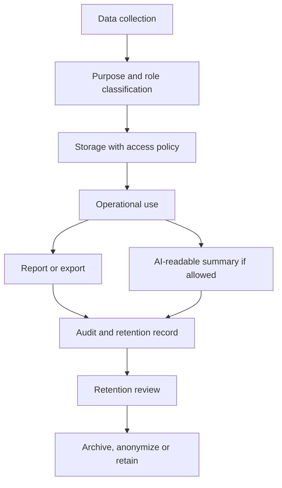

<!-- DIAGRAM:trd-08-data-lifecycle:END -->

Data design rules:

- Personal, financial, identity, media, access and AI-event data must be classified.
- Export actions should be audited where they include personal or financial data.
- AI retrieval should use explicit AI-readable flags and role-filtered context building.
- Retention decisions require legal/accounting review before production launch.

### 28.4 Engineering Gates

| Gate | Required Evidence | Exit Standard |
|---|---|---|
| Architecture gate | Domain model, data model, sequence flows, risk register | Critical flows are technically coherent |
| Security gate | RBAC/RLS checks, ASVS checklist, secret handling, audit events | No critical/high unresolved issue |
| Finance gate | Ledger tests, reversal tests, idempotency tests, accountant review | Balances reconcile and postings are immutable |
| Integration gate | Test mode, webhook verification, retry queue, manual fallback | No silent failure path |
| AI gate | Prompt logs, source links, role tests, restricted-action refusals | AI cannot mutate sensitive records directly |
| Launch gate | UAT evidence, backup/restore drill, monitoring, support runbook | Business owner accepts go-live readiness |

---

## 29. Technical Approval Checklist

- Architecture approved.
- Web/PWA launch scope approved.
- Native mobile exclusion approved.
- Tech stack approved.
- Data model approved.
- Finance ledger approach approved.
- RBAC/RLS approach approved.
- API approach approved.
- Integration strategy approved.
- AI guardrails approved.
- Security/KVKK approach approved.
- Turkish top-player technical implications reviewed.
- Edge-case and failure-mode coverage reviewed.
- Control architecture approved.
- Integration lifecycle approved.
- Data lifecycle approved.
- Engineering gates approved.
- Test strategy approved.
- Deployment strategy approved.
- Open technical questions assigned.
