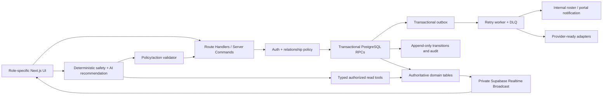

# 1Çatı – Funktionale Härtung, Ticketing, Emergency AI und Echtzeitbetrieb

Status: Umsetzung und Release-Härtung aktiv – Demo-Freigabe noch bedingt gesperrt
Audit-Stichtag: 14. Juli 2026
Code-Baseline: main / b3b66d17 plus nicht deployter Integrations-Worktree (Migrationen 20–35)
Vertraulichkeit: STRICTLY CONFIDENTIAL

## 0. Ausführungs- und Demo-Status

Die Statusbegriffe sind absichtlich streng:

- **Lokal verifiziert**: Implementierung und fokussierte Browser-/API-Tests sind im deterministischen QA-Modus grün.
- **DB-Gate offen**: Code und statische RLS-Verträge sind vorhanden, aber die Migration wurde in dieser Arbeitsumgebung nicht gegen eine echte Supabase/PostgreSQL-Instanz ausgeführt.
- **In Arbeit**: Ein konkreter interner Release-Blocker wird noch implementiert oder erneut geprüft.
- **Extern blockiert**: Vertrag, Credential, Provider, Storage-Bucket oder produktive Umgebung fehlt; die Oberfläche muss dies wahrheitsgemäß anzeigen.

| Nr. | Use Case | Aktueller Stand | Nachweis / verbleibendes Gate |
|---:|---|---|---|
| 1 | Rollenbasierter Zugriff / Rollenwechsel | Lokal verifiziert | Sechs App-Rollen plus getrennte Plattform-Superadmin-Grenze; Rollen-Dashboard Desktop und Mobile grün. Produktions-Auth/RLS bleibt DB-Gate. |
| 2 | 769-Unit-Live-Matrix | Lokal verifiziert | Manager-Matrix mit Suche/Gruppierung; Owner exakt A-001/A-054/D-023, Tenant exakt A-018/A-023, ohne Überschneidung. Echte Bestandsdaten bleiben Deployment-Gate. |
| 3 | Echtzeit-Dashboard | Lokal verifiziert, DB-Gate offen | API-/Realtime-Invalidierung, Frischezeit, Lade-/Fehlerzustände; 11/11 Desktop plus 11/11 Mobile. Supabase-Realtime mit Kundendaten noch prüfen. |
| 4 | Access & Buyer Compliance Cockpit | Lokal verifiziert | 9/9 fokussierte Compliance-Szenarien; produktive KBS-/Zugangsprovider bleiben extern. |
| 5 | Finanzübersicht Owner | In Arbeit | Sichere Owner-Projektion statt Roh-Ledger; abschließender Desktop-/Mobile-/RLS-Gate läuft. |
| 6 | Serviceauftrag End-to-End | In Arbeit | Persistenter Ticket→Order→Task-Flow und Rollenübergaben vorhanden; finale Emergency-/Tenant-Browserjourneys laufen. |
| 7 | Emergency-Erkennung | In Arbeit – Demo-Blocker | P0/112 muss sofort in Liste und Detail sichtbar sein, neu erstelltes Ticket fokussieren und darf nie als finanzblockiert erscheinen; RLS-/Browser-Gate läuft. Externe Anrufe bleiben human-/provider-gesteuert. |
| 8 | Digitale Neuregistrierung | Lokal verifiziert, DB-Gate offen | 4/4 Registrierungs-/IDV-Verträge grün; Versioned KVKK consent, HMAC-ID-Digest, Human Approval und Einmalaktivierung. Reale Supabase-Umgebung/Migration fehlt. |
| 9 | Çatı Training Video Library | Implementiert, Release-Gate offen | Migration/Assets vorhanden; vollständiger Playlist-/Deployment-Nachweis ist noch Teil des Gesamtharness. |
| 10 | QR-Meldekanal | Parallel implementiert, Integrations-Gate offen | Öffentlicher Intake/Tracking/Triage liegt im gemeinsamen Worktree; End-to-End-Gesamtharness steht aus. |
| 11 | Öffentlicher AI-Assistent | Lokal verifiziert | 11/11 API-/Widget-Gates; TR/EN/DE/RU Privacy-/KVKK-Chips, Paraphrasen, Retention/Deletion, Grounding und Negationsfall grün. |
| 12 | Interner AI-Assistent | Teilimplementiert, Release-Gate offen | Empfehlungen bleiben ohne autonome Finanz-/Zugangsentscheidung; vollständige Tool-/Grounding-/Drift-Evals stehen aus. |
| 13 | Personal & Rollenübersicht | Teilimplementiert, Integrations-Gate offen | Governance-/Authority-Flächen vorhanden; produktive Organisationszuordnung und RLS-Matrix noch prüfen. |
| 14 | Mehrsprachigkeit | Kritische Flows verifiziert, Gesamtgate offen | TR/EN/DE/RU für Rollen-Dashboard, Ticket/Owner-Approval und Public AI geprüft; vollständige App-Sprachparität bleibt Gesamtharness. |
| 15 | Sicherer Dokumentzugriff | Statisch gehärtet, DB-Gate offen | Direkte DML entzogen, Unit-/Role-/Retention-Scope verschärft, Identity-Dokumente residentenübergreifend ausgeschlossen; echte Storage-/RLS-Probes fehlen. |
| 16 | Auswertungen & Reports | Parallel implementiert, Integrations-Gate offen | Persistente Report-Artefakte im Worktree; Gesamtharness und echte Datenabstimmung offen. |
| 17 | Transparente Systemeinstellungen | Teilimplementiert | Live/provider-ready/blocked muss ehrlich sichtbar bleiben; Provider-Health mit echten Credentials offen. |
| 18 | Booking / Move-in / Move-out | Parallel implementiert, Integrations-Gate offen | Lifecycle-, Kalender-, ICS- und Offline-Slices im Worktree; Konflikt-/DB-/Gesamtharness offen. |
| 19 | Zahlung manuell buchen | In Arbeit | Atomare Buchung, Replay, Storno, Versionierung und unreconciled-Wahrheit vorhanden; finale Desktop-/Mobile-/RLS-Gates laufen. |
| 20 | Foto-/Video-Nachweis Serviceauftrag | Lokal verifiziert, DB-Gate offen | 16/16 Desktop/Mobile plus 2/2 Exploit-Verträge; residentensichere Projektion und service-role-only Upload/Scan. Persönliche ID-/Selfie-Verifikation ist ausdrücklich nicht enthalten. |
| 21 | Registrierung in echtes Konto umwandeln | Code-verifiziert, Umgebung blockiert | Admin-Entscheid, bestätigte E-Mail, Einmal-Token und exakte Unit/Site-Zuordnung; Token nicht mehr im Query-String. Ohne produktive Supabase-Auth/Migration kein Demo-Go. |
| 22 | Eigene Wohnung korrekt zugeordnet | Lokal verifiziert | Owner-/Tenant-Vertrag explizit entschieden und Desktop/Mobile geprüft; keine Demo-Platzhalter-Überschneidung. |
| 23 | Communication Center | Parallel implementiert, Integrations-Gate offen | Persistente Portal-Kommunikation im Worktree; Providerzustellung bleibt provider-ready, Gesamtharness offen. |
| 24 | Prospective Buyer Pipeline | Parallel implementiert, Integrations-Gate offen | Persistenter Pipeline-Slice im Worktree; Integrations- und echte Datenprüfung offen. |

Querschnitts-Blocker vor einer belastbaren Demo-Freigabe:

1. Emergency UC07 muss seine fokussierten Desktop-/Mobile-Journeys vollständig grün abschließen.
2. Migrationen 20–35 müssen auf einem sauberen, produktionsnahen Supabase-Schema ausgeführt und mit echten Auth-Rollen/RLS-Probes geprüft werden.
3. Der kuratierte Gesamtharness muss Lint, TypeScript, Build sowie alle neuen funktionalen Specs ohne Auslassung bestehen.
4. Produktive Supabase-Auth, Realtime und Storage müssen für die Demo-Umgebung konfiguriert sein; andernfalls bleiben Registrierung, echte Persistenz und Uploads sichtbar „nicht verfügbar“.
5. Externe Bank-/Payment-, Voice/SMS/E-Mail-, IDV/OCR/Selfie-, Access-/Kamera- und OAuth-Verbindungen bleiben bis Vertrag, Credentials, Datenschutz- und UAT-Freigabe blockiert.

## 1. Entscheidung in Kürze

Der Pull vom 13. Juli enthält eine deutlich bessere Ticket- und Reservierungsoberfläche sowie neue API-, Repository-, Migrations- und E2E-Bausteine. Der Flow ist trotzdem noch nicht produktionsreif. Die App ist derzeit ein Hybrid aus:

- echten Supabase-Lese- und einzelnen Schreibpfaden,
- statischen oder seed-basierten Boards,
- Prozessspeicher-Fallbacks,
- Action-Logs, die wie abgeschlossene Geschäftsaktionen wirken,
- sowie provider-ready Integrationen ohne aktive Provider.

Die empfohlene Zielarchitektur bleibt ein modularer Next.js-/Supabase-Monolith. Geschäftskritische Schreibvorgänge werden als atomare PostgreSQL-Kommandos/RPCs umgesetzt, Zustandsübergänge werden serverseitig erzwungen, Realtime wird aus persistierten Ereignissen gespeist und externe Effekte laufen über eine Outbox. Microservices würden für den aktuellen Standort- und Teamumfang mehr Betriebsrisiko als Nutzen erzeugen.

Die Umsetzung läuft inzwischen als koordinierter Integrations-Worktree. Die nachfolgenden Baseline-Abschnitte dokumentieren den Ausgangsbefund vom 13. Juli; bei Widerspruch ist die Statusmatrix in Abschnitt 0 maßgeblich. Eine Demo-Freigabe wird erst nach den dort genannten Gates erteilt.

## 2. Verifizierte Baseline

| Prüfung | Ergebnis | Aussage |
|---|---|---|
| Git Pull | Fast-forward von 9aa6213 auf b3b66d17 | Lokales main entspricht origin/main. |
| Diff-Check | Bestanden | Keine Whitespace-/Patchfehler im Pull. |
| TypeScript | Bestanden | Aktueller Produktionsquellstand kompiliert typseitig. |
| ESLint | Bestanden, drei bestehende Warnungen im Recording-Skript | Keine neuen Lint-Fehler im Produktcode. |
| Next.js Produktionsbuild | Bestanden | Der App-Build ist technisch erzeugbar. |
| Fokussierter Ticket-/Reservierungs-E2E im Produktionsmodus | 4 bestanden, 4 fehlgeschlagen | Happy Paths existieren, aber Approval-, Cross-Route-Persistenz- und UI-Aktualisierung sind inkonsistent. |
| Strukturierter E2E-Gate | Neue Spec nicht enthalten | Der aktuelle Release-Harness kann die neue Regression übersehen. |
| Migrationen | Doppelte Versionsnummer 00000000000015 | Cloud-Historie muss vor 16–19 abgeglichen werden. |
| Cloud-Schema | Dokumentiert nur bis Migration 13, Code erwartet spätere Spalten | Live-Fähigkeit ist unbewiesen und darf nicht aus lokalen Fallbacks abgeleitet werden. |

Die vier fokussierten Fehler waren:

1. Manager-Approval verliert eine Action Request über Routengrenzen und liefert 404 statt fachlichem Validierungsfehler.
2. Vorzeitige Tenant-Zuweisung liefert 404 statt Zustandskonflikt.
3. Eine Owner-Entscheidung wird in der Manager-Sicht nicht konsistent sichtbar.
4. Eine Reservierungsentscheidung bleibt in der Oberfläche als weiterhin ausführbare Freigabe stehen.

## 3. Context Map

### 3.1 Zu ändernde Kernbereiche

| Bereich | Primäre Dateien/Ordner | Geplante Änderung |
|---|---|---|
| Ticket-UI | apps/web/app/[locale]/dashboard/tickets/page.tsx | Rollengetrennte Resident-, Owner-, Dispatcher- und Staff-Flows; Timeline, Attachments, Fehlerzustände und mobile Arbeitsansicht. |
| Ticket-API | apps/web/app/api/site-management/tickets/route.ts | Dünner HTTP-Adapter auf versionierte Domain-Kommandos; stabile Fehlercodes, Idempotency und Cursor. |
| Approvals/Actions | apps/web/app/api/site-management/actions/route.ts, apps/web/lib/action-catalog.ts | Generische Log-only-Aktionen entfernen oder klar als Entwurf markieren; fachliche Commands explizit machen. |
| Ticket-Domain | apps/web/lib/ticket-routing.ts, apps/web/lib/site-management-repository.ts | Regelwerk, Zustandsmaschine, Transaktionen, echte Work Orders/Tasks, SLA und Outbox. Repository-Monolith schrittweise in Server-Module teilen. |
| Beziehungen/RBAC | apps/web/lib/role-scoped-views.ts, apps/web/lib/rbac.ts, apps/web/lib/auth.ts | Harte Demo-Unit-Sets durch userbezogene Owner-/Tenant-/Staff-Beziehungen ersetzen; Service-Role auf Systemjobs begrenzen. |
| Datenbank/RLS | supabase/migrations | Migrationshistorie reparieren; relationale Policies, atomare RPCs, Versionierung, Idempotency, append-only Events und Outbox. |
| Reservierungen | dashboard/calendar/page.tsx, booking-operations API, Repository, Migrationen | Konfigurierbare Ressourcen, Kapazität, Blackouts, DB-sichere Kollisionen, Freigabe, Gebühren/Deposit, Waitlist und Realtime. |
| Dokumente | document-storage.ts, document-uploads API, documents/page.tsx | Quarantäne, Review-, Scan- und Release-Gate; Vault aus echten Metadaten; Audit pro Download. |
| Kommunikation | communications API/page | Persistente Portal-Inbox/-Outbox; Zustellstatus und Retry. SMS/E-Mail/Push bleiben Provider-Adapter. |
| Finanzen | finance page, ledger/payment-control APIs, Repository | Manuelle Buchung, Storno, Abstimmung, Restriction-Entscheid und auditierbare Freigaben. |
| People/CRM | users/leads/listings pages und APIs | Echte Beziehungen/CRUD, Onboarding, Deal-Lifecycle und Public-Intake-Konvertierung. Twenty-Anbindung bleibt eigener Adapter. |
| Dashboard/Reports | dashboard, reports, compliance, settings | Seed-Projektionen durch DB-Views/RPCs ersetzen; echte Exporte, Filter, Audit und Systemstatus. |
| Offline/PWA | offline page/API, Service Worker | IndexedDB-Queue, idempotente Synchronisation, Backoff, Konfliktprüfung und Logout-Purge. |
| AI | AI-Routen, Antwort-/Knowledge-Module, neue Policy-/Eval-Module | Deterministische Safety-Schicht, typisierte Live-Tools, Quellenbelege, Abstention, Audit, Shadow Mode und Drift-Gates. |
| Verträge/QA | OpenAPI, E2E, Phase-Harnesses, QA-/Traceability-Dokumente | Verträge synchronisieren und produktionsnahe DB/RLS-/Concurrency-/A11y-/Performance-/AI-Evals hinzufügen. |

### 3.2 Abhängigkeiten

| Abhängigkeit | Status | Konsequenz |
|---|---|---|
| Supabase Auth/PostgreSQL/Storage/Realtime | Kernplattform | Autoritative Datenquelle; echte Auth-/RLS-Tests sind Pflicht. |
| Next.js 16 / React 19 | Vorhanden | Server Components für Leseansichten; kleine Client-Islands für Interaktion und Realtime. |
| Zahlungs-, Bank-, SMS-, E-Mail-, Voice-, Push-, Access-, Kamera- und OAuth-Provider | Nicht freigegeben | Adapter und Outbox dürfen fertig werden, echte Zustellung/Ausführung bleibt sichtbar blockiert. |
| Google/Outlook/Cal.com | Credentials/Verträge fehlen | ICS-Export/-Import kann intern gebaut werden; bidirektionaler OAuth-Sync bleibt Provider-Gate. |
| Twenty CRM | Self-hosting vorhanden, Web-Integration fehlt | Interner Lead-/Deal-Flow zuerst; Synchronisationsadapter separat. |
| Malware-/Virenscan | Providerentscheidung offen | Dateien bleiben bis sauberem Ergebnis in Quarantäne; kein optimistischer Download. |
| Kundendaten, Dienstleisterverträge, On-call-Roster, Facility Commissioning | Teilweise/offen | Keine fiktive Echtzeitverfügbarkeit oder automatische Dispatch-Freigabe. |

### 3.3 Relevante Tests

| Testebene | Vorhandenes Muster | Ergänzung |
|---|---|---|
| Static | lint, typecheck, build | Diff, Format, Import-Boundaries, generierte DB-Typen. |
| DB/Migration | SQL-Migrationen | Unique-Sequence-Check, clean reset, Upgrade-Test, pgTAP/RLS-Matrix, Backfill. |
| API/Contract | Playwright API Specs, OpenAPI | Alle Ticket-/Booking-Kommandos, stabile Fehlercodes, Idempotency und Cursor. |
| E2E | Rollen- und Operations-Specs | Echter Supabase-Testtenant, Cross-Role/-Unit, Mobile, vier Locales, Realtime-Recovery. |
| Concurrency | Fehlt | Doppel-Submit, parallele Approval-/Transition-/Reservation-Requests. |
| Security | Teilweise Header/RBAC | Direkter Supabase-Zugriff, RLS, Storage, Service-Role, Audit-Fälschung, Upload-Quarantäne. |
| Accessibility | Browser-Smoke | axe plus manuelle Keyboard-/Screenreader-Prüfung gegen WCAG 2.2 AA. |
| Performance | Kein festes Gate | API-p95, DB-Query, Realtime-Lag, Web Vitals und Lastprofil. |
| AI | Prompt-/Antwort-Smoke | Multilinguale Golden Sets, P0-Recall, Grounding, Calibration, OOD, Injection und Drift. |
| Resilience | Fehlt | Provider down, Model down, Realtime down, Retry/DLQ, stale roster, no-ack und Offline-Replay. |

### 3.4 Wiederverwendbare Muster

- Bestehende RBAC-Typen bleiben die UI-Navigationsebene, werden aber durch relationale Datenbankautorisierung ergänzt.
- Bestehende Supabase-SSR-Clients bleiben für usergebundene Reads.
- Bestehende Action Requests bleiben für echte Human-Approval-Entwürfe, nicht als Ersatz für Domain-Transaktionen.
- Bestehende Phase-Harness-Idee bleibt erhalten, wird aber manifestbasiert und evidenzorientiert.
- Bestehende Provider-ready Kennzeichnung bleibt für externe Abhängigkeiten verbindlich.
- Bestehende vier Locales tr/en/de/ru werden in jedem kritischen Flow getestet.

### 3.5 Hauptrisiken

| Risiko | Wahrscheinlichkeit/Auswirkung | Gegenmaßnahme |
|---|---|---|
| RLS erlaubt Cross-Unit-/Cross-Role-Zugriff | Hoch/Kritisch | Relationship-RLS, echte Auth-Tests, Fail-closed RPCs vor Featureausbau. |
| Doppelte Migration 15 oder abweichende Cloud-Historie | Hoch/Kritisch | Cloud-Dump/History-Abgleich, ADR und kontrollierter Upgrade-Pfad. |
| Partielle Multi-Write-Fehler erzeugen Scheinerfolg/Duplikate | Hoch/Kritisch | DB-Transaktion, Idempotency-Key, erwartete Version, Outbox. |
| Emergency-Regex erzeugt Fehlalarm oder verpasst Gefahr | Hoch/Kritisch | Deterministische konservative Regeln, P0 nie durch Modell downgraden, Human-Fallback. |
| AI halluziniert Kontakt oder Anweisung | Mittel/Kritisch | Versionierte Allowlist, strukturierter Output, Validator, keine modellgenerierten Nummern. |
| UI zeigt Seed/Fallback als live | Hoch/Hoch | Klare Source-Badges, kein stiller Seed-Fallback in Produktion, Contract Tests. |
| Reservierungsrennen erzeugt Doppelbuchung | Hoch/Hoch | Exclusion Constraint oder Slot-Lock-Transaktion. |
| Upload wird vor Review/Scan ausgeliefert | Hoch/Kritisch | Quarantäne und explizites Release-Gate. |
| Realtime-Lärm und Vollreload verschlechtern p95 | Mittel/Hoch | Gefilterte Broadcasts, Query-Invalidation, Debounce, Cursor und Polling-Fallback. |
| Scope wächst ohne vertikale Fertigstellung | Hoch/Hoch | Eine Wave nach der anderen; Exit-Gate vor nächster Wave. |

## 4. Code-verifizierte Funktionswahrheit

| Oberfläche | Ist-Zustand | Produktionslücke |
|---|---|---|
| Manager/Admin Dashboard | Teilweise Supabase-Snapshot, Polling und Realtime | Seed-Fallbacks und ungemessene Frische. |
| Accountant/Staff/Owner/Tenant Home | Lokale Seeds | Rollen-KPIs spiegeln keine echten Vorgänge. |
| Listings/Properties | Live Reads/Search möglich | Import-Preview/-Commit protokolliert nur Intention statt atomarem Import. |
| Users/People | Live Reads, teils Realtime | Kein vollständiges Beziehungs-/Access-CRUD. |
| Leads/Deals | Seed-basiert; kein vollständiger Deal-Screen | Kein dauerhafter Funnel oder Twenty-Sync. |
| Finance/Payments | Ledger-Reads vorhanden | Posting, Reversal, Reconciliation, Plan und Restriction-Ausführung fehlen. |
| Tickets/Service/Workforce | Ticket CRUD und Owner-Entscheid teilweise echt | Work Order, Task, Dispatch, Evidence und vollständiger SLA-Lifecycle fehlen. |
| Calendar/Reservations | Create und Approval teilweise persistent | Keine DB-sichere Kollision, Ressourcenkonfiguration, Realtime oder kompletter Lifecycle. |
| Documents | Optional echter Storage | Demo speichert keine Bytes; Pending-Review/-Scan kann aktuell downloadbar sein. |
| Communications | Local demo contract/simulation | Keine persistente Inbox, Antwort, Zustellung oder Retry Engine. |
| Reports/Compliance/Settings | Seed/Action-Log | Keine echte Generierung, Workflow- oder Provider-Administration. |
| PWA/Offline | Shell vorhanden | Keine echte Queue, Konfliktbehandlung oder sichere Synchronisation. |
| Operations AI | Optionales Modell plus deterministische Seeds | Keine autorisierten Live-Tools, Belege, durable Audit- oder Drift-Evals. |
| Public New Level Intake | Supabase-Queue möglich | Kein internes Review-/Konvertierungs-/Resolution-Workspace. |
| Marketplace/Calendar OAuth/Twenty Web Sync | Fehlend | Provider-/Adapterarbeit noch offen. |

Generische Dashboard-Aktionen dürfen künftig nur drei Zustände zeigen:

1. Erfolgreich ausgeführter und persistierter Domain-Command.
2. Gespeicherter Entwurf/Approval Request mit klar sichtbarem Folgeschritt.
3. Provider blockiert oder Simulation – niemals „erledigt“.

## 5. Ticketing: aktueller Bruch und Zielmodell

### 5.1 Aktueller Bruch

Ein Portal-POST legt das Ticket sofort an und erzeugt danach eine Manager-Action. Bei späterer Freigabe sieht der Materializer bereits die Ticket-ID und beendet sich vor Work Order, Workforce Task und Notification. Der Bildschirm kann abgeleitete Objekte anzeigen, obwohl keine entsprechenden Datensätze existieren. Owner-Approval, Manager-Approval und AI-Draft nutzen zudem widersprüchliche Pfade.

Weitere Blocker:

- RLS ist nicht unit-/relationship-sicher.
- Status können ohne Transition-Matrix überschrieben werden.
- Ticket, Event, Approval, Order, Task und Notification sind nicht atomar.
- Kein Optimistic Locking, keine Request-Idempotency und keine sichere Wiederholung.
- assignee ist ein Label statt einer gültigen Person-/Vendor-Referenz.
- SLA, Media Count, Requester und Approval-Felder werden teilweise falsch abgeleitet.
- Listenlimit 50/100 wird gleichzeitig für Scope, Approval und Kennzahlen missbraucht.

### 5.2 Ziel-Domain

Primärer Ticketstatus:

    submitted → triage → accepted → assigned → acknowledged → in_progress
      → manager_review → resolved → closed

Zusätzliche kontrollierte Übergänge:

    triage ↔ awaiting_information
    in_progress ↔ waiting_resident | waiting_access | waiting_part | waiting_vendor
    manager_review → rework → in_progress
    closed → reopened → triage
    zulässige Zustände → cancelled_with_reason

Orthogonale Zustände werden nicht in einen einzigen Status gepresst:

| Dimension | Werte |
|---|---|
| Severity | P0 life safety, P1 urgent critical system, P2 normal repair, P3 information/request |
| Approval | not_required, pending_owner, pending_manager, approved, rejected |
| Payment | not_required, pending, paid, waived, failed, refunded |
| Dispatch | not_required, pending, offered, accepted, en_route, on_site, failed |
| SLA clock | running, paused mit Grund, breached, completed |

Jeder Übergang enthält actor, role, timestamp, previous_state, new_state, reason, policy_version, expected_version und correlation_id. Completion verlangt eine Auflösungsnotiz und katalogabhängige Nachweise. Close ist Manager-/Policy-Entscheid; Contractor/Staff kann nicht allein einen P0 schließen.

### 5.3 Atomare Kommandos

Mindestens folgende versionierte Commands werden transaktional:

- submit_ticket_v1
- triage_ticket_v1
- decide_ticket_approval_v1
- accept_and_materialize_service_v1
- assign_ticket_v1
- acknowledge_dispatch_v1
- transition_ticket_v1
- complete_work_v1
- review_completion_v1
- reopen_ticket_v1
- cancel_ticket_v1

submit erzeugt Ticket, initiales Event, notwendige Approval-Zeile und Outbox-Einträge in einer Transaktion. accept_and_materialize erzeugt echte Service Order und Workforce Task genau einmal. Ein Unique-Idempotency-Key verhindert Duplikate; expected_version verhindert verlorene Updates.

### 5.4 Rollen-UX

| Rolle | Optimierter Flow |
|---|---|
| Tenant/Owner als Bewohner | Problem in unter 90 Sekunden melden; Unit vorausgewählt; Safety-Frage zuerst; optional Medien; klare Bestätigung, Timeline, Nachrichten und Reopen. |
| Owner als Freigeber | Nur Tickets tatsächlich eigener Units; Preis/SLA/Grund; approve/reject mit Grund; Emergency-Arbeit wird nicht blockiert. |
| Manager/Dispatcher | Triage-Board nach Severity/SLA; Incident-Gruppierung; Skill-/Shift-/Credential-basierte Zuweisung; No-ack-Eskalation. |
| Staff/Contractor | Mobile „meine Arbeit“-Queue; accept/decline, en route/on site; Checklist, Teile, Notiz, Medien; keine fremden Tickets. |
| Accountant | Kosten-/Payment-Teilansicht und Freigaben; keine Tickettext-/Statusmanipulation. |
| Admin | Katalog, SLA, Playbooks, Roster, Taxonomie und Policy-Versionen; Break-glass vollständig auditiert. |

## 6. Emergency Use Cases für Türkei/Antalya

Verifizierte öffentliche Wege:

| Fall | Öffentlicher Weg | 1Çatı-Verhalten |
|---|---|---|
| Lebensgefahr, Feuer, schwere medizinische Lage, Kriminalität, Katastrophe | 112 | Sofortiger Call-to-action; niemals auf AI, Upload, Login oder Ticket warten. |
| Gasgeruch/-leck ohne aktive Lebensgefahr | 187, bei Feuer/Symptomen zuerst 112 | Property-konfigurierter Hinweis plus interner Gas-Playbook-Dispatch. |
| Netz-/Stromausfall | 186, bei Stromschlag/Brand zuerst 112 | Interne Elektro-Queue; kein unqualifizierter Reparaturhinweis. |
| Wasser-/Abwasserstörung Antalya/Alanya | ASAT 185 | Jurisdiktionsabhängig in versionierter Site-Konfiguration. |
| Giftinformation | 114, akut 112 | Keine medizinische Diagnose durch AI. |
| Aufzugseinschluss ohne Verletzung/Feuer | Kabinen-Intercom + autorisierter Aufzugsservice | Keine Selbstbefreiungsanleitung; bei Gefahr 112. |

P0/P1-Katalog für New Level Premium:

- Feuer, Rauch, Explosion, Waldbrand und Generator-/Garage-/EV-Brand.
- Gas/CO, Chemikalien- oder Poolchlor-Ereignis.
- Stromschlag, freie Leitung, Wasser plus Elektrizität, Ausfall kritischer Safety-Systeme.
- Aufzugseinschluss, struktureller Schaden, Erdbebenfolge, Fassade/Steinschlag.
- Überflutung, Abwasser-Rückstau, Pumpen-/Sprinkler-/Brandmeldeausfall.
- Ertrinken, schwere Verletzung, Bewusstlosigkeit, akute Allergie oder Verbrennung.
- Gewalt, Waffe, Eindringen, vermisstes Kind und Safeguarding.
- Spa/Sauna/Dampfbad/Gym, Pool/Wasserpark/Strand, Shuttle und Spielplatz.
- Zugangssperre mit Kind/vulnerabler Person, Strombedarf medizinischer Geräte.

Ein P0 erzeugt sofort Safety UI, Incident, Ticket, interne Dispatch-Queue und Timer. Owner-/Debt-/Payment-Gates dürfen die Gefahrenabwehr nicht verzögern; die Kostenentscheidung folgt getrennt.

Quellen:

- 112-Zusammenführung und FAQ: https://www.112.gov.tr/duzce/tum-turkiyede-acil-durumlarda-tek-numara und https://www.112.gov.tr/erzincan/sikca-sorulan-sorular
- Gas 187: https://www.epdk.gov.tr/Detay/Icerik/12-1007/dogal-gaz-piyasasi
- Strom 186: https://www.epdk.gov.tr/detay/icerik/18/tuketici-kosesi
- ASAT 185: https://www.asat.gov.tr/tr/1/suyun-kapatilmasi-islemleri
- AFAD Erdbeben: https://www.afad.gov.tr/deprem-aninda-neler-yapmalisiniz
- Antalya Risiken: https://www.antalya.bel.tr/Content/UserFiles/Files/YarinlardaBizVariz/Dokumanlar/2022/SECAP-SURDULEBILIR-ENERJI-VE-IKLIM-EYLEM-PLANI-2022.pdf

## 7. AI-Governance und Guardrails

### 7.1 Deterministisch vor Modell

1. Ein lokales, versioniertes, multilinguales Regelwerk prüft Red Flags, Negation, Personenrisiko, Ort und Multi-Hazard.
2. Ein Regel-Treffer kann P0 setzen; ein Modell darf P0 niemals downgraden.
3. Safety UI und Ticketpersistenz funktionieren auch ohne Modell oder Netzwerk.
4. Das Modell erhält nur autorisierte, minimal notwendige Live-Daten und versionierte Policies.
5. Ein separater Validator prüft Taxonomie, Kontakt-ID, Credential, Shift, Policy-Version und erlaubte Aktion.

### 7.2 Erlaubt

- Sprache erkennen, Original bewahren und Übersetzung kennzeichnen.
- Ort, Asset, Hazard, Dringlichkeit und fehlende Felder extrahieren.
- Ticket zusammenfassen, Kategorie/Queue vorschlagen und Duplikate verlinken.
- Freigegebene Playbooks, Servicekataloge, Roster und Verträge abrufen.
- Interne Action Request, Incident, Timer und Outbox-Eintrag erzeugen.
- Bei validierter hoher Sicherheit eine vorab freigegebene interne/on-contract Queue routen.

### 7.3 Verboten

- Autonom 112, 186, 187, 185 oder 114 anrufen.
- Telefonnummern, Dienstleister, Diagnosen oder Sicherheitsanweisungen erfinden.
- Gefährliche Selbstreparatur, Elevator-Selbstbefreiung oder nicht freigegebene Evakuierung empfehlen.
- Unlizenzierte/abgelaufene Personen dispatchen.
- Payment, Refund, Zugang, Rolle, Konto oder P0-Close autonom ausführen.
- Aus Live-Tickets online weiterlernen.

Automatische Voice Calls sind erst für einen vorab autorisierten internen/on-contract Roster zulässig: feste minimale Vorlage, aktive Schicht/Credentials, begrenzte Wiederholung, Acknowledgement und Human-Fallback. Der Voice-/SMS-Provider bleibt bis Vertrag und Datenschutzfreigabe deaktiviert.

### 7.4 Grounding, Drift und Audit

Jede Entscheidung speichert:

- input_hash und originale Sprache,
- rule/taxonomy/policy/model/prompt/knowledge/contact version,
- Evidence-Spans und abgerufene Source IDs,
- Severity-Vorschlag, kalibrierte Konfidenz und Unsicherheit,
- Abstention-/Conflict-Grund,
- vorgeschlagene und tatsächlich freigegebene Aktion,
- Human Override mit Grund,
- Latenz, Fehler und correlation_id.

Kein „zero drift“-Versprechen ist seriös. Stattdessen werden Modell und Policies gepinnt, Online-Lernen deaktiviert, Golden Sets versioniert, Sprachparität und Calibration gemessen, Drift-Alarme ausgelöst und ein Kill Switch bereitgestellt.

Rollout:

    deterministic/manual → AI shadow → sichtbare Empfehlung
      → begrenztes internes Auto-Routing → überwachte Erweiterung

## 8. Zielarchitektur

Architekturentscheidungen:

- PostgreSQL ist die einzige Quelle der Wahrheit; kein Prozessspeicher für Produktion.
- Domain-Kommandos sind atomar und fail-closed.
- User-Reads verwenden usergebundene Clients; Service-Role nur in isolierten Systemjobs.
- Current-state Tabellen plus append-only Transition/Event Tabellen; kein vollständiges Event Sourcing.
- Outbox trennt zuverlässige Commit-Bestätigung von externen Effekten.
- Private Broadcast-Topics invalidieren gezielt Daten; 30-Sekunden-Polling bleibt Recovery, nicht Primärquelle.
- Server Components liefern initiale/lesende Views; Client Components bleiben auf Forms, optimistic UX und Realtime beschränkt.
- Alle Provider besitzen Health, Timeout, Retry/Backoff, Idempotency, Circuit Breaker und DLQ.

## 9. New Level Premium und Reservierungsziel

New Level Premium ist die konkrete Mixed-Use-Anlage in Avsallar/Alanya, kein Software-Tarif. Die dokumentierte Größenordnung umfasst sieben Wohnblöcke, Hotel-/Hospitality-Anteile, Pools/Wasserpark, Spa, Sport, Kinderbereiche, Parken, Aufzüge, Security, Generator, Shuttle/Strand und Gastronomie. Quelle: https://newlevel-group.com/en/complexes/turkey/alanya/avsallar/4545

Erforderliches In-house-Modell:

- site, building, unit, facility, amenity, bookable_resource und physical_asset,
- commissioning_state mit Nachweis; nicht freigegebene Angebote sind nicht buchbar,
- Entitlements für Owner, Tenant, Guest, Hotel Guest, Staff und Contractor,
- Öffnungszeiten, Zeitzone Europe/Istanbul, Kapazität, Dauer, Buffer und Vorlauf,
- Maintenance-/Event-Blackout, Safety-/Staffing-Voraussetzung,
- Einzel-, Gruppen-, Court-/Game-, Spa-, Shuttle-, Parkplatz- und Event-Buchungen,
- Waitlist, Approval, Fee, Deposit, Cancellation, No-show und Refund-Regel,
- Check-in/out, Turnover-Aufgabe und optionaler Zugang nur nach confirmed,
- Hotel-/Wohn-Verantwortung und Cost Center.

Ziel-Flow:

    discover → eligibility → availability → rules/price/deposit
      → hold → approval/payment as required → confirmed
      → access/check-in → completed/no-show/cancelled → settlement

Kollisionen werden in PostgreSQL verhindert, nicht durch SELECT-then-INSERT. Realtime aktualisiert Slots und Queue. Ein revokierbarer, privacy-reduzierter ICS-Feed sowie ICS-Import/-Export werden intern gebaut; Google-/Outlook-/Cal.com-OAuth bleibt bis Credentials provider-ready.

Markt-Baseline:

- Apsiyon: Live-Requests, Feldmanagement, QR/NFC-Wartung und Reservierungen – https://www.apsiyon.com/rezervasyon-sistemi
- BuildingLink: Emergency Templates, Multi-Channel-Kommunikation und Delivery/Read Tracking – https://www.buildinglink.io/solutions/communications
- AppFolio: 24/7 Intake, Triage und Vendor Routing – https://www.appfolio.com/property-manager/maintenance
- Yardi MyCafe: Request Tracking, Reservierungen, Payments, Dokumente und Announcements – https://www.yardi.com/en-gb/product/mycafe-resident-app/

Differenzierung für 1Çatı: Türkei-grounded Safety, TR/RU/EN/DE, Incident-Korrelation, commissioning-aware Facilities, credential-aware Dispatch und auditable AI.

## 10. Delivery Waves

Keine Wave ist abgeschlossen, solange ihre echte DB-/RLS-/E2E-Evidenz fehlt.

| Wave | Mapping | In-house-Ergebnis | Provider-Grenze | Exit Gate |
|---|---|---|---|---|
| 0 – Truth/Safety | Phasen 1–3, 15 | Cloud-History sichern, doppelte Migration 15 auflösen, Status/Feature Flags/OpenAPI korrigieren, Test-Supabase | Keine | Clean reset/upgrade, keine stille Demo-Live-Verwechslung. |
| 1 – Identity/Data Security | Phasen 3–5 | Company/Site/Unit/Owner/Tenant/Staff-Beziehungen, relationship RLS, sichere RPC-Basis, Service-Role-Isolation | OAuth optional | Vollständige Role×Resource×Action-RLS-Matrix grün. |
| 2 – Ticket Vertical Slice | Phasen 8–9 | State Machine, Ticket→Order→Task, Assignee, SLA, Kommentare, Evidence, Review/Rework/Reopen, Realtime | Externe Nachricht/Call aus | Tenant-to-close E2E mit echter DB und Audit grün. |
| 3 – Emergency/Incident | Phasen 8, 9, 14 | P0/P1 Rules, Incident-Korrelation, Playbooks, Roster, Dispatch-Ack/Eskalation, Safety UX, AI Shadow | Public Calls human; Voice/SMS deaktiviert | 100 % deterministische P0-Golden-Tests, No-ack-/stale-roster-Chaos grün. |
| 4 – Amenities/Calendar | Phase 10 | Ressourcen-/Commissioning-Modell, konfliktfreie Slots, Waitlist, Approval, Realtime, ICS, Turnover | OAuth/Access hardware aus | Parallelbuchung kann nicht doppelt bestätigen; kompletter Booking-E2E grün. |
| 5 – Finance/Checkout | Phasen 6, 7, 10 | Ledger Posting/Reversal, Reconciliation, Price/Deposit/Restriction, Checkout Settlement | Bank/Card/Refund provider-ready | Double-entry-/Balance-Invarianten und Approval/RLS grün. |
| 6 – People/Workforce/Documents/Comms | Phasen 5, 9, 11 | Onboarding, Access Grants, Roster, Portal Inbox, Templates, Document Quarantine/Review/Release | SMS/E-Mail/Push/Scan adapter-ready | Kein ungescanntes Dokument; Zustell-/Retry- und Workforce-E2E grün. |
| 7 – CRM/Public Intake/Reports | Phasen 4, 5, 11 | Echter Import, Lead/Deal, Intake Review/Conversion, Reports, Compliance, Settings Audit | Twenty-Sync optional | Kein generischer „Saved“-Scheinerfolg; Exporte stimmen mit DB überein. |
| 8 – PWA/Realtime/Integrations | Phasen 12–13 | IndexedDB Queue, Replay, Konfliktreview, Broadcast/Poll Recovery, Integration Health | Hardware/Provider bleiben gesperrt | Offline-/duplicate-/provider-down-Tests grün. |
| 9 – Grounded Premium AI | Phase 14 | Typisierte Tools, Sources, Validator, Audit, Evals, Drift, Human Approval | Modellprovider konfigurierbar | AI-Invarianten, Calibration und Sprachparität innerhalb freigegebener Budgets. |
| 10 – Experience/Launch | Phase 15 | WCAG 2.2 AA, mobile UX, p95, Security, Backup/Restore, UAT, Training, Runbook | Vertragsabhängige Go-live-Schalter | Alle Launch-Gates und Client-UAT signiert. |

## 11. Iterativer Harness

Jeder Vertical Slice durchläuft:

    discover → contract → threat/edge-case model → failing tests
      → small implementation → focused gates → browser QA
      → full phase harness → evidence → sign-off

### 11.1 Befund zum vorhandenen Harness

- Der generische Phase-Harness verwendet die Phasennummer nur als Report-Metadatum; fachlich laufen für jede Phase dieselben Gates.
- Der Phase-6–9-Ticketcheck prüft lediglich GET-Shapes und akzeptiert local-seed. Er führt keinen vollständigen Ticket-Lifecycle aus.
- Weder dieser Harness noch test:e2e:structured enthält die neue achtteilige Ticket-/Reservation-Spec.
- Playwright leert Supabase-Credentials und aktiviert Access Profiles; dadurch werden weder echte Auth/RLS noch DB-Persistenz, Realtime oder Storage bewiesen.
- Phase 10/11 wertet HTTP 201 für generische Action Requests als Erfolg, ohne den fachlichen Endzustand nach Reload zu prüfen.
- Phase 12–14 prüft überwiegend Flags, Fixture Counts und Textlängen, nicht Emergency Classification, Grounding, Injection, Calibration oder Fail-closed Tools.
- Der Full-App-Schema-Check betrachtet nur Migrationen 00–09, erkennt die doppelte Version 15 nicht und führt keinen Reset/Upgrade aus.
- Single-Sample-Dauern besitzen keine Schwelle und ergeben kein p95. Accessibility, Last, Core Web Vitals und Realtime-Lag fehlen.
- Retries sind blinde Wiederholungen; mutierende Calls besitzen dabei teilweise keine Idempotency Keys oder Live-Write-Sperre.
- Self-reported ready_for_uat-Flags werden als Evidenz akzeptiert und erzeugen einen Zirkelschluss.

Harness-Stufen:

1. Preflight: Worktree, Scope, Secrets, Migration-Sequence, Feature Flags.
2. Static: diff, format, lint, typecheck, build, dependency/route boundaries.
3. Database: clean reset, upgrade from production snapshot, constraints, RLS, RPC und Backfill.
4. Unit/Property: State Machine, Money, SLA, Availability, classifier rules.
5. Contract/Integration: OpenAPI, Auth, idempotente Commands, Outbox, Storage.
6. E2E: echte DB, alle Rollen, kritische Locales, Desktop/Mobile, Realtime.
7. Experience: axe, Keyboard, Focus, reduced motion, visual browser review.
8. Performance/Resilience: Last, p95/p99, Realtime-Lag, Provider/Model down, Retry/DLQ.
9. AI Eval: Golden Set, P0 Recall, Routing, Grounding, OOD, Injection, Drift.
10. Evidence: kuratierte Markdown-/JSON-/JUnit-Zusammenfassung; rohe Videos/Screenshots temporär.

Retry-Regeln:

- Ein deterministischer Produkt-, Security- oder Safety-Fehler wird diagnostiziert und behoben, nicht blind wiederholt.
- Transiente Infrastrukturfehler dürfen höchstens zweimal erneut laufen.
- Nach einem Focus-Fix läuft das Focus-Gate erneut, danach der gesamte Wave-Harness.
- Derselbe Blocker bei drei aufeinanderfolgenden Versuchen stoppt die Wave und verlangt Entscheidung.
- Kritische Flakes dürfen nicht quarantänisiert werden, um grün zu erscheinen.
- Ein fehlender Provider ist ein erwarteter blocked/provider-ready Status, kein künstlicher Pass.

Stop Conditions:

- Cross-company/-unit/-role Zugriff.
- Verlust oder Duplikation von Geld, Buchung, Ticket, Task oder Approval.
- P0 False Negative im deterministischen Golden Set.
- Öffentlicher Auto-Call oder modellgenerierte Kontaktdaten.
- Download eines nicht freigegebenen Dokuments.
- Migration nicht reproduzierbar oder Audit nicht append-only.
- Pflicht-E2E, Build, RLS oder Backup/Restore fehlschlägt.

## 12. SLOs und Observability

Vorgeschlagene Budgets; sie werden in Wave 0/1 mit realistischen Datenmengen kalibriert:

| Signal | Ziel |
|---|---|
| Lokale P0 Safety UI | p95 ≤ 100 ms, ohne AI/Netzwerk |
| Warmer List/Detail API Read | p95 ≤ 400 ms, p99 ≤ 800 ms |
| Transaktionaler Domain Command | p95 ≤ 500 ms ohne Upload/Provider |
| Emergency Commit plus Outbox | p95 ≤ 1 s |
| Availability Search | p95 ≤ 500 ms |
| Realtime Commit-to-visible | p95 ≤ 2 s; Poll-Recovery ≤ 30 s |
| AI-Empfehlung | p95 ≤ 3 s; Safety UI wartet nie darauf |
| API-Fehlerrate | < 1 % ohne fachliche 4xx |
| Core Web Vitals | p75 LCP ≤ 2,5 s, INP ≤ 200 ms, CLS ≤ 0,1 |

Web-Vitals-Referenz: https://web.dev/articles/defining-core-web-vitals-thresholds
WCAG-2.2-Referenz: https://www.w3.org/TR/WCAG22/

Jeder Request/Command erhält request_id, correlation_id, idempotency_key, actor, company/site, entity, action, policy/version, latency und stable error_code. Logs enthalten keine unnötigen Tickettexte, Gesundheitsdaten, Tokens oder Medien-URLs.

Operative Dashboards/Alerts:

- API-/DB-p50/p95/p99 und Slow Queries,
- RLS-Denials und Break-glass,
- Outbox Backlog, Retry, DLQ und Zustell-/Ack-Zeit,
- Realtime-Verbindungsstatus und Event-Lag,
- Ticket-SLA, No-ack, Reopen, falsche Zuweisung und wiederkehrende Störung,
- Booking-Konflikte, No-show und Slot-Frische,
- Document Quarantine/Scan/Review,
- AI P0 Recall, Routing Precision, Calibration, Abstention, Override, Grounding und Drift.

## 13. Security, Datenschutz und Accessibility

- KVKK-Grundsätze: Zweckbindung, Datenminimierung, Richtigkeit, begrenzte Speicherung und dokumentierte Rechtsgrundlage.
- Health, Disability, Violence, Child und Security Incident Data werden separat geschützt und minimal an Vendoren weitergegeben.
- Cross-border AI-Verarbeitung wird vor Aktivierung rechtlich geprüft; kein Providertraining mit Produktionstickets.
- Break-glass ist zeitbegrenzt, begründet, geloggt und nachträglich reviewed.
- Attachments: Quarantäne, Typ/Größe, Scan, EXIF/PII-Entscheid, Retention, signed URL und Download-Audit.
- Ticket-/OCR-/Bildinhalt gilt als untrusted input; keine Tool-Instruktion aus Nutzerdaten.
- WCAG 2.2 AA, vollständige Tastaturbedienung, Screenreader-Labels, sichtbarer Focus, konsistente Hilfe, erreichbare Touch Targets, reduced motion und barrierefreie Authentifizierung.

KVKK-Referenzen:

- https://www.kvkk.gov.tr/Icerik/6606/General-Principles-in-Processing-of-Personal-Data
- https://www.kvkk.gov.tr/Icerik/8183/Ozel-Nitelikli-Kisisel-Verilerin-Islenmesine-Iliskin-Rehber
- https://www.kvkk.gov.tr/Icerik/7048/Yapay-Zeka-Alaninda-Kisisel-Verilerin-Korunmasina-Dair-Tavsiyeler
- https://www.kvkk.gov.tr/Icerik/2053/Yurtdisina-Aktarim

## 14. Vollständige Edge-Case-Gruppen

### Identity und Scope

- Cross-company, Cross-site und Cross-unit; mehrere Units pro Owner; Co-owner; Tenant-Wechsel.
- Common area, vacant unit, guest, child/vulnerable resident, anonymes Public Intake.
- Offboarding, Schichtwechsel, abgelaufene Vendor-Credentials und ungültiger Assignee.

### Ticket und Dispatch

- Duplicate submit, Browser retry, Offline replay, ältere Tickets außerhalb eines Listenlimits.
- Parallele Owner-/Manager-Entscheide, stale version, wiederholte oder umgekehrte Approval.
- Negation wie „kein Feuer“, hypothetischer Text, Slang, ASR-Fehler, Code Switching.
- Mehrfachgefahr: Wasser plus Strom; Aufzug plus medizinischer Notfall; Mass Incident.
- After-hours, kein On-call, no answer/no ack, Vendor lehnt ab, Reassignment.
- Debt/Payment darf P0 nicht blockieren; Paid Non-emergency darf nicht ohne Task bleiben.
- SLA pause/resume, Feiertag/Zeitzone, Priority Change, Incident Merge/Split.
- Upload fail/retry, falscher Medientyp, Malware, PII, fehlender Pflichtnachweis.
- Disputed completion, Rework, Reopen, Recurrence, Root Cause und Preventive Task.

### Booking/Calendar

- Gleichzeitige Buchung, Capacity >1, Buffer, Daylight/Europe-Istanbul, recurring/overnight.
- Maintenance-/Commissioning-Blackout, Staff-/Safety-Voraussetzung, Waitlist-Promotion.
- Owner/Tenant/Guest-Entitlement, unpaid debt, deposit failure, cancel/refund/no-show.
- Access erst nach confirmed; revoked/cancelled darf nicht öffnen.
- ICS duplicate UID, update sequence, revoked feed token und Datenschutz-Redaktion.

### Reliability und UX

- Realtime getrennt, Events doppelt/out of order, Poll-Fallback, langsame/fehlende API.
- Optimistic UI rollback, stale response, Doppelklick, Navigation während Mutation.
- Vier Sprachen, lange Texte, Screenreader, Keyboard, reduced motion, schwaches Mobilnetz.
- Provider/model/storage down, Timeout, Retry exhaustion, DLQ und manueller Fallback.

## 15. Freigabeentscheidung

Vor Wave 0 werden gemeinsam freigegeben:

1. Modularer Monolith mit transactional RPC + outbox als Zielarchitektur.
2. Ticketstatus plus getrennte Approval-/Payment-/Dispatch-/SLA-Dimensionen.
3. Public Emergency Calls bleiben user-/human-initiated; nur freigegebene interne/on-contract Kontakte können später automatisiert angerufen werden.
4. Provider-Liste bleibt sichtbar blockiert, bis Vertrag, Credentials, Datenschutz und UAT vorliegen.
5. „Ready for UAT“ wird erst nach echten DB-/RLS-/Vertical-Slice-Gates wieder verwendet.

Nach Freigabe beginnt die Umsetzung in Wave 0 und Wave 1. Ticket-UI-Polish oder weitere Featureflächen vor der Security-/Persistence-Basis würden den vorhandenen Placeholder-Zustand nur vergrößern.
