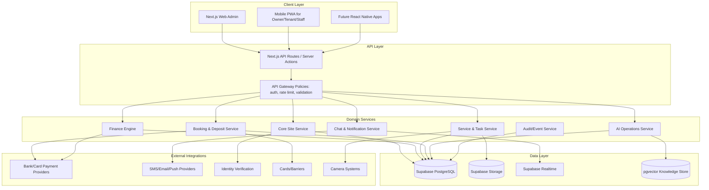
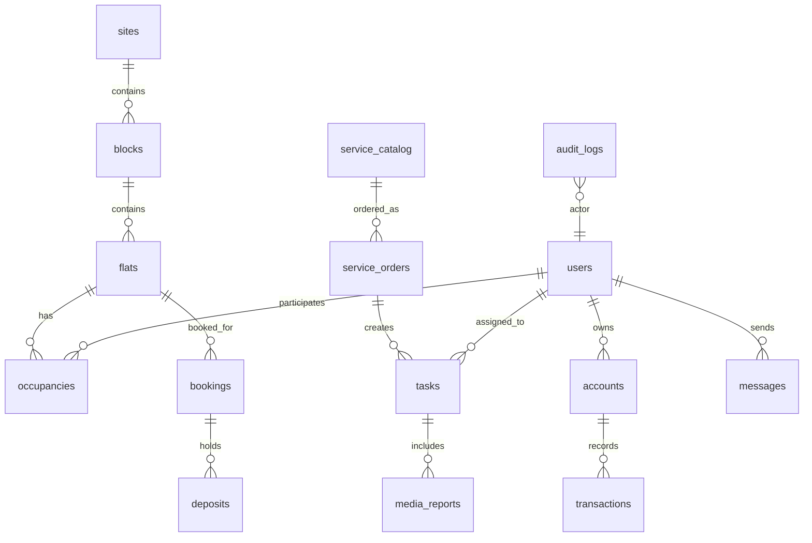

# Option 3 AI Site Management CRM - Implementation Plan

## Goal

Build exactly the client-requested full end-to-end residential complex management CRM for a 769-flat site, with web admin, mobile-first owner/tenant/staff access, real finance workflows, service/task operations, bookings, deposits, communication, notifications, reporting, integrations, and an AI operations layer.

The client requirement is the base scope. Our existing 1Cati strengths are added on top as premium differentiators: AI assistant, modern dashboard, multilingual UI, document workflows, calendar, analytics, polished UX, and mobile-responsive experience. The result is not just a basic site-management tool, but a premium AI-powered residential operations platform.

## Current Checkpoint - 30 June 2026

This plan defines the target product and implementation sequence. It is not a claim that every phase is already production complete.

| Phase range | Status | Practical meaning |
|---|---|---|
| Phase 1-4 | Complete as local/product foundation | Scope, UX/RBAC, Supabase schema, site/block/floor/unit model, import validation and live dashboard foundation exist. |
| Phase 5-14 | Complete as implementation foundation / ready-for-UAT slice | User/profile/role relationships, finance ledger, payment/deposit/restriction controls, service catalogue, workforce SLA board, booking/checkout, communication/documents, private document upload/storage contract, mobile-friendly web/PWA shell, offline-safe queue, provider-ready integration placeholders, same-language AI chat, AI recommendations and image/proof AI workflows are present with APIs, UI and harness coverage. They still need real-data validation, accounting/legal/storage review, provider choices and UAT before production activation. |
| Phase 15 | Accelerated delivery window | Launch hardening, final QA, security, performance, UAT, training and production readiness are targeted for rapid Codex-assisted completion by Wednesday 8 July 2026, with automated QA evidence collected before sign-off. |

Parallel-session reconciliation on 26 June 2026 confirmed the 15-phase ERP dashboard model, RBAC-aware dashboard drilldowns, listings interaction fixes, local Supabase fixes, fuzzy search, Jira/Xray dry-run workflow and realtime dashboard refresh. The 27-30 June 2026 work completed the Phase 5-14 implementation foundation: people/roles, finance ledger surfaces, guarded payment-control API, finance-page control panel, service catalogue, service orders, workforce SLA task board, media-proof workflow, booking readiness, checkout settlement, access handoff, communication center, notification retry queue, multilingual templates, document packet workflows, private document upload/storage contract, mobile-friendly web/PWA shell, offline-safe queue, provider-ready integration placeholders, same-language AI chat, AI recommendations, image/proof workflows, landing/product UX cleanup, multilingual route fixes and QA gates.

Accelerated delivery target on 30 June 2026: complete remaining Phase 15 development by Wednesday 8 July 2026, excluding a full exploratory manual testing round. This target assumes continuous Codex-assisted execution, fast review loops, unit checks, automated E2E/regression scripts, browser smoke checks and no blocking client/provider credentials. A separate exploratory manual QA/UAT round should be planned after this target and may take additional days depending on scope and client availability.

## Market Benchmark

### Turkish Competitor Baseline

- Apsiyon shows the local minimum bar: aidat tracking, online bank integrations, card collection, reservation, manager mobile, resident mobile, access control products, meter/billing products, email/SMS, and AI assistants.
- Apsiyon publicly positions itself as an end-to-end platform for apartments/sites and reports large operating scale: 24,970 sites/apartments, 1,723,841 homes, and 4,175,978 users.
- Apsiyon AI messaging includes digital assistants, predictive notifications, request categorization, billing error prediction, smart recommendations, voice/NLP, budget prediction, automatic matching, preventive maintenance, and anomaly detection.

### Global Competitor Baseline

- Buildium baseline: property accounting, online payments, maintenance requests, resident center, owner portal, leasing, marketplace, open API, automation, customization, business operations, and agentic AI.
- Yardi Breeze baseline: marketing/leasing, online balances and rent payments, automated rent/fee posting, ACH/card payments, electronic maintenance requests, smartphone photo/video capture, accounting, owner reports, and setup support.
- DoorLoop baseline: accounting, bank sync, financial reports, leasing, CRM, maintenance, mobile app, owner portal, file storage, rent collection, tenant management, communication tools, AI assistant, AI inspections, and workflows.

### Product Positioning

We should not position this as another basic apartment management tool. We should position it as:

> A premium AI-powered site operating system for Turkish residential complexes: finance, services, bookings, access, communication, and management decisions in one place.

### Market Standard Functionality Matrix

| Market Standard | Apsiyon / Turkey Baseline | Global Baseline | Our Target |
|---|---|---|---|
| Dues / aidat tracking | Required | Required as accounting/charges | Required in finance engine |
| Online bank/card collection | Required | Required | Required through provider adapters |
| Resident mobile app | Required | Required | Required as PWA first, native later |
| Manager mobile app | Required | Common | Required for managers and staff |
| Reservations / bookings | Required | Common for amenities/leasing | Required with flat booking and move-in |
| Access cards/barriers | Local differentiator | Integration-led | Required adapter layer |
| Meter/billing integration | Local differentiator | Utility billing in larger systems | Phase integration after MVP |
| Maintenance/task requests | Required | Required | Required with SLA and media reports |
| Owner/resident portals | Common | Required | Required |
| Accounting reports | Required | Required | Required with exportable ledgers |
| File/document storage | Common | Required | Required for contracts, statements, reports |
| Email/SMS/push | Required | Required | Required with notification templates |
| API/integrations | Emerging | Strong standard | Required API-first architecture |
| AI assistant | Competitive differentiator | Fast-growing standard | Core premium differentiator |
| AI inspections/media | Emerging | New global standard | Add as premium workflow |
| AI anomaly/debt prediction | Competitive differentiator | Advanced standard | Add to beat competitor offer |

## Scope

### Client Requirement - Must Deliver

- Site, block, floor, flat model for 769 flats.
- Owner, tenant, staff, manager, accountant, admin roles.
- Owner/tenant personal accounts, balances, deposits, payments, accruals, refunds.
- Service catalogue with price, SLA, contractor/staff owner.
- Service order flow: select service, debt check, payment/debit, task creation, assignment, notification, completion report.
- Booking flow: availability, booking, payment, deposit hold, move-in tasks, access activation.
- Checkout flow: inspection, debt settlement, deposit deduction/refund, access deactivation.
- Debt restriction rules for services, bookings, and access.
- Task management with priorities, SLA, assignee, status, media report.
- Communication: client-management chat, internal team chat, notifications.
- Reporting: debt list, financial reports, service reports, staff performance, daily cash flow.
- Dashboard: income, expenses, debt, tasks, KPIs, occupancy, AI risk highlights.
- Mobile-first web/PWA immediately; native iOS/Android later if budget/time allows.
- API-first backend and audit log for all important operations.

### Our Added Premium Features

- AI manager assistant.
- AI resident assistant.
- AI service triage and auto-categorization.
- AI debt and payment-risk summaries.
- AI daily operations briefing.
- AI report generation for managers/owners.
- AI anomaly detection for debt, meter usage, service volume, repeated faults.
- Voice-ready Turkish queries: "Bugun borclu daireleri goster", "Acil arizalar ne durumda?"

## Apps And System Surfaces

These are the apps/portals mentioned or implied by the client requirement and the competitor benchmark. We should treat them as one connected platform, not separate products.

| App / Surface | Main Users | Purpose |
|---|---|---|
| Web Admin App | Admin, manager, accounting | Full control center for site, finance, operations, bookings, reports and settings |
| Manager Mobile/PWA App | Site manager | Quick debt view, urgent tasks, approvals, announcements, resident issues |
| Owner Portal / App | Flat owner | Balance, payments, reports, tenant/rental management, documents, service requests |
| Tenant Portal / App | Tenant | Balance, payments, booking status, service requests, chat, notifications, documents |
| Staff/Technician Mobile/PWA App | Cleaning, security, repair, technical teams | Assigned tasks, SLA, route/tour checks, photo/video completion reports |
| Accounting Console | Accountant, finance manager | Accruals, collections, deposits, refunds, reconciliations, cash flow, debt reports |
| Booking And Letting Console | Manager, booking team | Availability calendar, booking, payment check, move-in, checkout, deposit handling |
| Service Operations Console | Manager, staff lead | Service catalogue, service orders, assignment, SLA, contractor/staff tracking |
| Communication Center | Manager, residents, staff | Resident-management chat, internal team chat, announcements, email/SMS/push |
| AI Command Center | Manager, admin, accounting | AI briefing, debt risk, service triage, anomaly detection, report generation |
| Reporting And Analytics App | Manager, admin, accounting, owner where allowed | Financial, debt, service, staff, occupancy, daily cash-flow and KPI reports |
| Integration Admin Console | Admin, technical support | Payment/bank, identity, access card/barrier, camera, meter and notification setup |
| Public/Support Website Surface | Prospects/residents if needed | Public information, support links, optional building/community website |

## Complete Feature Inventory

### Core Site And Property Data

- Site/complex profile, address, timezone, default currency and rules.
- Block, floor and flat model for 769 flats.
- Flat status: vacant, occupied, maintenance, renovation/fault, blocked.
- Flat type, size, capacity, ownership and tenancy history.
- Import/export from Excel for flats, owners, tenants and balances.
- Data quality checks for duplicate flats, missing contacts and invalid balances.

### Users, Roles And Permissions

- Owner, tenant, staff, manager, accountant and admin roles.
- Role-based permissions per module and action.
- Owner-to-flat and tenant-to-flat relationships.
- Tenant permissions controlled by owner/management rules.
- Staff assignment groups such as cleaning, security, repair and technical.
- Identity status, document storage and access eligibility.

### Finance, Accounting And Ledger

- Owner account, tenant account, deposit account and management company account.
- Accruals for aidat/service charges, utilities, services, rent and fees.
- Payments, debits, credits, refunds, deposit holds and automatic offsetting.
- Balance calculation from ledger, not manual numbers.
- Debt thresholds and restriction rules.
- Cash flow, receivables, payables, debt aging and daily financial reports.
- Exportable statements and owner/tenant transaction history.

### Payments, Deposits And Restrictions

- Online bank/card payment provider adapter.
- Manual payment posting with approval.
- Payment reconciliation and unmatched payment queue.
- Deposit block on move-in.
- Deposit use for debts/damages.
- Partial/full deposit refund on checkout.
- Restrictions: debt blocks paid services, bookings and access cards based on rules.

### Services And Operations

- Service catalogue: cleaning, transfer, maintenance/repair, tours/activity and custom services.
- Price, SLA, responsible staff/contractor and availability rules per service.
- Service order wizard with debt check and payment/debit step.
- Automatic task creation after approved service order.
- Completion report with photo/video and manager review where needed.

### Tasks, Staff And Field Work

- Task board by status, priority, SLA, assignee and location.
- Staff mobile task list.
- Photo/video evidence, notes, invoices/PO attachments where relevant.
- Tour control for security, cleaning and technical patrol routines.
- Staff performance reports: completion time, overdue tasks, SLA hit rate.
- Optional inventory/warehouse after MVP for spare parts and consumables.

### Booking, Letting, Move-In And Checkout

- Availability calendar.
- Booking creation and payment verification.
- Deposit hold.
- Move-in checklist and preparation tasks.
- Access activation.
- Checkout inspection, debt settlement, deposit deduction/refund and access deactivation.
- Final statement and document generation.

### Communication And Notifications

- Resident-management chat.
- Internal team chat.
- Threading by flat, service order, task, booking or finance case.
- Push, email and SMS notifications.
- Announcement broadcasting.
- Notification templates and delivery status.
- AI-assisted message draft and tone optimization.

### Mobile And UX

- Mobile-first PWA for speed.
- Native iOS/Android packaging after core flows are stable if required.
- Role-specific mobile home screens.
- Turkish-first language, with English/German/Russian optional if needed.
- Accessible color contrast, simple navigation, clear status badges and thumb-friendly actions.
- Offline-friendly staff task capture where possible.

### Integrations

- Payment systems and banks.
- Identity verification.
- Access systems: cards, gates/barriers and entry permissions.
- Camera systems and event references.
- Meter reading/billing integration.
- Email, SMS and push providers.
- Webhooks/Open API for future ecosystem integrations.

### Reporting, Dashboard And Analytics

- Executive dashboard: income, expenses, debt, tasks, occupancy and KPIs.
- Finance reports: debt list, cash flow, accruals, payments, deposits, refunds.
- Operations reports: service volume, SLA, overdue tasks, staff performance.
- Booking reports: occupancy, revenue, check-ins, checkouts, deposit exposure.
- Export to Excel/PDF.
- Drill-down from dashboard metric to source ledger/task records.

### AI Premium Features

- Manager AI assistant.
- Resident AI assistant.
- Staff AI assistant.
- Accountant AI assistant.
- Daily operations briefing.
- Debt risk and collection prioritization.
- Service request categorization and urgency detection.
- Suggested staff/task assignment.
- Billing anomaly detection.
- Meter/usage anomaly detection.
- Predictive maintenance and repeated-fault detection.
- Turkish natural language search and voice-ready commands.
- AI report generation for owners/managers.
- Human approval for any finance/access action.

### Security, Governance And Reliability

- API-first architecture.
- RBAC and row-level security.
- Audit log for all financial, booking, access, service and admin actions.
- Idempotency keys for payment/ledger writes.
- Rate limiting and validation.
- Backups, restore drills and monitoring.
- Error tracking and operational alerts.
- Data privacy controls for documents, identity and financial records.

## Client Requirement Coverage Plan

| Client Requirement | Delivery Plan |
|---|---|
| Owner and tenant management | Build full user, role, flat relationship and permission model |
| Site, block, flat structure | Build 769-flat site model with block/floor/flat matrix |
| Financial transactions | Build account ledger, accruals, payments, deposits, refunds |
| Service charges and utilities | Add recurring accrual engine and utility/service charge records |
| Deposit management | Add deposit hold, partial use, refund and checkout settlement |
| Operations and task management | Build task board, SLA tracking, assignment and media reports |
| Service management | Build service catalogue, price, SLA, contractor/staff owner |
| Letting and bookings | Build booking calendar, move-in, check-out and payment verification |
| Communication | Build resident-management chat, internal chat, notifications |
| Mobile app | Start with mobile PWA for speed, then package native apps if required |
| Payment systems/banks | Add provider adapter layer for bank/card integration |
| Identity verification | Add identity status and external provider adapter |
| Access cards/barriers | Add access-status model and integration adapter |
| Camera systems | Add camera/event integration adapter boundary and later vendor adapter |
| Reporting | Build financial, debt, service, staff, daily cash-flow reports |
| Dashboard | Build income, expense, debt, task, KPI and AI insight dashboard |
| API-first | Expose all modules through validated API/server-action boundaries |
| Role-based authorization | Extend current RBAC to exact client roles |
| Audit logs | Log every financial, access, booking, service and admin action |
| Scalability/fault tolerance | Use PostgreSQL, RLS, background jobs, retries, monitoring and backups |

## Target Architecture

## Data Model

### Key Tables

- `sites`: name, address, timezone, currency, settings.
- `blocks`: site_id, name, entrance_count, floor_count.
- `flats`: site_id, block_id, floor, number, type, m2, status.
- `users`: role, contact, identity_status, preferred_language.
- `occupancies`: flat_id, owner_id, tenant_id, start_date, end_date, permissions.
- `accounts`: user_id, flat_id, account_type, balance, currency.
- `transactions`: account_id, type, source, amount, status, posted_at, related_id.
- `service_catalog`: name, price, currency, SLA, active, contractor_id.
- `service_orders`: requester_id, flat_id, service_id, amount, payment_status, debt_check_result, status.
- `tasks`: service_order_id, booking_id, priority, status, assigned_to, SLA_due_at.
- `bookings`: flat_id, tenant_id, date_range, status, payment_status.
- `deposits`: booking_id, amount, blocked_amount, used_amount, refunded_amount, status.
- `messages`: thread_id, sender_id, channel, body, attachments.
- `notifications`: user_id, type, channel, status, payload.
- `audit_logs`: actor_id, entity_type, entity_id, action, before, after, timestamp, ip.
- `ai_events`: prompt, response, user_id, source_module, confidence, action_taken.

## Core Workflows

### Service Order

1. User selects service.
2. System checks user/flat balance.
3. If debt > 0, reject and explain restriction.
4. If allowed, debit balance or collect payment.
5. Create service order.
6. Create staff task.
7. Notify staff and requester.
8. Staff completes task with photo/video report.
9. Manager/accountant reviews if required.
10. Close task and write audit log.

### Tenant Move-In

1. Booking created.
2. Payment received/verified.
3. Deposit blocked.
4. Move-in/preparation tasks created.
5. Access card/barrier permission activated.
6. Tenant portal enabled.
7. Notifications sent.

### Checkout

1. Inspection task created.
2. Debts and open services checked.
3. Deposit used for debts if needed.
4. Remaining deposit refunded.
5. Access disabled.
6. Flat status updated.
7. Final statement generated.

### Debt Accumulation

1. Accrual posted.
2. Payment deadline monitored.
3. Late debt created.
4. Notification sequence starts.
5. Restrictions applied by rule.
6. AI flags risk list for manager.

## API Plan

- `GET /api/sites/:id/overview`
- `GET /api/blocks`
- `GET /api/flats?status=&block=&debt=`
- `POST /api/flats`
- `GET /api/users?role=`
- `POST /api/occupancies`
- `GET /api/accounts/:id`
- `POST /api/transactions/accrual`
- `POST /api/transactions/payment`
- `POST /api/deposits/block`
- `POST /api/deposits/refund`
- `GET /api/services/catalog`
- `POST /api/service-orders`
- `POST /api/tasks/:id/assign`
- `POST /api/tasks/:id/complete`
- `GET /api/bookings/availability`
- `POST /api/bookings`
- `POST /api/bookings/:id/check-in`
- `POST /api/bookings/:id/check-out`
- `GET /api/reports/debts`
- `GET /api/reports/cash-flow`
- `POST /api/chat/threads`
- `POST /api/ai/ask`
- `POST /api/ai/actions/approve`

All write endpoints need validation, RBAC permission checks, idempotency keys, and audit logging.

## AI Layer

### AI Assistant Modes

- Manager Copilot: "What needs attention today?"
- Accountant Copilot: debt, accrual, payment mismatch, refund risk.
- Staff Copilot: assigned jobs, SLA priority, route/order of tasks.
- Resident Copilot: balance, service request, documents, booking status.
- Admin Copilot: system health, unresolved incidents, adoption metrics.

### AI Features

- Daily briefing.
- Debt-risk prioritization.
- Service request triage.
- Automatic category/priority/SLA suggestion.
- Suggested response drafts for residents.
- Report summary generation.
- Anomaly detection for billing, usage, repeated faults.
- Natural language search over flats, owners, tenants, tasks, payments.

### Guardrails

- AI never posts payments, refunds deposits, or disables access without human approval.
- AI actions create pending recommendations.
- Every AI suggestion includes source data and confidence.
- Every AI action is logged.

## UI/UX Direction

### Audience

Turkish site managers, accounting staff, service staff, owners, and tenants. The UI must feel premium but operational, not decorative. Users need fast scanning, clear debt/task status, and simple actions.

### Design Principles

- Turkish-first language and content.
- Light mode as default for daily office use.
- Dark mode optional for control-room/premium feel.
- Dense but calm dashboards.
- Strong status colors: green paid/ok, amber warning, red debt/blocked, blue info, teal completed.
- Avoid overwhelming gradients; use clean backgrounds, subtle motion, crisp cards, accessible contrast.
- Mobile actions must be thumb-friendly.
- Every complex workflow should be wizard-based with clear next step.

### Main Screens

- Executive dashboard.
- Site map / block-flat matrix.
- Flat detail.
- Owner detail.
- Tenant detail.
- Account ledger.
- Payment posting.
- Deposit center.
- Service catalogue.
- Service order wizard.
- Task board.
- Staff mobile task view.
- Booking calendar.
- Check-in wizard.
- Checkout wizard.
- Debt restrictions center.
- Chat inbox.
- Notification center.
- Reports hub.
- AI command center.
- Audit log.
- Settings and integrations.

## Delivery Phases - Reimagined Into 15 Buildable Phases

The plan below splits the work into 15 smaller phases so each area has clear deliverables, backend impact, frontend/mobile scope, and acceptance criteria.

### Phase 1 - Discovery, Requirement Lock And Market Benchmark

Goal: Convert the client's short technical specification into a buildable product blueprint.

Standard functionality:
- Confirm 769-flat operating model, roles, finance rules, booking model, access rules and reporting needs.
- Benchmark against Turkish and global products so our offer is not behind the market.
- Decide MVP, premium scope and later integration scope.

Backend/API/database:
- Produce domain model and API boundary map.
- Define finance ledger rules before coding.

Frontend/mobile:
- Define app surfaces, navigation, role home pages and workflow maps.

AI/analytics:
- Define safe AI use cases and blocked AI actions.

Acceptance:
- Signed feature inventory, 15-phase roadmap, data model and workflow map.

### Phase 2 - UX/UI Design System And Product Navigation

Goal: Design a Turkish-first, modern, simple and premium operating interface.

Standard functionality:
- Dashboard layout, module navigation, status language, mobile patterns and accessibility standards.
- Design flows for manager, accountant, resident, tenant and staff.

Backend/API/database:
- Define UI state needs and API data contracts.

Frontend/mobile:
- Create design system tokens, layouts, tables, forms, wizards, task board, calendar and mobile shells.
- Build clickable prototype for the main flows.

AI/analytics:
- Design AI command center, AI briefing card and AI recommendation approval pattern.

Acceptance:
- Prototype covers dashboard, flat detail, finance ledger, service order, booking, task, chat and mobile views.

### Phase 3 - Platform Foundation, Auth, RBAC And Audit

Goal: Create the secure base for all future modules.

Standard functionality:
- Login, roles, permissions, organizations/sites, settings and audit logging.

Backend/API/database:
- Supabase/PostgreSQL schema for users, roles, permissions, sites, settings and audit logs.
- API validation, idempotency pattern, server action/API conventions and row-level security.

Frontend/mobile:
- Auth pages, role-specific shell, protected routes, settings base.

AI/analytics:
- AI event log table and permission rules for AI access.

Acceptance:
- Each role sees only allowed modules; every write action creates an audit log.

### Phase 4 - Site, Block, Floor, Flat And Data Import

Goal: Build the real property data foundation for 769 flats.

Standard functionality:
- Site -> block -> floor -> flat model.
- Flat status, type, size, owner/tenant links and history.
- Excel import and validation.

Backend/API/database:
- Tables for sites, blocks, floors/flat metadata, occupancy history and import batches.
- APIs for flat matrix, flat search, import preview and import commit.

Frontend/mobile:
- Block/flat matrix, flat list, flat profile, import wizard and data quality screen.

AI/analytics:
- AI data-quality summary after import.

Acceptance:
- System can load and display all 769 flats with correct status and relationships.

### Phase 5 - User, Owner, Tenant And Staff Management

Goal: Manage every person connected to the site with the right permissions.

Standard functionality:
- Owner, tenant, staff, manager, accountant and admin profiles.
- Documents, contact details, identity status and flat relationships.
- Tenant permissions controlled by owner/management rules.

Backend/API/database:
- User profile extensions, documents, identity status, occupancy permissions and staff groups.

Frontend/mobile:
- Owner profile, tenant profile, staff profile, relationship timeline and document vault.

AI/analytics:
- Duplicate user detection and missing-document alerts.

Acceptance:
- Users can be connected to flats, accounts and roles without data conflict.

### Phase 6 - Financial Ledger Engine

Goal: Build the core accounting engine correctly before adding payments.

Standard functionality:
- Owner, tenant, deposit and management accounts.
- Accruals, debits, credits, fees, rent, utilities and balance calculation.
- Transaction history and statements.

Backend/API/database:
- Accounts, transactions, journal entries, posting rules, ledger constraints and balance views.
- APIs for account ledger, posting accruals, reversals and statements.

Frontend/mobile:
- Account ledger, balance cards, transaction detail, statement export and accountant console.

AI/analytics:
- AI ledger explanation: why a balance is what it is.

Acceptance:
- Balance is always calculated from ledger records and financial writes are auditable.

### Phase 7 - Payments, Deposits, Reconciliation And Debt Restrictions

Goal: Implement the client's most important business rules around money and restrictions.

Standard functionality:
- Online/manual payment posting, bank/card provider adapter, reconciliation queue.
- Deposit block, partial use, refund and checkout settlement.
- Debt thresholds that block services, bookings and access.
- Automatic offsetting for rent/owner debt rules.

Backend/API/database:
- Payment intents, provider webhooks, reconciliation records, deposit records and restriction rules.
- APIs for payment posting, deposit block/use/refund, debt checks and restriction status.

Frontend/mobile:
- Payment screen, deposit center, debt restriction center and accountant approvals.

AI/analytics:
- Debt risk ranking and unmatched-payment suggestions.

Acceptance:
- A user with debt is blocked exactly as configured; deposit and refund flows are traceable.

### Phase 8 - Service Catalogue And Service Order Flow

Goal: Let residents order services while enforcing finance rules.

Standard functionality:
- Services such as cleaning, transfer, repair/maintenance, tours/activity and custom services.
- Price, SLA, contractor/staff owner and active/inactive state.
- Service order: select -> debt check -> payment/debit -> task creation -> notification.

Backend/API/database:
- Service catalogue, service orders, order state machine and debt-check API.

Frontend/mobile:
- Service catalogue admin, resident order wizard, order detail and service status tracker.

AI/analytics:
- AI category suggestion, urgency detection and suggested response.

Acceptance:
- Service order cannot bypass debt rules and always creates the correct downstream task.

### Phase 9 - Task, Workforce, SLA And Field Reporting

Goal: Make daily operational work manageable for staff and managers.

Standard functionality:
- Task creation, assignment, priority, SLA, progress, completion and cancellation.
- Photo/video reports and internal notes.
- Tour control for security, cleaning and technical teams.

Backend/API/database:
- Tasks, task events, assignments, media reports, SLA timers and storage policies.

Frontend/mobile:
- Task board, staff mobile task list, task detail, upload media, manager review.

AI/analytics:
- AI task prioritization, workload balancing and SLA risk warnings.

Acceptance:
- Staff can complete a task from mobile with media evidence and the manager sees SLA status.

### Phase 10 - Booking, Letting, Move-In And Checkout

Goal: Cover the full lifecycle from availability to checkout.

Standard functionality:
- Availability calendar, booking creation, payment verification, deposit hold.
- Move-in tasks, preparation checklist, access activation.
- Checkout inspection, debt deduction, deposit refund and access deactivation.

Backend/API/database:
- Bookings, availability rules, move-in/check-out workflows, settlement records and access action queue.

Frontend/mobile:
- Booking calendar, booking detail, move-in wizard, checkout wizard and final statement.

AI/analytics:
- AI checkout risk summary and missing-step alerts.

Acceptance:
- Move-in and checkout scenarios from the client specification can be run end to end.

### Phase 11 - Communication, Notifications And Documents

Goal: Centralize communication across residents, managers and staff.

Standard functionality:
- Client-management chat, internal team chat, announcements, email/SMS/push.
- Conversations linked to flat, account, task, booking or service order.
- Document storage, upload review queue, private object-storage contract and generated statements/reports.

Backend/API/database:
- Threads, messages, notification templates, delivery logs, documents, upload metadata, private object-storage policy and attachment permissions.

Frontend/mobile:
- Chat inbox, notification center, announcement composer, secure upload panel and document vault.

AI/analytics:
- AI reply drafts, announcement drafts and conversation summaries.

Acceptance:
- Messages and notifications are traceable, role-safe and linked to the right operational record.

### Phase 12 - Mobile-Friendly Web/PWA And Offline-Safe Experience

Goal: Make the platform usable from phones for residents, staff and managers.

Standard functionality:
- Web/PWA first for speed: login, balance, service request, chat, documents, notifications and tasks.
- Native iOS/Android packaging is not part of the current phase and should be considered later only if the client requires store apps.

Backend/API/database:
- Mobile-safe API responses, installable web manifest, service-worker shell, session handling and offline-safe queue where needed.

Frontend/mobile:
- Responsive owner, tenant, staff and manager web screens inside the same Next.js app.

AI/analytics:
- Mobile AI assistant with same-language responses and role-aware guardrails.

Acceptance:
- Core resident/staff/manager workflows work smoothly on mobile viewport and can be installed as a web app where the browser/host supports it.

### Phase 13 - External Integrations

Goal: Connect the CRM to real-world systems around the site.

Decision source:
- Use `docs/requirements/option-3-ai-site-crm/Third-Party-Integration-And-Vendor-Plan.md` for provider shortlist, Supabase Cloud Pro, external dependency cost register, adapter contracts and launch gates.

Standard functionality:
- External dependency cost register, Supabase Cloud Pro production setup, payment/card collection, bank import/reconciliation, SMS/email/push, wallet/top-up, identity, access cards/barriers, camera systems, meter/billing, monitoring and AI-provider gateway.

Backend/API/database:
- Integration registry, placeholder/provider-ready adapter layer, provider sandbox/prod mode, signed webhooks target, idempotency, retry/dead-letter queue, integration logs, future vendor credentials, secret rotation, health metrics and failure handling.

Frontend/mobile:
- Integration settings, Supabase connected status, provider shortlist status, connection readiness, health, queue length, manual fallback and client-required decision/API-key list.

AI/analytics:
- AI integration anomaly alerts such as failed payment imports or unusual meter data.

Acceptance:
- Each external dependency has a named billing owner, cost status, Jira tracking label and production decision gate; each integration has a test mode, audit trail, retry behavior, clear failure status, manual fallback and production sign-off before live credentials are used.

### Phase 14 - AI Premium Layer And Advanced Analytics

Goal: Make our offer stronger than a standard CRM by adding useful, controlled AI.

Standard functionality:
- Manager AI assistant, accountant assistant, resident assistant and staff assistant.
- Daily briefing, debt risk, service triage, booking/deposit review, integration advice, image/proof workflow support and report generation.
- Natural language search over flats, users, accounts, tasks, services and bookings.

Backend/API/database:
- AI orchestration service, same-language response guard, prompt templates, retrieval-ready structured records, future pgvector knowledge store, AI event logs and approval workflow.

Frontend/mobile:
- AI command center, AI cards in dashboard, explainable recommendations and approval/decline controls.

AI/analytics:
- Confidence, source citations, model evaluation, safety rules and human approval for financial/access actions.

Acceptance:
- AI can advise and draft, but cannot post money/refunds or disable access without human approval.

### Phase 15 - QA, Security, Performance, UAT, Training And Launch

Goal: Launch safely and make the system usable by non-technical staff.

Standard functionality:
- End-to-end tests, role tests, finance tests, mobile tests, integration tests and UAT scripts.
- Security review, backups, restore drill, monitoring, support workflow and training.

Backend/API/database:
- Load testing, RLS audit, backup/restore, observability, error tracking and operational runbooks.

Frontend/mobile:
- Accessibility audit, browser/mobile testing, Turkish copy review and onboarding/training screens.

AI/analytics:
- AI evaluation set, hallucination checks, permission tests and audit review.

Acceptance:
- UAT passes for service order, tenant move-in, checkout, late payment, debt restrictions, reports and mobile workflows.

## Timeline And Current Delivery Control

Accelerated planning assumption:

| Date | Target delivery scope | Estimated Codex-assisted effort |
|---|---|---:|
| 29 June 2026 | Phase 1-9 implementation foundation and QA evidence complete | Complete |
| 29 June 2026 | Phase 8 service catalogue and service-order flow | Complete |
| 29 June 2026 | Phase 9 tasks, workforce, SLA and field reporting | Complete |
| 30 June 2026 | Phase 10 booking, move-in and checkout | Complete |
| 30 June 2026 | Phase 11 communication, notifications, documents and private upload contract | Complete |
| 30 June 2026 | Phase 12 mobile-friendly web/PWA and offline-safe queue | Complete |
| 30 June 2026 | Phase 13 external integration placeholders and provider readiness screens | Complete |
| 30 June 2026 | Phase 14 AI premium layer and advanced analytics v1 | Complete |
| 8 July 2026 | Phase 15 final automated QA, security checks, UAT pack, training material and launch-readiness preparation | 18-28 hours |

Current control point: phases 1-14 are complete as an implementation foundation and ready-for-UAT delivery slice. Phase 15 is now under an accelerated delivery target to finish development by Wednesday 8 July 2026, excluding full exploratory manual testing. This target is aggressive but feasible only with continuous Codex-assisted execution, parallel automated QA and immediate correction of defects found by the harnesses.

## Next Engineering Priorities

1. Validate Phase 5-14 implementation foundation with real client data, accounting/legal review and UAT evidence before production activation.
2. Confirm provider decisions for payments, bank reconciliation, SMS/email/push, access/security and monitoring before live credentials are issued.
3. Execute Phase 15 launch hardening in the compressed 30 June to 8 July delivery window.
4. Keep dashboard metrics tied to Supabase-backed APIs with realtime or polling refresh, not static-only cards.
5. Harden RLS, RBAC and audit coverage for every write action before production UAT.
6. Keep Jira/Xray synchronization aligned with this checkpoint; remote attachment uploads still require explicit approval because the package contains confidential material.
7. Add Playwright coverage for each phase as it moves from active build to UAT-ready.

## Risks

- Full finance logic must be precise; demo shortcuts cannot go into production.
- Payment and bank integrations depend on selected provider and contracts.
- Access/card/barrier/camera integrations need vendor details.
- Native apps take longer than PWA; PWA should be first for speed.
- AI must be controlled with approval workflows for financial/access actions.
- Migration from Excel/current system must be planned early.

## Definition Of Done For Production Sign-Off

- Every production module uses real database tables or approved external provider APIs, not mock-only data.
- Every write action has RBAC, validation, audit log, and error handling.
- Every financial rule has tests.
- Every critical workflow has Playwright E2E coverage.
- Mobile PWA works for resident and staff flows.
- AI suggestions are explainable and logged.
- Dashboard metrics match ledger/task data.
- Reports can be exported.
- System can be demonstrated in Turkish with realistic site data.
